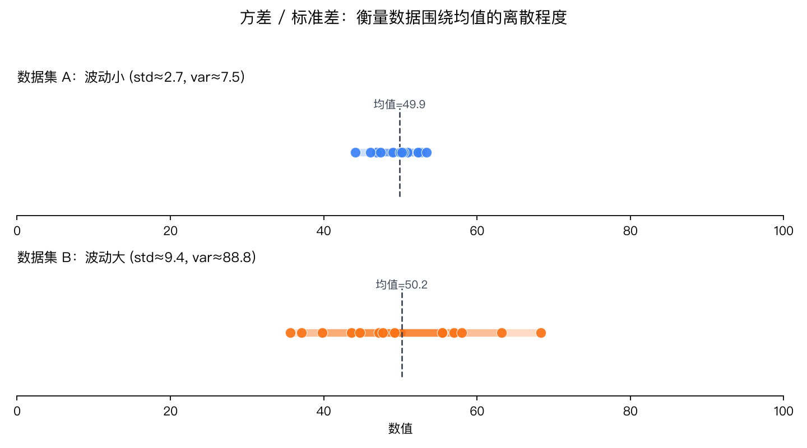
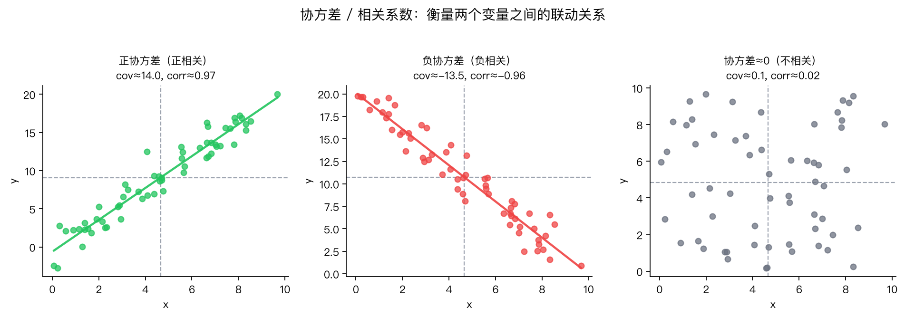

# NumPy 库操作手册

> 本手册根据 `inaction_01_numpy` 目录下 `chapter_01` ~ `chapter_09` 的学习笔记整理而成，涵盖数组创建、数据类型、复制视图、索引切片、形状操作、广播机制、通用函数、统计汇总函数、线性代数，以及方差/标准差/协方差等统计学基础常识。

---

## 目录

1. [基础操作](#1-基础操作)
2. [数据类型](#2-数据类型)
3. [复制和视图](#3-复制和视图)
4. [索引和切片](#4-索引和切片)
5. [数组形状操作（变形、转置、堆叠、拆分）](#5-数组形状操作)
6. [广播机制](#6-广播机制)
7. [通用函数（元素级方法）](#7-通用函数)
8. [where、排序、集合操作、统计汇总函数](#8-where排序集合操作统计汇总函数)
9. [线性代数](#9-线性代数)
10. [统计学基础常识（方差、标准差、协方差）](#10-统计学基础常识)

---

## 1. 基础操作

### 1.1 数组的创建

| 函数 | 说明 |
|---|---|
| `np.array(list)` | 从 Python 列表创建数组 |
| `np.zeros(shape, dtype)` | 创建全 0 数组 |
| `np.ones(shape, dtype)` | 创建全 1 数组 |
| `np.full(shape, fill_value)` | 创建指定形状、填充任意值的数组 |
| `np.random.randint(low, high, size)` | 创建指定范围内的随机整数数组 |
| `np.random.rand(d0, d1, ...)` | 创建 [0, 1) 均匀分布的随机数组 |
| `np.random.randn(d0, d1, ...)` | 创建标准正态分布（均值0，标准差1）的随机数组 |
| `np.random.normal(loc, scale, size)` | 创建指定均值 `loc`、标准差 `scale` 的正态分布数组 |
| `np.arange(start, stop, step)` | 等差数列，**左闭右开** |
| `np.linspace(start, stop, num)` | 等差数列，**左闭右闭**，`num` 指定生成的元素个数 |

```python
import numpy as np

nd1 = np.array([1, 2, 3, 4, 5])
nd2 = np.zeros(shape=(3, 4), dtype=np.int32)
nd3 = np.ones(shape=(3, 4), dtype=np.float32)
nd4 = np.full(shape=(2, 3, 4), fill_value=3.1415926)
nd5 = np.random.randint(0, 100, size=15)
nd6 = np.random.rand(2, 3)
nd7 = np.random.randn(3, 5)
nd8 = np.random.normal(loc=100, scale=10, size=(1, 5))
nd9 = np.arange(1, 100)               # 差值为1
nd91 = np.arange(1, 100, step=10)     # 差值为10, 左闭右开
nd10 = np.linspace(1, 100, num=10)    # 左闭右闭, 生成10个数
```

### 1.2 查看数组的属性

| 属性 | 说明 |
|---|---|
| `nd.shape` | 数组的形状（各维度大小） |
| `nd.dtype` | 数组的数据类型 |
| `nd.size` | 数组元素总个数 |
| `nd.ndim` | 数组的维度数 |
| `nd.itemsize` | 每个元素占用的字节数 |

### 1.3 文件读写

| 函数 | 说明 |
|---|---|
| `np.save(path, arr)` | 保存单个数组到 `.npy` 文件 |
| `np.load(path)` | 加载 `.npy` / `.npz` 文件 |
| `np.savez(path, key1=arr1, key2=arr2)` | 保存多个数组到一个 `.npz` 文件，需要用 key 取值 |
| `np.savez_compressed(path, key1=arr1, ...)` | 保存压缩版 `.npz` 文件 |
| `np.savetxt(fname, X, fmt, delimiter)` | 保存为文本 / CSV 文件 |
| `np.loadtxt(fname)` | 读取文本 / CSV 文件 |

```python
np.save('./data', nd2)
np.load('./data.npy')

np.savez('./data', a=nd1, b=nd2)
data = np.load('./data.npz')
data['a']; data['b']          # 必须通过 key 获取，取不存在的 key 会报错

np.savez_compressed('./data2.npz', x=nd1, y=nd2)

np.savetxt(fname='./data.txt', X=nd1, fmt='%0.2f', delimiter=',')
np.loadtxt('./data.txt')
```

---

## 2. 数据类型

### 2.1 常用数据类型

- 有符号整型：`int8`、`int16`、`int32`、`int64`
- 无符号整型：`uint8` ...
- 浮点型：`float16`、`float32`、`float64` ...
- 字符串类型：`<U1`（Unicode，1个字符）等

> `int8` 可表示 **-128 ~ 127**；`uint8` 可表示 **0 ~ 255**。超出范围会发生**溢出（overflow）**，新版本 NumPy 对越界转换会给出 `DeprecationWarning`。

```python
nd1 = np.array([2, 3], dtype=np.int8)

# 超出 uint8 范围（-3、-5、256）会溢出
np.array([-3, -5, 0, 255, 0, 256], dtype=np.uint8)
# array([253, 251, 0, 255, 0, 0], dtype=uint8)

np.random.randint(0, 100, size=10, dtype=np.int8)
```

### 2.2 类型转换

| 方法 | 说明 |
|---|---|
| `np.asarray(arr, dtype=...)` | 生成一个新数组（不改变原数组） |
| `arr.astype(dtype)` | 转换为指定类型，生成新数组 |

```python
nd1 = np.asarray(nd, dtype='float16')
nd1.astype(np.float16)
```

### 2.3 数组运算

**基本运算（逐元素）：**

```python
nd1 + nd2   # 逐元素相加
nd1 - nd2   # 逐元素相减
nd1 * nd2   # 逐元素相乘
nd1 / nd2   # 逐元素相除
nd1 ** nd2  # 幂运算，等价于 np.power(nd1, nd2)
np.power(nd1, nd2)

np.log(10)     # 以 e 为底的对数
np.log10(1000) # 以 10 为底的对数
np.log2(1024)  # 以 2 为底的对数
```

**逻辑运算（逐元素比较，返回布尔数组）：**

```python
nd1 > nd2
nd1 < nd2
nd1 >= nd2
nd1 == nd2
```

**数组与标量计算（广播到每个元素）：**

```python
nd1 + 10
nd1 - 10
nd1 * 10
nd1 / 10
2 / np.array([1, 2, 0, 5])   # 除以0 得到 inf，并给出 RuntimeWarning
```

**原地运算符（直接修改原数组，`/=` 不存在类似写法需注意）：**

```python
nd1 += 10
nd1 -= 10
nd1 *= 3
```

---

## 3. 复制和视图

NumPy 中数据"共享"关系分为三种情况：

| 方式 | 写法 | 特点 |
|---|---|---|
| 完全不复制（赋值） | `b = a` | `a is b` 为 `True`，两者是同一个对象 |
| 视图 / 浅拷贝 | `b = a.view()` 或切片 `b = a[3:7]` | `a is b` 为 `False`，但共用同一份底层数据；`b.flags.owndata` 为 `False`；修改 `b` 会影响 `a` |
| 深拷贝 | `b = a.copy()` 或花式索引 `b = a[[1,3]]` | 完全独立的数据，`b.flags.owndata` 为 `True`；修改互不影响 |

```python
# 1. 完全没有复制
nd2 = nd1
nd2 is nd1  # True

# 2. 视图（浅拷贝）
b = a.view()
a is b               # False
a.flags.owndata      # True
b.flags.owndata      # False（用的是 a 的数据）
a[0] = 1024          # 修改 a 不会影响 b（view 只是共享内存，不是引用同一对象）

# 3. 深拷贝
b = a.copy()
a is b               # False
a[0] = 1024
b[0] = 2048          # 互不影响

# 用 copy() 释放大数组内存
a = np.arange(1e8)
b = a[[1, 2, 4]].copy()   # 只保留需要的部分
del a                      # 释放剩余内存
```

> **注意**：普通切片（如 `a[3:7]`）得到的是**视图**，`flags.owndata` 为 `False`，共用一份数据；而**花式索引**（如 `a[[1,3]]`）得到的是**深拷贝**，独立于原始数据。

---

## 4. 索引和切片

### 4.1 一维数组索引/切片基础

```python
a[3]              # 获取单个元素
a[[1, 3, 5]]      # 获取多个元素（列表下标）
a[0:3]            # 切片，左闭右开
a[:3]             # 省略起始下标，默认从0开始
a[5:]             # 省略结束下标，默认到最后
a[::2]            # 从0开始，步长为2
a[3::3]           # 从下标3开始，步长为3
a[::-1]           # 整体反转
a[::-2]           # 反转，每2个取1个
a[1:7:2]          # 从1到7（不含），步长2
a[5:2:-1]         # 反向切片：起点>终点，步长为负
```

### 4.2 多维数组的切片

```python
b[1]              # 获取整行
b[[1, 3, 5]]      # 获取多行
b[1, 3]           # 逗号分隔维度：行=1，列=3 的单个元素
b[1, [1,2,3]]     # 第1行中，第1、2、3列
b[2::7, 1::3]     # 行从2开始每隔7取一个，列从1开始每隔3取一个
b[-1, -1]         # 负数下标表示倒数
b[-2, (-1,-2,-3)] # 倒数第2行的，倒数第1、2、3列
```

### 4.3 花式索引和索引技巧

- **普通切片**返回**视图**（`owndata=False`），修改会影响原数组。
- **花式索引**（如 `a[[1, 3]]`）返回**深拷贝**（`owndata=True`），与原数组独立。
- **布尔索引**：可以用条件表达式筛选满足条件的元素。

```python
a = np.arange(20)
b = a[3:7]          # 视图，共享数据
b[0] = 100
# a 也会跟着改变

a = np.arange(20, 100, 10)
b = a[[1, 3]]        # 花式索引，深拷贝
b.flags.owndata      # True

# 布尔索引：筛选出所有元素 >= 120 的值（一维结果）
cond = a >= 120
a[cond]

# 多条件组合（& 表示按位与，逐行判断是否所有列都满足条件）
cond1 = a > 100
cond2 = a < 30
a[cond1[:, 0] * cond1[:, 1] * cond1[:, 2]]
```

---

## 5. 数组形状操作

### 5.1 数组的变形（reshape）

```python
a = np.arange(10, 100, 2)
b = a.reshape(9, 5)   # reshape 返回视图（浅拷贝），共用一份数据
b[0][0] = 100         # 会影响原数组 a
```

### 5.2 数组的转置

```python
a.T                       # 转置（简写）
a.transpose()             # 转置
np.transpose(a, (1, 0))   # 显式指定轴的顺序
```

### 5.3 数组的堆叠

| 函数 | 作用 | 等价于 |
|---|---|---|
| `np.concatenate((a, b), axis=0/1)` | 沿指定轴拼接 | 基础函数 |
| `np.hstack((a, b))` | 水平堆叠（列增加） | `concatenate(axis=1)` |
| `np.vstack((a, b))` | 垂直堆叠（行增加） | `concatenate(axis=0)` |
| `np.dstack((a, b))` | 深度堆叠（第三维增加，如图像通道合并） | `concatenate(axis=2)` |

```python
np.concatenate((a, b), axis=1)   # 水平方向拼接
np.hstack((a, b))                # 列增加
np.vstack((a, b))                # 行增加
np.vstack((a, a, b))             # 可以传入多个数组
```

### 5.4 数组的拆分

| 函数 | 作用 |
|---|---|
| `np.split(a, indices_or_sections, axis=0)` | 通用拆分；数字表示平均分成几份，数组表示按具体切分点拆分 |
| `np.hsplit(a, indices_or_sections)` | 水平方向拆分（按列拆） |
| `np.vsplit(a, indices_or_sections)` | 垂直方向拆分（按行拆） |

```python
np.split(a, indices_or_sections=3)               # 按行平均分成3份
np.split(a, indices_or_sections=2, axis=1)       # 按列平均分成2份
np.split(a, indices_or_sections=[1, 3, 7, 9])    # 按指定切分点拆分
np.hsplit(a, indices_or_sections=2)              # 水平拆分
np.vsplit(a, indices_or_sections=[5])            # 垂直拆分
```

---

## 6. 广播机制

当两个数组形状不同但满足广播规则时，NumPy 会自动"扩展"较小的数组维度以完成计算。

**规则要点：** 从末尾维度开始比较，若某一维度大小相同，或其中一个为 1（或缺失），则可以广播；不满足时报错。

```python
# 行不够时，广播行
arr1 = np.array([[0,0,0],[1,1,1],[2,2,2],[3,3,3]])  # shape (4,3)
arr2 = np.array([1, 2, 3])                            # shape (3,)
arr1 + arr2   # arr2 被广播到每一行

# 列不够时，广播列
arr3 = np.array([[1],[2],[3],[4]])                    # shape (4,1)
arr1 + arr3   # arr3 被广播到每一列

# 高维广播示例
a = np.arange(1,9).tolist() * 3
a = np.array(a).reshape(3, 4, 2)   # shape (3,4,2)
b = np.arange(8).reshape(4, 2)     # shape (4,2)
a + b   # b 被广播到 a 的每一个 “批次”
```

---

## 7. 通用函数

### 7.1 元素级数学函数

| 函数 | 说明 |
|---|---|
| `np.abs(a)` | 绝对值 |
| `np.sqrt(a)` | 开平方（负数会得到 `nan` 并警告） |
| `np.square(a)` | 平方 |
| `np.exp(a)` | 自然底数 e 的幂 |
| `np.log(a)` / `log10` / `log2` | 对数（自然对数 / 10为底 / 2为底） |
| `np.sin` / `np.cos` / `np.tan` | 三角函数 |
| `np.maximum(a, b)` | 两数组逐元素比较，取较大值 |
| `np.minimum(a, b)` | 两数组逐元素比较，取较小值 |
| `np.any(a)` | 只要有一个非0元素就返回 `True` |
| `np.all(a)` | 所有元素都非0才返回 `True` |
| `np.inner(a, b)` | 内积（对应元素相乘后求和） |
| `np.clip(a, min, max)` | 裁剪：小于 min 变为 min，大于 max 变为 max |
| `arr.round(n)` | 四舍五入，保留 n 位小数 |
| `np.ceil(a)` | 向上取整 |
| `np.floor(a)` | 向下取整 |
| `np.trace(a)` | 主对角线元素之和：`a[0,0]+a[1,1]+...`，非方阵取 `min(行数,列数)` 个 |

```python
a = np.array([-1, 3, 5, -2, 11, 10, -6])

np.abs(a)          # 绝对值
np.sqrt(a)          # 负数处会产生 nan
np.square(a)        # 平方
np.exp(3)           # e ** 3
np.log(20)          # ln(20)
np.sin(np.pi / 2)   # 1.0

np.maximum(a, c)    # 两数组对应位置取较大值

nd1 = np.array([1, 3, 5, 0])
np.any(nd1)         # True（有非0元素）
np.all(nd1)         # False（含有0）

np.inner(a, b)      # 内积: sum(a*b)

np.clip(nd1, 20, 30)     # 裁剪到 [20, 30]
nd1.round(2)              # 保留2位小数
np.ceil([-1.5, 2.7])      # 向上取整
np.floor([-1.5, 2.7])     # 向下取整

np.trace(a)          # 对角线元素之和
```

---

## 8. where、排序、集合操作、统计汇总函数

### 8.1 `np.where` 函数

```python
# 条件选择：True 取 nd1 对应元素，False 取 nd2 对应元素
cond = np.array([True, False, True, True, False, False])
np.where(cond, nd1, nd2)

# 常用写法：条件成立取原值，否则做变换
np.where(a > 50, a, a + 20)

# 多条件组合（& 表示与）
cond = (a > 50) & (a < 60)
np.where(cond, a + 10, a)
```

### 8.2 排序：`sort` / `argsort`

```python
a.sort()          # 原地排序（无返回值，直接修改原数组）
index = a.argsort()   # 返回排序后，原始下标组成的数组

a[index]              # 按下标花式索引，得到从小到大排序的结果
a[index][::-1]        # 先升序再反转 -> 降序
a[index[::-1]]        # 下标数组先反转再取值 -> 降序（等价写法）
```

### 8.3 集合操作函数

| 函数 | 说明 |
|---|---|
| `np.intersect1d(a, b)` | 交集 |
| `np.union1d(a, b)` | 并集 |
| `np.setdiff1d(a, b)` | 差集（属于 a 不属于 b） |

### 8.4 统计与汇总函数

| 函数 | 说明 |
|---|---|
| `a.min()` / `a.max()` | 最小值 / 最大值（可加 `axis` 参数按行/列计算） |
| `a.mean()` | 平均值 |
| `np.median(a)` | 中位数 |
| `a.sum()` | 求和 |
| `a.std()` | 标准差 |
| `a.var()` | 方差（标准差的平方；越大波动越大） |
| `a.cumsum()` | 累加和 |
| `a.cumprod()` | 累乘和 |
| `a.argmin()` / `a.argmax()` | 最小值 / 最大值的索引 |
| `np.argwhere(cond)` | 返回满足条件元素的坐标（索引对） |
| `np.cov(a)` | 协方差（衡量两个属性之间的相关程度） |
| `np.corrcoef(a)` | 相关系数（基于协方差归一化，范围 [-1, 1]，0 表示无关） |

```python
a.min(); a.max()
a.max(axis=0)     # 每列的最大值（沿轴0，跨行比较）
a.max(axis=1)     # 每行的最大值（沿轴1，跨列比较）
a.mean(); np.median(a); a.sum()
a.std(); a.var()

b = np.array([1, 2, 3, 4, 5, 6])
b.cumsum()    # [1, 3, 6, 10, 15, 21]
b.cumprod()   # [1, 2, 6, 24, 120, 720]
b.argmin(); b.argmax()

index = np.argwhere(a > 40)   # 返回坐标 (i, j) 列表
for i, j in index:
    print(a[i, j])

np.cov(a)         # 协方差矩阵
np.corrcoef(a)    # 相关系数矩阵
```

---

## 9. 线性代数

### 9.1 矩阵乘法

矩阵乘法（区别于逐元素相乘 `*`）有三种等价写法：

```python
np.matmul(a, b)   # 矩阵乘法函数
a @ b              # 矩阵乘法运算符（推荐，简洁）
a.dot(b)           # dot 方法
```

> **注意**：矩阵乘法要求 `a` 的列数等于 `b` 的行数（`a.shape=(3,3)`, `b.shape=(3,4)` → 结果 `(3,4)`）。而 `a / b` 这种逐元素运算则要求两者形状能够广播，**否则会报 `ValueError: operands could not be broadcast together`**。

---

## 10. 统计学基础常识

配合第 8 节的 `std`、`var`、`cov`、`corrcoef`，这里补充它们背后的统计概念，帮助理解"为什么这么算、算出来的数字代表什么"。

### 10.1 方差（Variance）与标准差（Standard Deviation）

**方差**衡量的是数据**离均值有多远**（离散程度）：先求每个数据点与均值的差，再平方（消除正负号影响），最后取平均。

$$
\text{方差}\ \ var = \frac{1}{n}\sum_{i=1}^{n}(x_i - \bar{x})^2
$$

**标准差**就是方差开平方：

$$
\text{标准差}\ \ std = \sqrt{var}
$$

- 方差单位是原数据单位的**平方**（不直观），标准差单位和原数据**一致**，所以实际描述波动时更常用标准差。
- **std / var 越大 → 数据越分散（越不稳定）；越小 → 数据越集中（越稳定）**。

**图示：** 两组数据均值都在 50 附近，但离散程度完全不同——数据集 A 的点紧紧围绕均值，数据集 B 的点则大幅偏离均值：



**案例：两个班的考试成绩，均值相同，但稳定性不同**

```python
import numpy as np

# 两个班平均分都是 75 分左右
class_a = np.array([73, 74, 75, 76, 77, 75])   # 成绩很整齐
class_b = np.array([50, 60, 75, 90, 100, 75])  # 成绩两极分化

print(class_a.mean(), class_b.mean())   # 75.0  75.0  —— 均值完全一样
print(class_a.std(), class_b.std())     # 1.29  16.83 —— 标准差差异巨大
print(class_a.var(), class_b.var())     # 1.67  283.33

# 结论：仅看均值会误判两个班水平相近；
# 但 std/var 揭示了 B 班内部差距悬殊，A 班则整体稳定
```

### 10.2 协方差（Covariance）

方差描述**一个变量自身**的波动；协方差描述**两个变量之间**是否会"一起变化"——一个变大时，另一个是变大、变小、还是没关系。

$$
\text{协方差}\ \ cov(x, y) = \frac{1}{n}\sum_{i=1}^{n}(x_i - \bar{x})(y_i - \bar{y})
$$

- `cov > 0`：**正相关**，x 增大时 y 也倾向于增大（同向变化）。
- `cov < 0`：**负相关**，x 增大时 y 倾向于减小（反向变化）。
- `cov ≈ 0`：两者**没有线性关系**。

协方差的数值大小受原始数据的量级影响（不同单位不能直接比较），因此实际中常用**归一化**后的**相关系数** `corrcoef`（取值范围固定在 `[-1, 1]`，1 表示完全正相关，-1 表示完全负相关，0 表示不相关），可比性更强。

**图示：** 三种典型关系——正相关（点从左下到右上）、负相关（点从左上到右下）、不相关（点随机散布，无明显趋势）：



**案例：身高与体重（正相关）、复习时间与错题率（负相关）**

```python
import numpy as np

height = np.array([160, 165, 170, 175, 180, 185])   # 身高(cm)
weight = np.array([50,  55,  62,  68,  75,  82])    # 体重(kg)

# 协方差矩阵：对角线是各自的方差，非对角线是两者的协方差
print(np.cov(height, weight))
# [[ 87.5  113.  ]
#  [113.   146.27]]
# height 与 weight 的协方差 = 113 > 0 → 身高越高，体重倾向越大（正相关）

print(np.corrcoef(height, weight))
# [[1.       0.9989]
#  [0.9989   1.      ]]
# 相关系数≈0.999，非常接近 1，说明二者几乎完全正相关

review_time = np.array([1, 2, 3, 4, 5, 6])   # 复习时长(小时)
error_rate  = np.array([30, 25, 18, 12, 8, 3])  # 错题率(%)

print(np.cov(review_time, error_rate)[0, 1])     # -19.2  —— 负数：复习时间越长，错题率越低
print(np.corrcoef(review_time, error_rate)[0, 1]) # ≈-0.997 —— 接近 -1，强负相关
```

> **小结**：`std`/`var` 回答"这一组数据本身稳不稳定"；`cov`/`corrcoef` 回答"这两组数据是否会一起变化、往哪个方向变化"。`corrcoef` 是 `cov` 的归一化版本，数值可比性更好，是实际分析中更常用的指标。

---

## 附：函数速查表

| 分类 | 常用函数 |
|---|---|
| 创建 | `array`、`zeros`、`ones`、`full`、`arange`、`linspace`、`random.randint/rand/randn/normal` |
| 属性 | `shape`、`dtype`、`size`、`ndim`、`itemsize` |
| 文件 | `save`、`load`、`savez`、`savez_compressed`、`savetxt`、`loadtxt` |
| 类型转换 | `asarray`、`astype` |
| 复制视图 | `view`、`copy`、`flags.owndata` |
| 形状 | `reshape`、`T`/`transpose`、`concatenate`、`hstack`、`vstack`、`dstack`、`split`、`hsplit`、`vsplit` |
| 元素级函数 | `abs`、`sqrt`、`square`、`exp`、`log/log10/log2`、`sin/cos/tan`、`maximum/minimum`、`any/all`、`inner`、`clip`、`round`、`ceil`、`floor`、`trace` |
| 查找/排序 | `where`、`sort`、`argsort`、`argwhere` |
| 集合 | `intersect1d`、`union1d`、`setdiff1d` |
| 统计 | `min/max`、`mean`、`median`、`sum`、`std`、`var`、`cumsum`、`cumprod`、`argmin/argmax`、`cov`、`corrcoef` |
| 线性代数 | `matmul`、`@`、`dot` |
