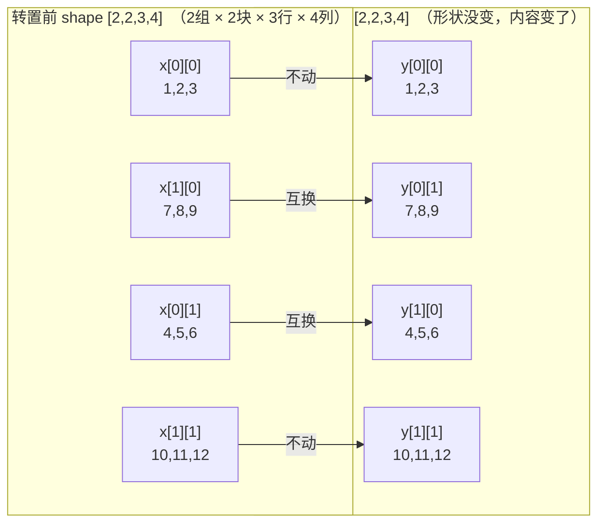

# 四维张量转置 `transpose_(1, 0)` 动态图解

## 目录

1. 预备知识：常用 API 速查
2. 热身：二维张量转置 `x.t()`（含 `t_()`）
3. 转置前：形状 `[2, 2, 3, 4]`
4. `x.shape` 是什么、组/块/行/列怎么区分？
5. 动态图：块如何互换位置
6. `x.transpose_(1, 0)` 做了什么
7. 按块看坐标映射
8. 实际运行结果
9. 要点小结
10. 延伸：块内部转置 —— `transpose(2, 3)`
11. 为什么会有"交换维度"这种操作？
12. `transpose_` 与 `transpose`：下划线 in-place 的区别，参数顺序是否敏感
13. 转置后 `is_contiguous()` 是 `True` 还是 `False`？为什么？`contiguous()` 工作中怎么用？

## 1. 预备知识：常用 API 速查

本文档后面全篇都会用到这几个 API，先统一说清楚"谁是张量的方法、谁是创建张量的函数"：

| API | 类型 | 作用 |
|---|---|---|
| `x.shape` / `x.size()` | **张量属性/实例方法** | 返回 `torch.Size`（tuple），列出每个维度的元素个数 |
| `x.dim()` / `x.ndim` | **张量实例方法/属性** | 返回维度总数（比如4维张量返回 `4`） |
| `x.numel()` | **张量实例方法** | 返回张量元素总个数（所有维度 size 的乘积） |
| `x.stride()` | **张量实例方法** | 查询每个维度"跨到下一个下标要跳过多少个内存单元"，纯 metadata 查询，不碰数据，跟 `x.shape` 是同一类东西 |
| `x.transpose(dim0, dim1)` / `x.transpose_(dim0, dim1)` | **张量实例方法** | **交换指定的两个维度，`dim0`/`dim1` 只是"第几个维度"的位置编号（从0开始计数，也可以用 `-1`/`-2` 从后往前数），跟"行、列"没有必然关系** |
| `x.data_ptr()` | **张量实例方法** | 返回底层存储的内存地址（整数），常用来判断两个张量是否共享同一块内存 |
| `torch.arange(...)` | **工厂函数**（`torch.` 命名空间下，不依附于已有张量） | 生成一个**新的一维张量**，元素是等差数列，类似 Python 内置 `range()`，但返回 Tensor |
| `torch.rand(...)` / `torch.randn(...)` | **工厂函数** | 生成指定 shape 的新张量，元素分别是 `[0,1)` 均匀分布 / 标准正态分布随机数 |
| `torch.randint(low, high, size)` | **工厂函数** | 生成指定 shape 的**整数**随机张量，取值范围 `[low, high)`；`size` **必须显式传一个 tuple**，不能像 `rand(2,3)` 那样直接传散装的整数 |
| `x.clone()` | **张量实例方法** | 拷贝出一份**独立的新张量**（新内存，不共享 `data_ptr`），常用于"想测试原地操作但不想破坏原变量"的场景 |
| `x.view(new_shape)` | **张量实例方法** | 不挪动、不拷贝数据，只是换一种 shape/stride 去"解释"同一块内存，返回的新张量与原张量共享底层存储；**要求原张量必须连续**，否则报错 |
| `x.reshape(new_shape)` | **张量实例方法** | 跟 `view()` 目的相同（换个形状看数据），但更"宽松"：原张量连续时行为等同于 `view()`（共享内存，不拷贝）；不连续时**自动 `.contiguous()` 拷贝一份再变形**，不会报错 |
| `x.squeeze(dim)` / `x.unsqueeze(dim)` | **张量实例方法** | `squeeze` 删掉指定维度上 size 为 1 的维度；`unsqueeze` 在指定位置插入一个 size 为 1 的新维度 |
| `torch.equal(a, b)` | **工厂函数** | 比较两个张量的 shape 和每个元素的值是否完全相同，返回 Python `bool` |

**`shape` / `size()` / `dim()` / `numel()`——查形状/维度数/元素总数：**

```python
x = torch.arange(24).reshape(2, 3, 4)
x.shape        # torch.Size([2, 3, 4])，x.size() 结果完全一样
x.dim()        # 3，也可以写 x.ndim（属性写法）
x.numel()      # 24，即 2*3*4，所有维度 size 的乘积
```

**`data_ptr()`——查底层内存地址，本文档大量用它验证"是否共享内存"：**

```python
x = torch.arange(6).reshape(2, 3)
y = x.transpose(0, 1)
y.data_ptr() == x.data_ptr()   # True，transpose 只是 view，共享同一块内存
z = x.clone()
z.data_ptr() == x.data_ptr()   # False，clone 拷贝出了一份新内存
```

**`torch.rand(...)` / `torch.randn(...)`——快速生成随机张量：**

```python
torch.rand(2, 3)     # [0,1) 均匀分布
torch.randn(2, 3)    # 标准正态分布（均值0，方差1）
```

**`torch.randint(low, high, size)`——整数随机张量，`size` 必须是个 tuple：**

`rand`/`randn` 可以直接传散装的整数（`rand(2, 3)`），但 `randint` 的第三个参数 `size` **必须显式传一个 tuple**——这里藏着两个容易踩的坑：

**坑① `size` 元组的"长度"决定维度数，元组里的"值"决定每一维的元素个数**，这是硬性定义（不是习惯），所有张量库都一样：

```python
torch.randint(0, 10, (1,))     # 元组长度=1 -> 1维；这一维size=1 -> 只有1个元素
torch.randint(0, 10, (5,))     # 元组长度=1 -> 仍然是1维；这一维size=5 -> 1维张量里有5个元素
torch.randint(0, 10, (1, 1))   # 元组长度=2 -> 2维；每一维size都是1 -> 总共1个元素，但形状是2维的
torch.randint(0, 10, (2, 3))   # 元组长度=2 -> 2维；size分别是2和3 -> 一共6个元素
```

`dim()`/`numel()` 实测验证：

```python
a = torch.randint(0, 10, (1,))
c = torch.randint(0, 10, (1, 1))
a.dim(), a.numel()   # 1, 1
c.dim(), c.numel()   # 2, 1   <- 元素总数和 a 一样，但维度数不同，因为元组长度不同
```

**坑② Python 里 `(1)` 根本不是元组，只是整数 `1`**——元组靠**逗号**判断，不是靠括号，少写一个逗号会直接报错：

```python
torch.randint(0, 10, (1))    # (1) 是 int 不是 tuple -> 报错：
# got (int, int, int), but expected ... tuple of ints size ...

torch.randint(0, 10, (1,))   # (1,) 才是真正的单元素 tuple -> 正确
```

以上两条是**硬性规则**（数学定义、Python 语法本身），跟"约定俗成"（比如 batch 维放前面还是后面、内存 row-major 排布）不是一回事——规则没有例外，约定可能因库、因场景而不同。

**`stride()`——查内存跨度：**

```python
x = torch.arange(12).reshape(3, 4)
x.stride()      # (4, 1)
# dim0(行)每往后走一步要跨过4个元素；dim1(列)每往后走一步跨过1个元素
x.stride(0)     # 4，也可以传 dim 参数只查某一维
```

第13节判断"是否连续"，本质就是拿 `x.stride()` 的实际值去对比"标准连续 stride 公式"算出来的期望值。

**`transpose(dim0, dim1)`——`dim0`/`dim1` 是纯位置编号，不是"行、列"：**

**维度的位置编号从 `0` 开始计数**：`x.shape` 的第1个数对应 `dim0`，第2个数对应 `dim1`，以此类推——`dim0` 不是"第0维"这个说法很奇怪，但确实是"排在最前面的那一维"，不是"第1维"（那是 `dim1`）。

**也可以用负数从后往前数**：`-1` 表示最后一维，`-2` 表示倒数第二维，以此类推，跟 Python 列表的负数下标是同一套规则。对一个 `ndim` 维的张量，`-1` 等价于 `ndim-1`，`-2` 等价于 `ndim-2`。比如10维张量的最后两维，既可以写 `transpose(8, 9)`，也可以写成更通用、不用管总维度数的 `transpose(-2, -1)`——第11.4节 `A @ B.transpose(-2, -1)` 用的就是这种写法。

```python
x = torch.randn(2, 3, 4, 5)      # dim0=2, dim1=3, dim2=4, dim3=5，语义随你定义
x.transpose(0, 1)                # 交换 dim0、dim1（这里语义上可能是"批量"和"分组"，跟行列无关）
```

只有在**二维**张量里，dim0、dim1 才恰好等于行、列（因为二维总共就这两个维度）；维度一多，"行、列"通常习惯性地放在**最后两维**（矩阵乘法 `matmul` 默认对最后两维做运算），要转置真正的"行列"要写 `x.transpose(-2, -1)`，而不是 `x.transpose(0, 1)`（第10节讲的 `transpose(2, 3)`、第11.4节的 `transpose(-2, -1)` 就是这个道理）。

一句话：**`transpose(dim0, dim1)` 只是个纯位置操作，你想交换哪两个维度就填哪两个数字，它不知道也不关心你把哪个维度当成"行"哪个当成"列"——"行、列"是你自己给某两个维度赋予的语义，通常习惯性地放在最后两维，但这只是约定俗成，不是语法强制。**

**`arange()`——造一串等差数列的张量，本文档大量测试代码用它来快速构造数据：**

```python
torch.arange(12)          # tensor([0, 1, ..., 11])，等价 range(0, 12)
torch.arange(2, 10, 2)    # tensor([2, 4, 6, 8])   start=2, end=10(不含), step=2
torch.arange(12).reshape(3, 4)   # 本文档到处用的写法：先造一串连续数字，再 reshape 成想要的形状
```

**`clone()`——拷贝出一份独立的新张量：**

```python
x = torch.arange(6).reshape(2, 3)
y = x.clone()
y.data_ptr() == x.data_ptr()   # False，不共享内存
y[0, 0] = 100
x[0, 0]                        # 0，y 改了不影响 x
```

本文档很多测试代码（比如第12节验证 `transpose_` 原地修改）都会先 `x.clone()` 一份再做原地操作，避免污染同一个变量、方便对比前后差异。

**`view()`——换个形状看同一块内存：**

```python
x = torch.arange(12)          # shape (12,)
y = x.view(3, 4)              # 同一块内存，换个形状去看
y.data_ptr() == x.data_ptr()  # True，共享内存
```

前提：`x` 必须是**连续**的（第13节的核心结论），否则报错，需要先 `.contiguous()` 或改用 `.reshape()`（自动兜底）。

**`reshape()`——`view()` 的"宽松版"：**

```python
x = torch.arange(12).reshape(3, 4)
y = x.transpose(0, 1)             # 不连续
y.view(-1)                        # 报错
# RuntimeError: view size is not compatible with input tensor's size and stride
#  (at least one dimension spans across two contiguous subspaces). Use .reshape(...) instead.

y.reshape(-1)                     # 不报错，内部自动 .contiguous() 拷贝一份再变形
```

`view()` 与 `reshape()` 的核心区别（第13节实测验证过）：

| | `view()` | `reshape()` |
|---|---|---|
| 张量不连续时 | **直接报错** | **自动拷贝一份再变形**，不报错 |
| 是否保证共享内存 | 保证共享（否则报错，不会静默拷贝） | **不保证**——连续时共享内存，不连续时会拷贝出新内存 |

一句话：`view` 严格要求原内存本来就能这么解释（不满足就报错），`reshape` 遇到不满足的情况会悄悄拷贝一份内存来兜底——更好用，但也更容易掩盖"这里其实发生了一次内存拷贝"这个事实。

**`squeeze()` / `unsqueeze()`——删掉/插入 size 为 1 的维度：**

```python
a = torch.zeros(2, 1, 3)
a.squeeze(1).shape      # torch.Size([2, 3])，把 size=1 的 dim1 删掉

b = torch.zeros(2, 3)
b.unsqueeze(1).shape    # torch.Size([2, 1, 3])，在 dim1 位置插入一个 size=1 的新维度
```

第13节讲过：size=1 的维度不影响 `is_contiguous()` 的判定，这也是为什么 `squeeze`/`unsqueeze`（只增删 size=1 的维度）几乎不会改变张量的连续性。

**`torch.equal(a, b)`——比较两个张量是否完全相同：**

```python
torch.equal(torch.tensor([1, 2, 3]), torch.tensor([1, 2, 3]))   # True
torch.equal(torch.tensor([1, 2, 3]), torch.tensor([1, 2, 4]))   # False
```

要求 shape 和每个元素的值都相同才返回 `True`，本文档验证 `transpose(0,1)` 与 `transpose(1,0)` 等价（第12.1节）就是靠它。

## 2. 热身：二维张量转置 `x.t()`

在看4维张量之前，先看最简单、最贴近"传统数学转置"的情形——二维张量（矩阵）。

```python
x = torch.tensor([[1, 1, 1, 1, 1],
                   [2, 2, 2, 2, 2],
                   [3, 3, 3, 3, 3]], dtype=torch.int32)
print(x)
y = x.t()
print(y)
```

`x.shape` 是 `[3, 5]`（3行5列）。`.t()` 是 PyTorch 专为二维张量提供的转置简写，效果等同于 `x.transpose(0, 1)`——交换第0维（行）和第1维（列），也就是最经典的矩阵转置 $y_{ji} = x_{ij}$：

```
转置前 x（3行5列）:          转置后 y = x.t()（5行3列）:
[1, 1, 1, 1, 1]              [1, 2, 3]
[2, 2, 2, 2, 2]   ----->     [1, 2, 3]
[3, 3, 3, 3, 3]              [1, 2, 3]
                              [1, 2, 3]
                              [1, 2, 3]
```

实测：

```python
x.shape            # torch.Size([3, 5])
y.shape            # torch.Size([5, 3])
torch.equal(y, x.transpose(0, 1))   # True，二维情形下 .t() 和 transpose(0,1) 完全等价
y.data_ptr() == x.data_ptr()        # True，共享同一块内存，只是view
y.is_contiguous()                   # False，转置后不再连续
```

**`.t()` 的局限：只能用在 ≤2 维的张量上。** 维度一高就不能用了：

```python
z = torch.rand(2, 2, 3, 4)
z.t()
# RuntimeError: t() expects a tensor with <= 2 dimensions, but self is 4D
```

原因很直观：二维张量只有"行、列"两个维度，转置的意思毫无歧义，可以省略参数直接调用 `.t()`；但到了3维、4维……张量有3个及以上的维度可选，"转置"必须明确说清楚"交换哪两个维度"，所以高维张量必须显式调用 `x.transpose(dim0, dim1)`，指定具体的两个轴——这正是下面4维例子里为什么要写 `x.transpose_(1, 0)` 而不能简单地写 `x.t()` 的原因。

**`.t()` 也有对应的 in-place 版本：`t_()`**，跟第12节讲的 `transpose_` / `transpose` 是同一套下划线命名约定：

```python
x = torch.tensor([[1, 1, 1, 1, 1],
                   [2, 2, 2, 2, 2],
                   [3, 3, 3, 3, 3]], dtype=torch.int32)
x.t_()               # 原地转置，直接修改 x 自身
print(x.is_contiguous())   # False
print(x)
```

```
tensor([[1, 2, 3],
        [1, 2, 3],
        [1, 2, 3],
        [1, 2, 3],
        [1, 2, 3]], dtype=torch.int32)
```

实测：`id(x)`、`x.data_ptr()` 在调用前后都不变——`t_()` 没有创建新对象，是直接把 `x` 自身的 shape 从 `[3, 5]` 改成了 `[5, 3]`。对比：`y = x.t()` 需要接收返回值、`x` 本身不变；`x.t_()` 不需要接收返回值，`x` 自己就被改了。

## 3. 转置前：形状 `[2, 2, 3, 4]`

这是一个 4 维张量，可以理解为 **2 个"组"，每组有 2 个"块"，每块是一个 3×4 的小矩阵**：

```
维度含义:   dim0(组)  dim1(块)  dim2(行)  dim3(列)

组 x[0]：
    块 x[0][0]:  [1,1,1,1]   块 x[0][1]:  [4,4,4,4]
                 [2,2,2,2]                [5,5,5,5]
                 [3,3,3,3]                [6,6,6,6]

组 x[1]：
    块 x[1][0]:  [7,7,7,7]   块 x[1][1]:  [10,10,10,10]
                 [8,8,8,8]                [11,11,11,11]
                 [9,9,9,9]                [12,12,12,12]
```

## 4. `x.shape` 是什么、组/块/行/列怎么区分？

`x.shape`（等价于 `x.size()`）返回一个 `torch.Size`（本质是个 tuple），按 `dim0, dim1, dim2, ...` 的顺序列出**每一维有多少个元素**：

```python
x.shape    # torch.Size([2, 2, 3, 4])
            #              ↑  ↑  ↑  ↑
            #            dim0 dim1 dim2 dim3
            #             组   块   行   列
```

**关键点：`shape` 只汇报"每一维有几个元素"，不会告诉你"这一维代表什么意思"。** "组、块、行、列"这几个名字是人为起的，只是按维度的先后顺序、方便讲解用的说法，PyTorch 本身只认 `dim0, dim1, dim2, dim3`。

**怎么区分——看下标的位置。** 访问元素写 `x[a][b][c][d]`，四层下标对应四个维度：

```python
x[a][b][c][d]
  ↑   ↑   ↑   ↑
 dim0 dim1 dim2 dim3
（第几组）（组内第几块）（块内第几行）（行内第几个数）
```

**结合"中括号层数"看：**

```
x = [                                          <- 最外层 [：dim0，2个元素 -> "组"
      [                                        <- 第2层 [：dim1，每组2个元素 -> "块"
        [ [1,1,1,1], [2,2,2,2], [3,3,3,3] ],   <- 第3层 [：dim2，每块3个元素 -> "行"
        [ [4,4,4,4], [5,5,5,5], [6,6,6,6] ]    <- 最内层 [1,1,1,1] 里4个数：dim3，4个元素 -> "列"
      ],
      [
        [ [7,7,7,7], [8,8,8,8], [9,9,9,9] ],
        [ [10,...], [11,...], [12,...] ]
      ]
    ]
```

从外到内数中括号：第1层包了几个东西 → dim0（组数）；第2层 → dim1（每组几块）；第3层 → dim2（每块几行）；第4层（最内层）→ dim3（每行几列）。同样，这四个维度到了实际场景里可能被叫作别的名字，比如 `[batch, num_heads, seq_len, head_dim]`（见 [第11节](#11-为什么会有交换维度这种操作)）。

## 5. 动态图：块如何互换位置


由于本例 `dim0`（组）和 `dim1`（块）大小都是 2，四个"块"（每块都是一个完整的 3×4 小矩阵）可以看成排成一个 **2×2 的"元矩阵"**：

```
元矩阵 =  [ x[0][0](1,2,3)   x[0][1](4,5,6)  ]
          [ x[1][0](7,8,9)   x[1][1](10,11,12) ]
```

动态图演示的就是这个 2×2 元矩阵做转置：**对角线上的两个块（`x[0][0]` 和 `x[1][1]`）原地不动**，**非对角线的两个块（`x[0][1]` 和 `x[1][0]`）互换位置**（动图里分别走左、右两侧绕过去，避免两个块直接穿模重叠）。

## 6. `x.transpose_(1, 0)` 做了什么

`transpose_(dim0, dim1)` 交换**指定的两个维度**，原地修改 `x`。这里 `transpose_(1, 0)` 交换的是 **dim1（块）和 dim0（组）**，`dim2`（行）、`dim3`（列）完全不动。

规则：新张量 `y` 满足 `y[b][a] = x[a][b]`（把"组下标 a"和"块下标 b"互换位置，`[c][d]` 保持原样）。

**"第一个块" `x[0][0]` 是怎么变换的？** 代入规则：当 `a=0, b=0` 时，`y[0][0] = x[0][0]`——下标互换后还是 `[0][0]`，位置没变！所以 `x[0][0]`（值 `1,2,3`）转置后还是待在 `y[0][0]` 位置，内容原封不动。同理 `x[1][1]` 也在 `y[1][1]`，没动。真正换了位置的，是 `a≠b` 的两个块：`x[0][1]`（4,5,6）跑到了 `y[1][0]`，`x[1][0]`（7,8,9）跑到了 `y[0][1]`。



**核心变化**：对角线（`a=b`）上的块位置不变；非对角线（`a≠b`）上的两个块互换位置。块内部（行、列）的内容完全没动。

## 7. 按块看坐标映射

由于 `dim2`（行）、`dim3`（列）完全不受影响，只需要看"块"这一级怎么变，就能推出所有元素的变化：

| 转置前 (a,b) 块 | 块内容（3×4，每行重复4次） | 转置后位置 |
|---|---|---|
| x[0][0] | 行: 1, 2, 3 | y[0][0]（不变） |
| x[0][1] | 行: 4, 5, 6 | y[1][0] |
| x[1][0] | 行: 7, 8, 9 | y[0][1] |
| x[1][1] | 行: 10, 11, 12 | y[1][1]（不变） |

比如具体到单个元素：`x[0][1][2][3]`（值为 `6`，第0组、第1块、第2行、第3列）转置后坐标变成 `y[1][0][2][3]`——`a,b` 互换成了 `b,a`，`c=2, d=3` 原样保留，值还是 `6`。

## 8. 实际运行结果

```
tensor([[[[ 1,  1,  1,  1],
          [ 2,  2,  2,  2],
          [ 3,  3,  3,  3]],

         [[ 4,  4,  4,  4],
          [ 5,  5,  5,  5],
          [ 6,  6,  6,  6]]],


        [[[ 7,  7,  7,  7],
          [ 8,  8,  8,  8],
          [ 9,  9,  9,  9]],

         [[10, 10, 10, 10],
          [11, 11, 11, 11],
          [12, 12, 12, 12]]]], dtype=torch.int32)
---------------------------------------------------------------
tensor([[[[ 1,  1,  1,  1],
          [ 2,  2,  2,  2],
          [ 3,  3,  3,  3]],

         [[ 7,  7,  7,  7],
          [ 8,  8,  8,  8],
          [ 9,  9,  9,  9]]],


        [[[ 4,  4,  4,  4],
          [ 5,  5,  5,  5],
          [ 6,  6,  6,  6]],

         [[10, 10, 10, 10],
          [11, 11, 11, 11],
          [12, 12, 12, 12]]]], dtype=torch.int32)
```

## 9. 要点小结

- `transpose_(dim0, dim1)` 是 **原地操作**（下划线后缀 `_`），直接修改 `x` 本身，不返回新对象。
- 只交换指定的两个维度，其余维度（这里是第2维/行、第3维/列）保持不变。
- **本例的特殊之处**：`dim0` 和 `dim1` 大小都是 2，所以 `x.shape` 转置前后都是 `[2, 2, 3, 4]`——**形状没变，但内容变了**（对角线块不动，非对角线块互换）。如果两个维度大小不同（比如把某一维换成大小为 3 的维），转置后 `shape` 本身也会跟着变，比如 `[2,3,4,5]` 交换 `dim0,dim1` 会变成 `[3,2,4,5]`。
- 如果只想拿到转置结果而不改变原张量，用不带下划线的 `x.transpose(1, 0)`（返回新张量，与原张量共享内存）。
- 转置后 `x.is_contiguous()` 会变成 `False`（内存不再连续），如果后续要 `.view()`，需要先 `.contiguous()`。

## 10. 延伸：块内部转置 —— `transpose(2, 3)`

前面 `transpose(0, 1)` 交换的是 **组和块**，块本身（3×4 的内容）原封不动地整体搬家。同样的思路，交换 **行(dim2) 和 列(dim3)**，组、块的位置不动，但每个块内部会做一次普通的二维矩阵转置：

```python
y = x.transpose(2, 3)   # 交换 行 和 列，组、块不变
```

以 `x[0][0]`（3×4）为例：

```
原始 x[0][0]（3行4列）：        transpose(2,3) 后（4行3列）：
[1, 1, 1, 1]                   [1, 2, 3]
[2, 2, 2, 2]        ----->     [1, 2, 3]
[3, 3, 3, 3]                   [1, 2, 3]
                                [1, 2, 3]
```

因为原来每一行本身就是常数（同一行4个数相同），转置后每一列也就变成了常数——新的每一行都是 `[1, 2, 3]`。

两种交换方式对比：

| 交换的维度 | 效果 | 谁保持不变 |
|---|---|---|
| `transpose(0, 1)`（组↔块） | 整块（3×4）在"组-块"这张 2×2 元矩阵里换位置，相当于把 2×2 元矩阵做转置 | 块内部（行、列）内容不变 |
| `transpose(2, 3)`（行↔列） | 每个块内部做普通二维矩阵转置 | 组、块的位置不变 |

## 11. 为什么会有"交换维度"这种操作？

单看这个例子，转置像是在"重新摆放数字"，看不出实际意义。但在真实深度学习代码里，`transpose`/`permute` 几乎是必用操作，原因是：**同一份数据，不同的库、不同的层，要求的"维度顺序约定"不一样**，张量本身不会变，但要让下一步计算认得这个顺序，就必须交换维度。常见场景：

### 11.1 batch 维和序列维互换（RNN / Transformer）
PyTorch 的 `nn.RNN`、`nn.LSTM` 默认要求输入形状是 `[seq_len, batch, feature]`（`batch_first=False`），但我们从 `DataLoader` 拿到的数据一般是 `[batch, seq_len, feature]`。于是喂进 RNN 之前要转置：
```python
x = x.transpose(0, 1)   # [batch, seq, feature] -> [seq, batch, feature]
```

### 11.2 图像通道顺序：NCHW ↔ NHWC
PyTorch 卷积层默认吃 `[batch, channel, height, width]`（NCHW），但图片文件、部分硬件/框架习惯 `[batch, height, width, channel]`（NHWC）。跨框架转模型或对接图像库时要做：
```python
x = x.permute(0, 2, 3, 1)   # NCHW -> NHWC
```

### 11.3 多头注意力（Multi-Head Attention）
本教程的例子形状是 `[2, 2, 3, 4]`，正好可以对应到多头注意力里常见的 `[batch, num_heads, seq_len, head_dim]`（2条样本、2个头、3个时间步、每个头4维）。如果某个中间结果拿到手时形状是 `[num_heads, batch, seq_len, head_dim]`（`num_heads` 和 `batch` 顺序反了），就需要：
```python
x = x.transpose(1, 0)   # [num_heads, batch, ...] -> [batch, num_heads, ...]
```
这正是本例 `transpose_(1, 0)` 对应的真实场景：把维护成对的两个维度（这里是"组"对应 `num_heads`，"块"对应 `batch`）位置换过来，`seq_len`、`head_dim` 这两维（对应例子里的"行""列"）保持不动。

### 11.4 矩阵乘法/线性代数的形状对齐
比如要计算 `A @ Bᵀ`（常见于相似度矩阵、注意力打分），必须先把 `B` 转置成"内维对齐"的形状，`matmul` 才能算：
```python
scores = A @ B.transpose(-2, -1)
```

一句话总结：**转置本身不改变数据的值，只改变"按哪个维度去切片/理解"这些数据，是用来适配不同 API、不同硬件、不同计算方式对形状的约定的。**

## 12. `transpose_` 与 `transpose`：下划线 in-place 的区别，参数顺序是否敏感

两者交换维度的逻辑完全一样，唯一的区别是**有没有下划线后缀**——这是 PyTorch 的通用命名约定：**带下划线 `_` 的方法是 in-place（原地）操作，不带下划线的方法返回新对象**。

| | `x.transpose(0, 1)`（无下划线） | `x.transpose_(0, 1)`（有下划线） |
|---|---|---|
| `x` 自身是否改变 | **不变**，`x` 还是原来的 shape | **直接被修改**，`x` 的 shape 变了 |
| 返回值 | 一个**新的 Tensor 对象** | 就是 `x` 自己 |
| 返回值和 `x` 是否是同一对象（`is`） | `False` | `True` |
| 是否共享底层存储（`data_ptr`） | 是（只是 view，没拷贝数据） | 是（本来就是同一个对象） |
| 用法 | 必须接收返回值：`y = x.transpose(0, 1)`，否则原变量没变 | 不需要接收返回值，`x.transpose_(0, 1)` 这一行执行完 `x` 就已经变了 |

**实测验证：**

```python
import torch

x = torch.arange(6).reshape(2, 3)

x1 = x.clone()
y = x1.transpose(0, 1)          # 非 in-place
print(x1.shape, y.shape, x1 is y, x1.data_ptr() == y.data_ptr())
# torch.Size([2, 3]) torch.Size([3, 2]) False True
#   ↑ x1 没变            ↑ y 是新形状       ↑ 不是同一对象   ↑ 但共享内存

x2 = x.clone()
z = x2.transpose_(0, 1)         # in-place
print(x2.shape, z.shape, x2 is z)
# torch.Size([3, 2]) torch.Size([3, 2]) True
#   ↑ x2 自己变了                          ↑ 返回值就是 x2 本身
```

结论：
- **两者对底层数据的处理完全相同**——都不拷贝数据，都只是修改 shape/stride 元数据，转置后都是非连续张量（`is_contiguous()` 为 `False`）。
- **区别只在于"改完之后往哪写"**：`transpose` 把修改结果包成一个新对象返回，原对象不动；`transpose_` 把修改直接写回原对象本身。
- 本文档第6节的 `x.transpose_(1, 0)` 之所以能"原地"生效、后面直接 `print(x)` 就能看到变化，正是因为用了带下划线的版本；如果写成 `x.transpose(1, 0)` 而不接收返回值，`x` 会保持原样不变。

### 12.1 补充：`transpose_(0, 1)` 与 `transpose_(1, 0)`——参数顺序有区别吗？

**没有区别，两者完全等价**，无论张量是多少维、也不管带不带下划线。

原因：`transpose(dim0, dim1)` 做的是"交换第 `dim0` 和第 `dim1` 这两个轴"，这个操作本身是**对称的**——"交换 A 和 B" 跟 "交换 B 和 A" 是同一件事，就像"交换第2列和第3列"和"交换第3列和第2列"是同一个操作一样。函数内部只是把这两个位置的 shape 和 stride 互换，跟传参的先后顺序无关。

```python
x = torch.randn(2, 3, 4, 5)
a = x.transpose(0, 1)
b = x.transpose(1, 0)
torch.equal(a, b)      # True
a.shape == b.shape     # True，都是 (3, 2, 4, 5)
```

这也是为什么本文档第6节写的是 `x.transpose_(1, 0)`，而不是 `x.transpose_(0, 1)`——两种写法对本例效果完全一样，选哪个纯粹是习惯问题。

**注意区分**：这跟 `permute` 不同——`permute(dims...)` 是一次性重排全部维度，参数顺序是敏感的（`permute(1, 0, 2)` 和 `permute(0, 1, 2)` 结果不同），不能套用"顺序无关"这个结论。

## 13. 转置后 `is_contiguous()` 是 `True` 还是 `False`？为什么？`contiguous()` 工作中怎么用？

### 13.1 结论

**绝大多数情况下转置后是 `False`**，但也有例外——不是"转置=必然变 False"这么绝对，要看 stride 具体怎么变。

### 13.2 什么是"连续"（contiguous）

一个张量是"连续"的，指它底层一维内存的排列顺序，和"按 `shape` 从左到右、逐个下标递增遍历元素"的顺序完全一致（也就是标准的 C / row-major 顺序）。用公式讲：对 shape 为 `(s0, s1, ..., sn-1)` 的张量，**"标准连续 stride"** 应该是：

```
stride[n-1] = 1
stride[i]   = stride[i+1] * s[i+1]      （从最后一维往前推）
```

比如 `x = torch.arange(12).reshape(3, 4)`，标准连续 stride 应为 `(4, 1)`——实测确实如此，`x.is_contiguous()` 为 `True`。

### 13.3 为什么转置后通常变 `False`

`transpose(dim0, dim1)` **只交换 `stride` 里对应的两个数字，不搬动任何数据、也不重新计算标准 stride**。所以转置后的 stride 大概率不再满足上面那个"从后往前递增"的标准公式，于是 `is_contiguous()` 返回 `False`。

实测（2维和方阵）：

```python
x = torch.arange(12).reshape(3, 4)
print(x.stride())              # (4, 1)   标准连续
y = x.transpose(0, 1)
print(y.shape, y.stride())     # torch.Size([4, 3])  (1, 4)   不再是标准连续 stride
print(y.is_contiguous())       # False

# 方阵也一样，形状没变，但 stride 变了
x = torch.arange(9).reshape(3, 3)
y = x.transpose(0, 1)
print(y.stride(), y.is_contiguous())   # (1, 3)  False
```

道理很直观：转置前，`dim0` 每往后走一步要跨 `stride[0]` 个内存单元，`dim1` 每往后走一步跨 `stride[1]` 个；交换维度后，新的 `dim0` 用的是旧的 `stride[1]`、新的 `dim1` 用的是旧的 `stride[0]`——但内存里的数据一个字节都没挪动，所以"下标顺序"和"内存顺序"就此错位，不再连续。**这跟维度数无关**：不管是2维、4维还是10维张量，只要交换的两个维度各自的 size 都大于1，转置后几乎必然是 `False`。

### 13.4 例外：这几种情况转置后仍是 `True`

**① 自己转自己 `transpose(i, i)`**：no-op，stride 没变，自然还是连续的。

```python
x = torch.arange(12).reshape(3, 4)
y = x.transpose(0, 0)
print(y.stride(), y.is_contiguous())   # (4, 1)  True
```

**② 被交换的维度中有一维 size 为 1**：PyTorch 判断连续性时，size 为 1 的维度的 stride 是"无所谓"的（反正这一维只有一个元素，不管 stride 是几，都不影响内存遍历顺序），所以哪怕这个 stride 数值上和标准公式不符，也不会被判定为不连续。

```python
x = torch.arange(5).reshape(1, 5)
y = x.transpose(0, 1)
print(y.shape, y.stride(), y.is_contiguous())
# torch.Size([5, 1])  (1, 5)  True   <- 按标准公式该维stride该是1却是5，但因为该维size=1，不影响判定

# 4维同理：只要交换的其中一维 size=1，也可能仍是连续的
x = torch.randn(2, 1, 3, 4)
y = x.transpose(0, 1)
print(y.shape, y.stride(), y.is_contiguous())
# torch.Size([1, 2, 3, 4])  (12, 12, 4, 1)  True
```

**③ 转置两次（换回原状）**：两次 `transpose(0,1)` 等于把 stride 换回去了，自然又变回连续。

```python
y = torch.arange(12).reshape(3, 4).transpose(0, 1).transpose(0, 1)
print(y.stride(), y.is_contiguous())   # (4, 1)  True
```

**小结**：转置后是否连续，本质上只取决于"交换维度后的 stride 是否还符合标准连续公式"，size=1 的维度和 no-op 转置是最常见的两个"意外仍连续"的例外，跟张量维度数本身没有直接关系。

### 13.5 工作中 `x.contiguous()` 怎么用

**用途一：把非连续张量"物理拷贝"成连续内存**，供必须要求连续内存的操作使用：

```python
x = torch.arange(12).reshape(3, 4)
y = x.transpose(0, 1)          # is_contiguous() = False
y.view(-1)                     # 报错！
# RuntimeError: view size is not compatible with input tensor's size and stride
#  (at least one dimension spans across two contiguous subspaces). Use .reshape(...) instead.

z = y.contiguous()             # 先物理拷贝成连续内存
z.view(-1)                     # OK
```

原因：`.view()` 只改 shape 元数据、不挪数据，要求原内存本来就是"能这么解释"的连续布局；转置后的 `y` 内存不连续，`view` 没法在不挪数据的前提下满足新 shape，所以直接报错，提示你用 `.reshape()` 或先 `.contiguous()`。

**用途二：`reshape()` 遇到非连续张量时会自动帮你做这件事**，不需要手动调用：

```python
r = y.reshape(-1)              # 内部自动检测到不连续，自动拷贝
print(r.data_ptr() == y.data_ptr())   # False，说明确实拷贝了一份新内存
```

所以工程上很多人图省事直接全用 `.reshape()` 而不是 `.view()`，靠它自动兜底；但 `.view()` 更能显式暴露"这里必须是连续的"这个约束，出问题时报错也更早、更明确，规模较大的项目里 `.view()` + 显式 `.contiguous()` 反而更利于排查内存拷贝发生的位置。

**用途三：`contiguous()` 本身是"按需拷贝"，已连续时是零成本 no-op**：

```python
z = y.contiguous()              # y 不连续 -> 真正发生一次内存拷贝，data_ptr 变了
w = z.contiguous()               # z 已连续 -> 直接返回 z 自己，不拷贝
print(w.data_ptr() == z.data_ptr(), w is z)   # True True
```

所以实践中可以**放心地"防御性"调用 `.contiguous()`**——如果张量已经连续，这行代码几乎不产生任何开销（不拷贝、不分配新内存）；只有真的不连续时才会付出一次拷贝的代价。

**真实场景（承接第11节的多头注意力例子）**：`transpose`/`permute` 之后紧跟着 `.contiguous()` 再 `.view()`，是 Transformer 类代码里的高频写法：

```python
# x: [batch, num_heads, seq_len, head_dim]
x = x.transpose(1, 2)                  # -> [batch, seq_len, num_heads, head_dim]，此时不连续
x = x.contiguous().view(batch, seq_len, num_heads * head_dim)  # 合并最后两维，必须先连续
```

如果省略 `.contiguous()` 直接 `.view()`，会因为转置后内存不连续而直接报错；这也是为什么本文档第2、9节反复强调"转置后 `is_contiguous()` 变 `False`，后续要 `.view()` 必须先 `.contiguous()`"的实际落地场景。
