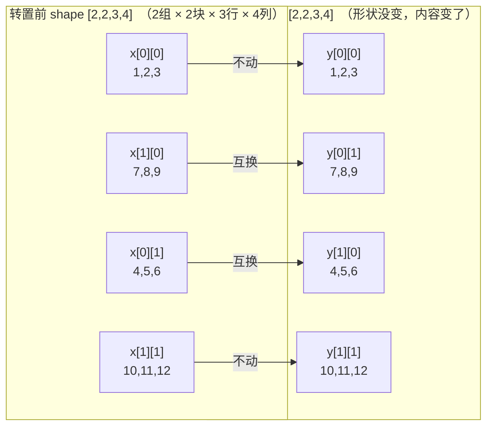

# 四维张量转置 `transpose_(1, 0)` 动态图解

对应代码：

```python
x = torch.tensor([
    [
        [
            [1, 1, 1, 1],
            [2, 2, 2, 2],
            [3, 3, 3, 3]
        ],
        [
            [4, 4, 4, 4],
            [5, 5, 5, 5],
            [6, 6, 6, 6]
        ]
    ],
    [
        [
            [7, 7, 7, 7],
            [8, 8, 8, 8],
            [9, 9, 9, 9]
        ],
        [
            [10, 10, 10, 10],
            [11, 11, 11, 11],
            [12, 12, 12, 12]
        ]
    ]], dtype=torch.int32)
print(x)
print('---------------------------------------------------------------')
x.transpose_(1, 0)
print(x)
```

## 1. 转置前：形状 `[2, 2, 3, 4]`

这是一个 4 维张量，可以理解为 **2 个"组"，每组有 2 个"块"，每块是一个 3×4 的小矩阵**：

```
维度含义:   dim0(组)  dim1(块)  dim2(行)  dim3(列)

组 x[0]：
    块 x[0][0]:  [1,1,1,1]   块 x[0][1]:  [4,4,4,4]
                 [2,2,2,2]                [5,5,5,5]
                 [3,3,3,3]                [6,6,6,6]

组 x[1]：
    块 x[1][0]:  [7,7,7,7]   块 x[1][1]:  [10,10,10,10]
                 [8,8,8,8]                [11,11,11,11]
                 [9,9,9,9]                [12,12,12,12]
```

## 2. `x.shape` 是什么、组/块/行/列怎么区分？

`x.shape`（等价于 `x.size()`）返回一个 `torch.Size`（本质是个 tuple），按 `dim0, dim1, dim2, ...` 的顺序列出**每一维有多少个元素**：

```python
x.shape    # torch.Size([2, 2, 3, 4])
            #              ↑  ↑  ↑  ↑
            #            dim0 dim1 dim2 dim3
            #             组   块   行   列
```

**关键点：`shape` 只汇报"每一维有几个元素"，不会告诉你"这一维代表什么意思"。** "组、块、行、列"这几个名字是人为起的，只是按维度的先后顺序、方便讲解用的说法，PyTorch 本身只认 `dim0, dim1, dim2, dim3`。

**怎么区分——看下标的位置。** 访问元素写 `x[a][b][c][d]`，四层下标对应四个维度：

```python
x[a][b][c][d]
  ↑   ↑   ↑   ↑
 dim0 dim1 dim2 dim3
（第几组）（组内第几块）（块内第几行）（行内第几个数）
```

**结合"中括号层数"看：**

```
x = [                                          <- 最外层 [：dim0，2个元素 -> "组"
      [                                        <- 第2层 [：dim1，每组2个元素 -> "块"
        [ [1,1,1,1], [2,2,2,2], [3,3,3,3] ],   <- 第3层 [：dim2，每块3个元素 -> "行"
        [ [4,4,4,4], [5,5,5,5], [6,6,6,6] ]    <- 最内层 [1,1,1,1] 里4个数：dim3，4个元素 -> "列"
      ],
      [
        [ [7,7,7,7], [8,8,8,8], [9,9,9,9] ],
        [ [10,...], [11,...], [12,...] ]
      ]
    ]
```

从外到内数中括号：第1层包了几个东西 → dim0（组数）；第2层 → dim1（每组几块）；第3层 → dim2（每块几行）；第4层（最内层）→ dim3（每行几列）。同样，这四个维度到了实际场景里可能被叫作别的名字，比如 `[batch, num_heads, seq_len, head_dim]`（见 [第9节](#9-为什么会有交换维度这种操作)）。

## 3. 动态图：块如何互换位置


由于本例 `dim0`（组）和 `dim1`（块）大小都是 2，四个"块"（每块都是一个完整的 3×4 小矩阵）可以看成排成一个 **2×2 的"元矩阵"**：

```
元矩阵 =  [ x[0][0](1,2,3)   x[0][1](4,5,6)  ]
          [ x[1][0](7,8,9)   x[1][1](10,11,12) ]
```

动态图演示的就是这个 2×2 元矩阵做转置：**对角线上的两个块（`x[0][0]` 和 `x[1][1]`）原地不动**，**非对角线的两个块（`x[0][1]` 和 `x[1][0]`）互换位置**（动图里分别走左、右两侧绕过去，避免两个块直接穿模重叠）。

## 4. `x.transpose_(1, 0)` 做了什么

`transpose_(dim0, dim1)` 交换**指定的两个维度**，原地修改 `x`。这里 `transpose_(1, 0)` 交换的是 **dim1（块）和 dim0（组）**，`dim2`（行）、`dim3`（列）完全不动。

规则：新张量 `y` 满足 `y[b][a] = x[a][b]`（把"组下标 a"和"块下标 b"互换位置，`[c][d]` 保持原样）。

**"第一个块" `x[0][0]` 是怎么变换的？** 代入规则：当 `a=0, b=0` 时，`y[0][0] = x[0][0]`——下标互换后还是 `[0][0]`，位置没变！所以 `x[0][0]`（值 `1,2,3`）转置后还是待在 `y[0][0]` 位置，内容原封不动。同理 `x[1][1]` 也在 `y[1][1]`，没动。真正换了位置的，是 `a≠b` 的两个块：`x[0][1]`（4,5,6）跑到了 `y[1][0]`，`x[1][0]`（7,8,9）跑到了 `y[0][1]`。



**核心变化**：对角线（`a=b`）上的块位置不变；非对角线（`a≠b`）上的两个块互换位置。块内部（行、列）的内容完全没动。

## 5. 按块看坐标映射

由于 `dim2`（行）、`dim3`（列）完全不受影响，只需要看"块"这一级怎么变，就能推出所有元素的变化：

| 转置前 (a,b) 块 | 块内容（3×4，每行重复4次） | 转置后位置 |
|---|---|---|
| x[0][0] | 行: 1, 2, 3 | y[0][0]（不变） |
| x[0][1] | 行: 4, 5, 6 | y[1][0] |
| x[1][0] | 行: 7, 8, 9 | y[0][1] |
| x[1][1] | 行: 10, 11, 12 | y[1][1]（不变） |

比如具体到单个元素：`x[0][1][2][3]`（值为 `6`，第0组、第1块、第2行、第3列）转置后坐标变成 `y[1][0][2][3]`——`a,b` 互换成了 `b,a`，`c=2, d=3` 原样保留，值还是 `6`。

## 6. 实际运行结果

```
tensor([[[[ 1,  1,  1,  1],
          [ 2,  2,  2,  2],
          [ 3,  3,  3,  3]],

         [[ 4,  4,  4,  4],
          [ 5,  5,  5,  5],
          [ 6,  6,  6,  6]]],


        [[[ 7,  7,  7,  7],
          [ 8,  8,  8,  8],
          [ 9,  9,  9,  9]],

         [[10, 10, 10, 10],
          [11, 11, 11, 11],
          [12, 12, 12, 12]]]], dtype=torch.int32)
---------------------------------------------------------------
tensor([[[[ 1,  1,  1,  1],
          [ 2,  2,  2,  2],
          [ 3,  3,  3,  3]],

         [[ 7,  7,  7,  7],
          [ 8,  8,  8,  8],
          [ 9,  9,  9,  9]]],


        [[[ 4,  4,  4,  4],
          [ 5,  5,  5,  5],
          [ 6,  6,  6,  6]],

         [[10, 10, 10, 10],
          [11, 11, 11, 11],
          [12, 12, 12, 12]]]], dtype=torch.int32)
```

## 7. 要点小结

- `transpose_(dim0, dim1)` 是 **原地操作**（下划线后缀 `_`），直接修改 `x` 本身，不返回新对象。
- 只交换指定的两个维度，其余维度（这里是第2维/行、第3维/列）保持不变。
- **本例的特殊之处**：`dim0` 和 `dim1` 大小都是 2，所以 `x.shape` 转置前后都是 `[2, 2, 3, 4]`——**形状没变，但内容变了**（对角线块不动，非对角线块互换）。如果两个维度大小不同（比如把某一维换成大小为 3 的维），转置后 `shape` 本身也会跟着变，比如 `[2,3,4,5]` 交换 `dim0,dim1` 会变成 `[3,2,4,5]`。
- 如果只想拿到转置结果而不改变原张量，用不带下划线的 `x.transpose(1, 0)`（返回新张量，与原张量共享内存）。
- 转置后 `x.is_contiguous()` 会变成 `False`（内存不再连续），如果后续要 `.view()`，需要先 `.contiguous()`。

## 8. 延伸：块内部转置 —— `transpose(2, 3)`

前面 `transpose(0, 1)` 交换的是 **组和块**，块本身（3×4 的内容）原封不动地整体搬家。同样的思路，交换 **行(dim2) 和 列(dim3)**，组、块的位置不动，但每个块内部会做一次普通的二维矩阵转置：

```python
y = x.transpose(2, 3)   # 交换 行 和 列，组、块不变
```

以 `x[0][0]`（3×4）为例：

```
原始 x[0][0]（3行4列）：        transpose(2,3) 后（4行3列）：
[1, 1, 1, 1]                   [1, 2, 3]
[2, 2, 2, 2]        ----->     [1, 2, 3]
[3, 3, 3, 3]                   [1, 2, 3]
                                [1, 2, 3]
```

因为原来每一行本身就是常数（同一行4个数相同），转置后每一列也就变成了常数——新的每一行都是 `[1, 2, 3]`。

两种交换方式对比：

| 交换的维度 | 效果 | 谁保持不变 |
|---|---|---|
| `transpose(0, 1)`（组↔块） | 整块（3×4）在"组-块"这张 2×2 元矩阵里换位置，相当于把 2×2 元矩阵做转置 | 块内部（行、列）内容不变 |
| `transpose(2, 3)`（行↔列） | 每个块内部做普通二维矩阵转置 | 组、块的位置不变 |

## 9. 为什么会有"交换维度"这种操作？

单看这个例子，转置像是在"重新摆放数字"，看不出实际意义。但在真实深度学习代码里，`transpose`/`permute` 几乎是必用操作，原因是：**同一份数据，不同的库、不同的层，要求的"维度顺序约定"不一样**，张量本身不会变，但要让下一步计算认得这个顺序，就必须交换维度。常见场景：

### 9.1 batch 维和序列维互换（RNN / Transformer）
PyTorch 的 `nn.RNN`、`nn.LSTM` 默认要求输入形状是 `[seq_len, batch, feature]`（`batch_first=False`），但我们从 `DataLoader` 拿到的数据一般是 `[batch, seq_len, feature]`。于是喂进 RNN 之前要转置：
```python
x = x.transpose(0, 1)   # [batch, seq, feature] -> [seq, batch, feature]
```

### 9.2 图像通道顺序：NCHW ↔ NHWC
PyTorch 卷积层默认吃 `[batch, channel, height, width]`（NCHW），但图片文件、部分硬件/框架习惯 `[batch, height, width, channel]`（NHWC）。跨框架转模型或对接图像库时要做：
```python
x = x.permute(0, 2, 3, 1)   # NCHW -> NHWC
```

### 9.3 多头注意力（Multi-Head Attention）
本教程的例子形状是 `[2, 2, 3, 4]`，正好可以对应到多头注意力里常见的 `[batch, num_heads, seq_len, head_dim]`（2条样本、2个头、3个时间步、每个头4维）。如果某个中间结果拿到手时形状是 `[num_heads, batch, seq_len, head_dim]`（`num_heads` 和 `batch` 顺序反了），就需要：
```python
x = x.transpose(1, 0)   # [num_heads, batch, ...] -> [batch, num_heads, ...]
```
这正是本例 `transpose_(1, 0)` 对应的真实场景：把维护成对的两个维度（这里是"组"对应 `num_heads`，"块"对应 `batch`）位置换过来，`seq_len`、`head_dim` 这两维（对应例子里的"行""列"）保持不动。

### 9.4 矩阵乘法/线性代数的形状对齐
比如要计算 `A @ Bᵀ`（常见于相似度矩阵、注意力打分），必须先把 `B` 转置成"内维对齐"的形状，`matmul` 才能算：
```python
scores = A @ B.transpose(-2, -1)
```

一句话总结：**转置本身不改变数据的值，只改变"按哪个维度去切片/理解"这些数据，是用来适配不同 API、不同硬件、不同计算方式对形状的约定的。**
