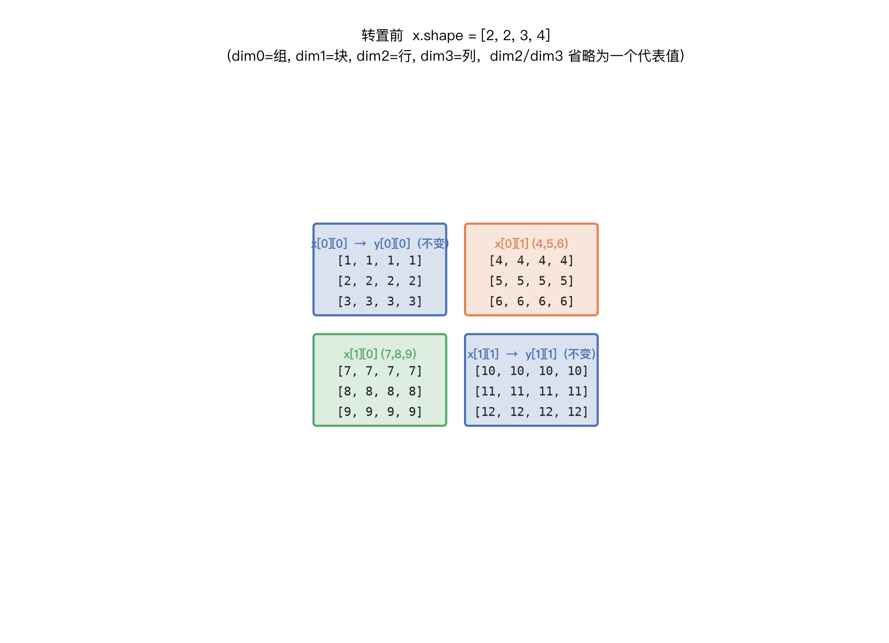
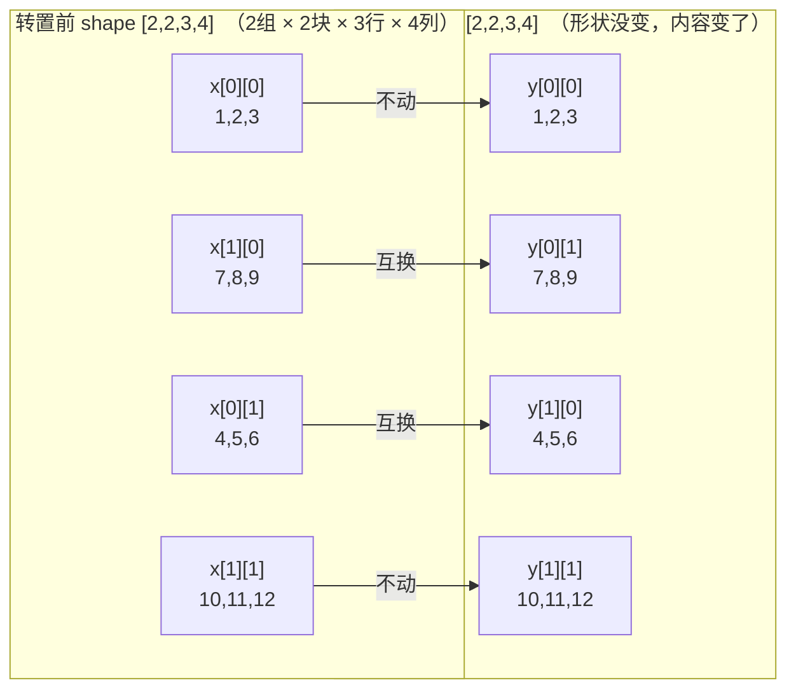
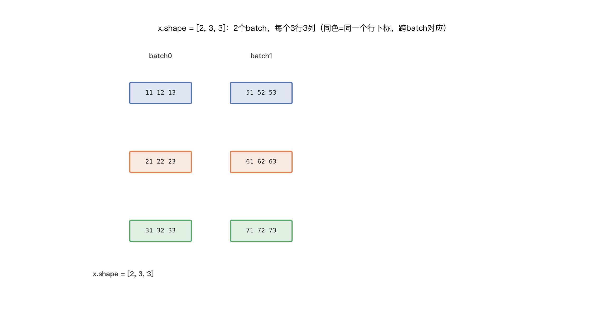
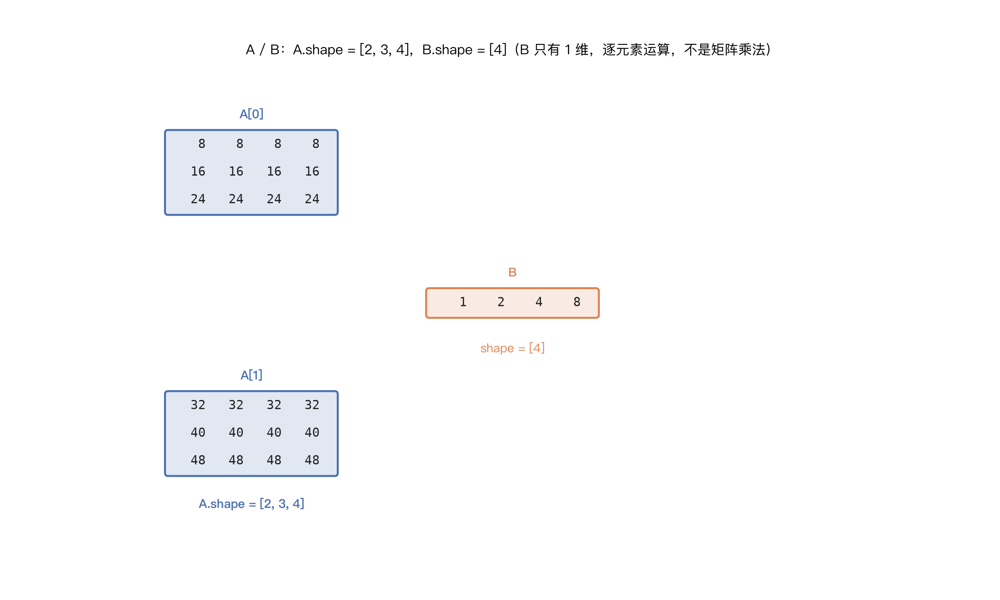
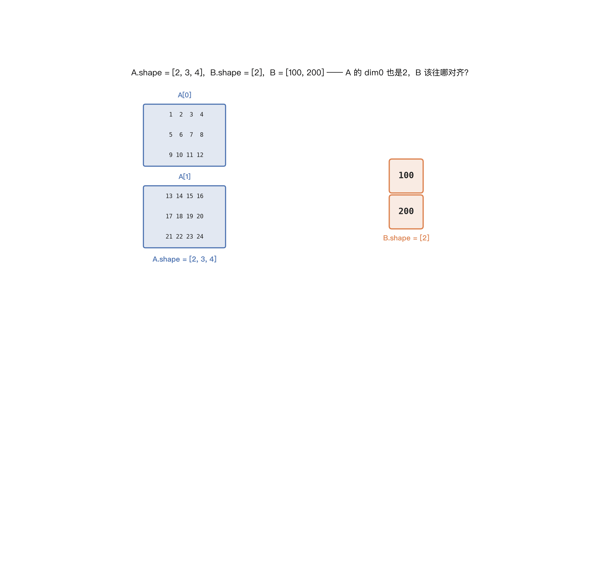
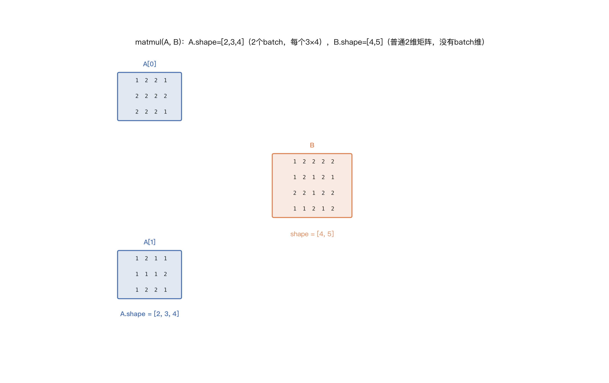
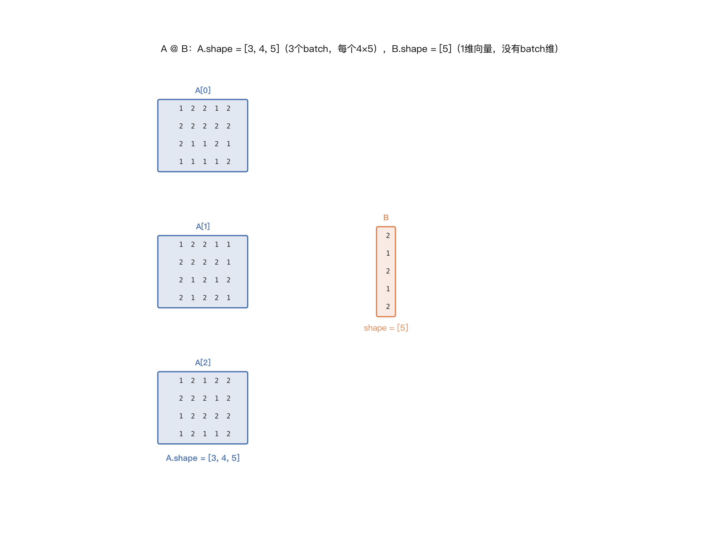
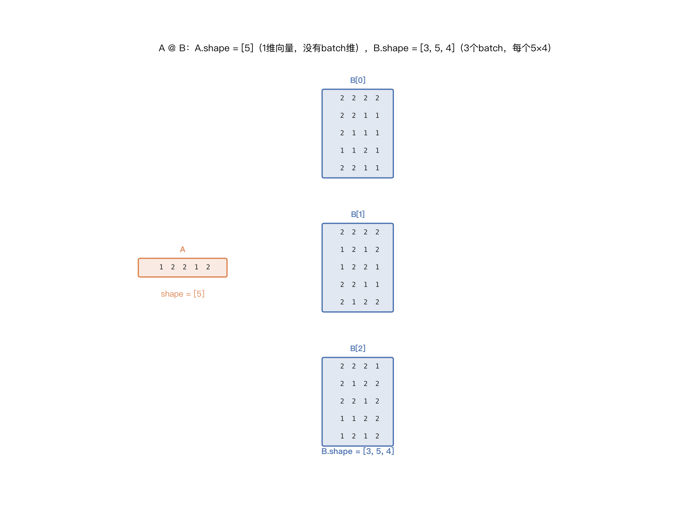
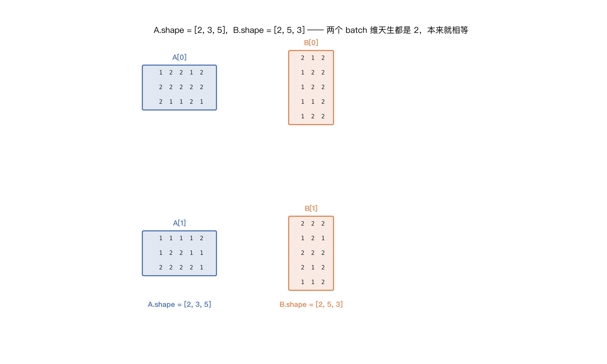

# 张量基础知识

本文档从"四维张量转置 `transpose_(1, 0)`"这个具体例子出发，逐步扩展到张量的形状、连续性、逐元素运算广播、矩阵乘法广播等基础知识点，均配代码实测和动态图解。

## 目录

1. 预备知识：常用 API 速查
2. 热身：二维张量转置 `x.t()`（含 `t_()`）
3. 转置前：形状 `[2, 2, 3, 4]`
4. `x.shape` 是什么、组/块/行/列怎么区分？
5. 动态图：块如何互换位置
6. `x.transpose_(1, 0)` 做了什么
7. 按块看坐标映射
8. 实际运行结果
9. 要点小结
10. 延伸：块内部转置 —— `transpose(2, 3)`
11. 为什么会有"交换维度"这种操作？
12. `transpose_` 与 `transpose`：下划线 in-place 的区别，参数顺序是否敏感
13. 转置后 `is_contiguous()` 是 `True` 还是 `False`？为什么？`contiguous()` 工作中怎么用？
14. `m` 维张量 `/` `n` 维张量：除法（逐元素运算）是怎么广播的？
15. `m` 维张量 `@` `n` 维张量：到底能不能相乘？

## 1. 预备知识：常用 API 速查

本文档后面全篇都会用到这几个 API，先统一说清楚"谁是张量的方法、谁是创建张量的函数"：

| API | 类型 | 作用 |
|---|---|---|
| `x.shape` / `x.size()` | **张量属性/实例方法** | 返回 `torch.Size`（tuple），列出每个维度的元素个数 |
| `x.dim()` / `x.ndim` | **张量实例方法/属性** | 返回维度总数（比如4维张量返回 `4`） |
| `x.numel()` | **张量实例方法** | 返回张量元素总个数（所有维度 size 的乘积） |
| `x.stride()` | **张量实例方法** | 查询每个维度"跨到下一个下标要跳过多少个内存单元"，纯 metadata 查询，不碰数据，跟 `x.shape` 是同一类东西 |
| `x.transpose(dim0, dim1)` / `x.transpose_(dim0, dim1)` | **张量实例方法** | **交换指定的两个维度，`dim0`/`dim1` 只是"第几个维度"的位置编号（从0开始计数，也可以用 `-1`/`-2` 从后往前数），跟"行、列"没有必然关系** |
| `x.data_ptr()` | **张量实例方法** | 返回底层存储的内存地址（整数），常用来判断两个张量是否共享同一块内存 |
| `torch.arange(...)` | **工厂函数**（`torch.` 命名空间下，不依附于已有张量） | 生成一个**新的一维张量**，元素是等差数列，类似 Python 内置 `range()`，但返回 Tensor |
| `torch.rand(...)` / `torch.randn(...)` | **工厂函数** | 生成指定 shape 的新张量，元素分别是 `[0,1)` 均匀分布 / 标准正态分布随机数 |
| `torch.randint(low, high, size)` | **工厂函数** | 生成指定 shape 的**整数**随机张量，取值范围 `[low, high)`；`size` **必须显式传一个 tuple**，不能像 `rand(2,3)` 那样直接传散装的整数 |
| `x.clone()` | **张量实例方法** | 拷贝出一份**独立的新张量**（新内存，不共享 `data_ptr`），常用于"想测试原地操作但不想破坏原变量"的场景 |
| `x.view(new_shape)` | **张量实例方法** | 不挪动、不拷贝数据，只是换一种 shape/stride 去"解释"同一块内存，返回的新张量与原张量共享底层存储；**要求原张量必须连续**，否则报错 |
| `x.reshape(new_shape)` | **张量实例方法** | 跟 `view()` 目的相同（换个形状看数据），但更"宽松"：原张量连续时行为等同于 `view()`（共享内存，不拷贝）；不连续时**自动 `.contiguous()` 拷贝一份再变形**，不会报错 |
| `x.squeeze(dim)` / `x.unsqueeze(dim)` | **张量实例方法** | `squeeze` 删掉指定维度上 size 为 1 的维度；`unsqueeze` 在指定位置插入一个 size 为 1 的新维度 |
| `torch.equal(a, b)` | **工厂函数** | 比较两个张量的 shape 和每个元素的值是否完全相同，返回 Python `bool` |

**`shape` / `size()` / `dim()` / `numel()`——查形状/维度数/元素总数：**

```python
x = torch.arange(24).reshape(2, 3, 4)
x.shape        # torch.Size([2, 3, 4])，x.size() 结果完全一样
x.dim()        # 3，也可以写 x.ndim（属性写法）
x.numel()      # 24，即 2*3*4，所有维度 size 的乘积
```

**`data_ptr()`——查底层内存地址，本文档大量用它验证"是否共享内存"：**

```python
x = torch.arange(6).reshape(2, 3)
y = x.transpose(0, 1)
y.data_ptr() == x.data_ptr()   # True，transpose 只是 view，共享同一块内存
z = x.clone()
z.data_ptr() == x.data_ptr()   # False，clone 拷贝出了一份新内存
```

**`torch.rand(...)` / `torch.randn(...)`——快速生成随机张量：**

```python
torch.rand(2, 3)     # [0,1) 均匀分布
torch.randn(2, 3)    # 标准正态分布（均值0，方差1）
```

**`torch.randint(low, high, size)`——整数随机张量，`size` 必须是个 tuple：**

`rand`/`randn` 可以直接传散装的整数（`rand(2, 3)`），但 `randint` 的第三个参数 `size` **必须显式传一个 tuple**——这里藏着两个容易踩的坑：

**坑① `size` 元组的"长度"决定维度数，元组里的"值"决定每一维的元素个数**，这是硬性定义（不是习惯），所有张量库都一样：

```python
torch.randint(0, 10, (1,))     # 元组长度=1 -> 1维；这一维size=1 -> 只有1个元素
torch.randint(0, 10, (5,))     # 元组长度=1 -> 仍然是1维；这一维size=5 -> 1维张量里有5个元素
torch.randint(0, 10, (1, 1))   # 元组长度=2 -> 2维；每一维size都是1 -> 总共1个元素，但形状是2维的
torch.randint(0, 10, (2, 3))   # 元组长度=2 -> 2维；size分别是2和3 -> 一共6个元素
```

`dim()`/`numel()` 实测验证：

```python
a = torch.randint(0, 10, (1,))
c = torch.randint(0, 10, (1, 1))
a.dim(), a.numel()   # 1, 1
c.dim(), c.numel()   # 2, 1   <- 元素总数和 a 一样，但维度数不同，因为元组长度不同
```

**坑② Python 里 `(1)` 根本不是元组，只是整数 `1`**——元组靠**逗号**判断，不是靠括号，少写一个逗号会直接报错：

```python
torch.randint(0, 10, (1))    # (1) 是 int 不是 tuple -> 报错：
# got (int, int, int), but expected ... tuple of ints size ...

torch.randint(0, 10, (1,))   # (1,) 才是真正的单元素 tuple -> 正确
```

以上两条是**硬性规则**（数学定义、Python 语法本身），跟"约定俗成"（比如 batch 维放前面还是后面、内存 row-major 排布）不是一回事——规则没有例外，约定可能因库、因场景而不同。

**`stride()`——查内存跨度：**

```python
x = torch.arange(12).reshape(3, 4)
x.stride()      # (4, 1)
# dim0(行)每往后走一步要跨过4个元素；dim1(列)每往后走一步跨过1个元素
x.stride(0)     # 4，也可以传 dim 参数只查某一维
```

第13节判断"是否连续"，本质就是拿 `x.stride()` 的实际值去对比"标准连续 stride 公式"算出来的期望值。

**`transpose(dim0, dim1)`——`dim0`/`dim1` 是纯位置编号，不是"行、列"：**

**维度的位置编号从 `0` 开始计数**：`x.shape` 的第1个数对应 `dim0`，第2个数对应 `dim1`，以此类推——`dim0` 不是"第0维"这个说法很奇怪，但确实是"排在最前面的那一维"，不是"第1维"（那是 `dim1`）。

**也可以用负数从后往前数**：`-1` 表示最后一维，`-2` 表示倒数第二维，以此类推，跟 Python 列表的负数下标是同一套规则。对一个 `ndim` 维的张量，`-1` 等价于 `ndim-1`，`-2` 等价于 `ndim-2`。比如10维张量的最后两维，既可以写 `transpose(8, 9)`，也可以写成更通用、不用管总维度数的 `transpose(-2, -1)`——第11.4节 `A @ B.transpose(-2, -1)` 用的就是这种写法。

```python
x = torch.randn(2, 3, 4, 5)      # dim0=2, dim1=3, dim2=4, dim3=5，语义随你定义
x.transpose(0, 1)                # 交换 dim0、dim1（这里语义上可能是"批量"和"分组"，跟行列无关）
```

只有在**二维**张量里，dim0、dim1 才恰好等于行、列（因为二维总共就这两个维度）；维度一多，"行、列"通常习惯性地放在**最后两维**（矩阵乘法 `matmul` 默认对最后两维做运算），要转置真正的"行列"要写 `x.transpose(-2, -1)`，而不是 `x.transpose(0, 1)`（第10节讲的 `transpose(2, 3)`、第11.4节的 `transpose(-2, -1)` 就是这个道理）。

一句话：**`transpose(dim0, dim1)` 只是个纯位置操作，你想交换哪两个维度就填哪两个数字，它不知道也不关心你把哪个维度当成"行"哪个当成"列"——"行、列"是你自己给某两个维度赋予的语义，通常习惯性地放在最后两维，但这只是约定俗成，不是语法强制。**

**`arange()`——造一串等差数列的张量，本文档大量测试代码用它来快速构造数据：**

```python
torch.arange(12)          # tensor([0, 1, ..., 11])，等价 range(0, 12)
torch.arange(2, 10, 2)    # tensor([2, 4, 6, 8])   start=2, end=10(不含), step=2
torch.arange(12).reshape(3, 4)   # 本文档到处用的写法：先造一串连续数字，再 reshape 成想要的形状
```

**`clone()`——拷贝出一份独立的新张量：**

```python
x = torch.arange(6).reshape(2, 3)
y = x.clone()
y.data_ptr() == x.data_ptr()   # False，不共享内存
y[0, 0] = 100
x[0, 0]                        # 0，y 改了不影响 x
```

本文档很多测试代码（比如第12节验证 `transpose_` 原地修改）都会先 `x.clone()` 一份再做原地操作，避免污染同一个变量、方便对比前后差异。

**`view()`——换个形状看同一块内存：**

```python
x = torch.arange(12)          # shape (12,)
y = x.view(3, 4)              # 同一块内存，换个形状去看
y.data_ptr() == x.data_ptr()  # True，共享内存
```

前提：`x` 必须是**连续**的（第13节的核心结论），否则报错，需要先 `.contiguous()` 或改用 `.reshape()`（自动兜底）。

**`reshape()`——`view()` 的"宽松版"：**

```python
x = torch.arange(12).reshape(3, 4)
y = x.transpose(0, 1)             # 不连续
y.view(-1)                        # 报错
# RuntimeError: view size is not compatible with input tensor's size and stride
#  (at least one dimension spans across two contiguous subspaces). Use .reshape(...) instead.

y.reshape(-1)                     # 不报错，内部自动 .contiguous() 拷贝一份再变形
```

`view()` 与 `reshape()` 的核心区别（第13节实测验证过）：

| | `view()` | `reshape()` |
|---|---|---|
| 张量不连续时 | **直接报错** | **自动拷贝一份再变形**，不报错 |
| 是否保证共享内存 | 保证共享（否则报错，不会静默拷贝） | **不保证**——连续时共享内存，不连续时会拷贝出新内存 |

一句话：`view` 严格要求原内存本来就能这么解释（不满足就报错），`reshape` 遇到不满足的情况会悄悄拷贝一份内存来兜底——更好用，但也更容易掩盖"这里其实发生了一次内存拷贝"这个事实。

**`squeeze()` / `unsqueeze()`——删掉/插入 size 为 1 的维度：**

```python
a = torch.zeros(2, 1, 3)
a.squeeze(1).shape      # torch.Size([2, 3])，把 size=1 的 dim1 删掉

b = torch.zeros(2, 3)
b.unsqueeze(1).shape    # torch.Size([2, 1, 3])，在 dim1 位置插入一个 size=1 的新维度
```

第13节讲过：size=1 的维度不影响 `is_contiguous()` 的判定，这也是为什么 `squeeze`/`unsqueeze`（只增删 size=1 的维度）几乎不会改变张量的连续性。

**`torch.equal(a, b)`——比较两个张量是否完全相同：**

```python
torch.equal(torch.tensor([1, 2, 3]), torch.tensor([1, 2, 3]))   # True
torch.equal(torch.tensor([1, 2, 3]), torch.tensor([1, 2, 4]))   # False
```

要求 shape 和每个元素的值都相同才返回 `True`，本文档验证 `transpose(0,1)` 与 `transpose(1,0)` 等价（第12.1节）就是靠它。

## 2. 热身：二维张量转置 `x.t()`

在看4维张量之前，先看最简单、最贴近"传统数学转置"的情形——二维张量（矩阵）。

```python
x = torch.tensor([[1, 1, 1, 1, 1],
                   [2, 2, 2, 2, 2],
                   [3, 3, 3, 3, 3]], dtype=torch.int32)
print(x)
y = x.t()
print(y)
```

`x.shape` 是 `[3, 5]`（3行5列）。`.t()` 是 PyTorch 专为二维张量提供的转置简写，效果等同于 `x.transpose(0, 1)`——交换第0维（行）和第1维（列），也就是最经典的矩阵转置 $y_{ji} = x_{ij}$：

```
转置前 x（3行5列）:          转置后 y = x.t()（5行3列）:
[1, 1, 1, 1, 1]              [1, 2, 3]
[2, 2, 2, 2, 2]   ----->     [1, 2, 3]
[3, 3, 3, 3, 3]              [1, 2, 3]
                              [1, 2, 3]
                              [1, 2, 3]
```

实测：

```python
x.shape            # torch.Size([3, 5])
y.shape            # torch.Size([5, 3])
torch.equal(y, x.transpose(0, 1))   # True，二维情形下 .t() 和 transpose(0,1) 完全等价
y.data_ptr() == x.data_ptr()        # True，共享同一块内存，只是view
y.is_contiguous()                   # False，转置后不再连续
```

**`.t()` 的局限：只能用在 ≤2 维的张量上。** 维度一高就不能用了：

```python
z = torch.rand(2, 2, 3, 4)
z.t()
# RuntimeError: t() expects a tensor with <= 2 dimensions, but self is 4D
```

原因很直观：二维张量只有"行、列"两个维度，转置的意思毫无歧义，可以省略参数直接调用 `.t()`；但到了3维、4维……张量有3个及以上的维度可选，"转置"必须明确说清楚"交换哪两个维度"，所以高维张量必须显式调用 `x.transpose(dim0, dim1)`，指定具体的两个轴——这正是下面4维例子里为什么要写 `x.transpose_(1, 0)` 而不能简单地写 `x.t()` 的原因。

**`.t()` 也有对应的 in-place 版本：`t_()`**，跟第12节讲的 `transpose_` / `transpose` 是同一套下划线命名约定：

```python
x = torch.tensor([[1, 1, 1, 1, 1],
                   [2, 2, 2, 2, 2],
                   [3, 3, 3, 3, 3]], dtype=torch.int32)
x.t_()               # 原地转置，直接修改 x 自身
print(x.is_contiguous())   # False
print(x)
```

```
tensor([[1, 2, 3],
        [1, 2, 3],
        [1, 2, 3],
        [1, 2, 3],
        [1, 2, 3]], dtype=torch.int32)
```

实测：`id(x)`、`x.data_ptr()` 在调用前后都不变——`t_()` 没有创建新对象，是直接把 `x` 自身的 shape 从 `[3, 5]` 改成了 `[5, 3]`。对比：`y = x.t()` 需要接收返回值、`x` 本身不变；`x.t_()` 不需要接收返回值，`x` 自己就被改了。

## 3. 转置前：形状 `[2, 2, 3, 4]`

这是一个 4 维张量，可以理解为 **2 个"组"，每组有 2 个"块"，每块是一个 3×4 的小矩阵**：

```
维度含义:   dim0(组)  dim1(块)  dim2(行)  dim3(列)

组 x[0]：
    块 x[0][0]:  [1,1,1,1]   块 x[0][1]:  [4,4,4,4]
                 [2,2,2,2]                [5,5,5,5]
                 [3,3,3,3]                [6,6,6,6]

组 x[1]：
    块 x[1][0]:  [7,7,7,7]   块 x[1][1]:  [10,10,10,10]
                 [8,8,8,8]                [11,11,11,11]
                 [9,9,9,9]                [12,12,12,12]
```

## 4. `x.shape` 是什么、组/块/行/列怎么区分？

`x.shape`（等价于 `x.size()`）返回一个 `torch.Size`（本质是个 tuple），按 `dim0, dim1, dim2, ...` 的顺序列出**每一维有多少个元素**：

```python
x.shape    # torch.Size([2, 2, 3, 4])
            #              ↑  ↑  ↑  ↑
            #            dim0 dim1 dim2 dim3
            #             组   块   行   列
```

**关键点：`shape` 只汇报"每一维有几个元素"，不会告诉你"这一维代表什么意思"。** "组、块、行、列"这几个名字是人为起的，只是按维度的先后顺序、方便讲解用的说法，PyTorch 本身只认 `dim0, dim1, dim2, dim3`。

**怎么区分——看下标的位置。** 访问元素写 `x[a][b][c][d]`，四层下标对应四个维度：

```python
x[a][b][c][d]
  ↑   ↑   ↑   ↑
 dim0 dim1 dim2 dim3
（第几组）（组内第几块）（块内第几行）（行内第几个数）
```

**结合"中括号层数"看：**

```
x = [                                          <- 最外层 [：dim0，2个元素 -> "组"
      [                                        <- 第2层 [：dim1，每组2个元素 -> "块"
        [ [1,1,1,1], [2,2,2,2], [3,3,3,3] ],   <- 第3层 [：dim2，每块3个元素 -> "行"
        [ [4,4,4,4], [5,5,5,5], [6,6,6,6] ]    <- 最内层 [1,1,1,1] 里4个数：dim3，4个元素 -> "列"
      ],
      [
        [ [7,7,7,7], [8,8,8,8], [9,9,9,9] ],
        [ [10,...], [11,...], [12,...] ]
      ]
    ]
```

从外到内数中括号：第1层包了几个东西 → dim0（组数）；第2层 → dim1（每组几块）；第3层 → dim2（每块几行）；第4层（最内层）→ dim3（每行几列）。同样，这四个维度到了实际场景里可能被叫作别的名字，比如 `[batch, num_heads, seq_len, head_dim]`（见 [第11节](#11-为什么会有交换维度这种操作)）。

## 5. 动态图：块如何互换位置



由于本例 `dim0`（组）和 `dim1`（块）大小都是 2，四个"块"（每块都是一个完整的 3×4 小矩阵）可以看成排成一个 **2×2 的"元矩阵"**：

```
元矩阵 =  [ x[0][0](1,2,3)   x[0][1](4,5,6)  ]
          [ x[1][0](7,8,9)   x[1][1](10,11,12) ]
```

动态图演示的就是这个 2×2 元矩阵做转置：**对角线上的两个块（`x[0][0]` 和 `x[1][1]`）原地不动**，**非对角线的两个块（`x[0][1]` 和 `x[1][0]`）互换位置**（动图里分别走左、右两侧绕过去，避免两个块直接穿模重叠）。

## 6. `x.transpose_(1, 0)` 做了什么

`transpose_(dim0, dim1)` 交换**指定的两个维度**，原地修改 `x`。这里 `transpose_(1, 0)` 交换的是 **dim1（块）和 dim0（组）**，`dim2`（行）、`dim3`（列）完全不动。

规则：新张量 `y` 满足 `y[b][a] = x[a][b]`（把"组下标 a"和"块下标 b"互换位置，`[c][d]` 保持原样）。

**"第一个块" `x[0][0]` 是怎么变换的？** 代入规则：当 `a=0, b=0` 时，`y[0][0] = x[0][0]`——下标互换后还是 `[0][0]`，位置没变！所以 `x[0][0]`（值 `1,2,3`）转置后还是待在 `y[0][0]` 位置，内容原封不动。同理 `x[1][1]` 也在 `y[1][1]`，没动。真正换了位置的，是 `a≠b` 的两个块：`x[0][1]`（4,5,6）跑到了 `y[1][0]`，`x[1][0]`（7,8,9）跑到了 `y[0][1]`。



**核心变化**：对角线（`a=b`）上的块位置不变；非对角线（`a≠b`）上的两个块互换位置。块内部（行、列）的内容完全没动。

## 7. 按块看坐标映射

由于 `dim2`（行）、`dim3`（列）完全不受影响，只需要看"块"这一级怎么变，就能推出所有元素的变化：

| 转置前 (a,b) 块 | 块内容（3×4，每行重复4次） | 转置后位置 |
|---|---|---|
| x[0][0] | 行: 1, 2, 3 | y[0][0]（不变） |
| x[0][1] | 行: 4, 5, 6 | y[1][0] |
| x[1][0] | 行: 7, 8, 9 | y[0][1] |
| x[1][1] | 行: 10, 11, 12 | y[1][1]（不变） |

比如具体到单个元素：`x[0][1][2][3]`（值为 `6`，第0组、第1块、第2行、第3列）转置后坐标变成 `y[1][0][2][3]`——`a,b` 互换成了 `b,a`，`c=2, d=3` 原样保留，值还是 `6`。

## 8. 实际运行结果

```
tensor([[[[ 1,  1,  1,  1],
          [ 2,  2,  2,  2],
          [ 3,  3,  3,  3]],

         [[ 4,  4,  4,  4],
          [ 5,  5,  5,  5],
          [ 6,  6,  6,  6]]],


        [[[ 7,  7,  7,  7],
          [ 8,  8,  8,  8],
          [ 9,  9,  9,  9]],

         [[10, 10, 10, 10],
          [11, 11, 11, 11],
          [12, 12, 12, 12]]]], dtype=torch.int32)
---------------------------------------------------------------
tensor([[[[ 1,  1,  1,  1],
          [ 2,  2,  2,  2],
          [ 3,  3,  3,  3]],

         [[ 7,  7,  7,  7],
          [ 8,  8,  8,  8],
          [ 9,  9,  9,  9]]],


        [[[ 4,  4,  4,  4],
          [ 5,  5,  5,  5],
          [ 6,  6,  6,  6]],

         [[10, 10, 10, 10],
          [11, 11, 11, 11],
          [12, 12, 12, 12]]]], dtype=torch.int32)
```

## 9. 要点小结

- `transpose_(dim0, dim1)` 是 **原地操作**（下划线后缀 `_`），直接修改 `x` 本身，不返回新对象。
- 只交换指定的两个维度，其余维度（这里是第2维/行、第3维/列）保持不变。
- **本例的特殊之处**：`dim0` 和 `dim1` 大小都是 2，所以 `x.shape` 转置前后都是 `[2, 2, 3, 4]`——**形状没变，但内容变了**（对角线块不动，非对角线块互换）。如果两个维度大小不同（比如把某一维换成大小为 3 的维），转置后 `shape` 本身也会跟着变，比如 `[2,3,4,5]` 交换 `dim0,dim1` 会变成 `[3,2,4,5]`。
- 如果只想拿到转置结果而不改变原张量，用不带下划线的 `x.transpose(1, 0)`（返回新张量，与原张量共享内存）。
- 转置后 `x.is_contiguous()` 会变成 `False`（内存不再连续），如果后续要 `.view()`，需要先 `.contiguous()`。

## 10. 延伸：块内部转置 —— `transpose(2, 3)`

前面 `transpose(0, 1)` 交换的是 **组和块**，块本身（3×4 的内容）原封不动地整体搬家。同样的思路，交换 **行(dim2) 和 列(dim3)**，组、块的位置不动，但每个块内部会做一次普通的二维矩阵转置：

```python
y = x.transpose(2, 3)   # 交换 行 和 列，组、块不变
```

以 `x[0][0]`（3×4）为例：

```
原始 x[0][0]（3行4列）：        transpose(2,3) 后（4行3列）：
[1, 1, 1, 1]                   [1, 2, 3]
[2, 2, 2, 2]        ----->     [1, 2, 3]
[3, 3, 3, 3]                   [1, 2, 3]
                                [1, 2, 3]
```

因为原来每一行本身就是常数（同一行4个数相同），转置后每一列也就变成了常数——新的每一行都是 `[1, 2, 3]`。

两种交换方式对比：

| 交换的维度 | 效果 | 谁保持不变 |
|---|---|---|
| `transpose(0, 1)`（组↔块） | 整块（3×4）在"组-块"这张 2×2 元矩阵里换位置，相当于把 2×2 元矩阵做转置 | 块内部（行、列）内容不变 |
| `transpose(2, 3)`（行↔列） | 每个块内部做普通二维矩阵转置 | 组、块的位置不变 |

## 11. 为什么会有"交换维度"这种操作？

单看这个例子，转置像是在"重新摆放数字"，看不出实际意义。但在真实深度学习代码里，`transpose`/`permute` 几乎是必用操作，原因是：**同一份数据，不同的库、不同的层，要求的"维度顺序约定"不一样**，张量本身不会变，但要让下一步计算认得这个顺序，就必须交换维度。常见场景：

### 11.1 batch 维和序列维互换（RNN / Transformer）
PyTorch 的 `nn.RNN`、`nn.LSTM` 默认要求输入形状是 `[seq_len, batch, feature]`（`batch_first=False`），但我们从 `DataLoader` 拿到的数据一般是 `[batch, seq_len, feature]`。于是喂进 RNN 之前要转置：
```python
x = x.transpose(0, 1)   # [batch, seq, feature] -> [seq, batch, feature]
```

### 11.2 图像通道顺序：NCHW ↔ NHWC
PyTorch 卷积层默认吃 `[batch, channel, height, width]`（NCHW），但图片文件、部分硬件/框架习惯 `[batch, height, width, channel]`（NHWC）。跨框架转模型或对接图像库时要做：
```python
x = x.permute(0, 2, 3, 1)   # NCHW -> NHWC
```

### 11.3 多头注意力（Multi-Head Attention）
本教程的例子形状是 `[2, 2, 3, 4]`，正好可以对应到多头注意力里常见的 `[batch, num_heads, seq_len, head_dim]`（2条样本、2个头、3个时间步、每个头4维）。如果某个中间结果拿到手时形状是 `[num_heads, batch, seq_len, head_dim]`（`num_heads` 和 `batch` 顺序反了），就需要：
```python
x = x.transpose(1, 0)   # [num_heads, batch, ...] -> [batch, num_heads, ...]
```
这正是本例 `transpose_(1, 0)` 对应的真实场景：把维护成对的两个维度（这里是"组"对应 `num_heads`，"块"对应 `batch`）位置换过来，`seq_len`、`head_dim` 这两维（对应例子里的"行""列"）保持不动。

### 11.4 矩阵乘法/线性代数的形状对齐
比如要计算 `A @ Bᵀ`（常见于相似度矩阵、注意力打分），必须先把 `B` 转置成"内维对齐"的形状，`matmul` 才能算：
```python
scores = A @ B.transpose(-2, -1)
```

一句话总结：**转置本身不改变数据的值，只改变"按哪个维度去切片/理解"这些数据，是用来适配不同 API、不同硬件、不同计算方式对形状的约定的。**

## 12. `transpose_` 与 `transpose`：下划线 in-place 的区别，参数顺序是否敏感

两者交换维度的逻辑完全一样，唯一的区别是**有没有下划线后缀**——这是 PyTorch 的通用命名约定：**带下划线 `_` 的方法是 in-place（原地）操作，不带下划线的方法返回新对象**。

| | `x.transpose(0, 1)`（无下划线） | `x.transpose_(0, 1)`（有下划线） |
|---|---|---|
| `x` 自身是否改变 | **不变**，`x` 还是原来的 shape | **直接被修改**，`x` 的 shape 变了 |
| 返回值 | 一个**新的 Tensor 对象** | 就是 `x` 自己 |
| 返回值和 `x` 是否是同一对象（`is`） | `False` | `True` |
| 是否共享底层存储（`data_ptr`） | 是（只是 view，没拷贝数据） | 是（本来就是同一个对象） |
| 用法 | 必须接收返回值：`y = x.transpose(0, 1)`，否则原变量没变 | 不需要接收返回值，`x.transpose_(0, 1)` 这一行执行完 `x` 就已经变了 |

**实测验证：**

```python
import torch

x = torch.arange(6).reshape(2, 3)

x1 = x.clone()
y = x1.transpose(0, 1)          # 非 in-place
print(x1.shape, y.shape, x1 is y, x1.data_ptr() == y.data_ptr())
# torch.Size([2, 3]) torch.Size([3, 2]) False True
#   ↑ x1 没变            ↑ y 是新形状       ↑ 不是同一对象   ↑ 但共享内存

x2 = x.clone()
z = x2.transpose_(0, 1)         # in-place
print(x2.shape, z.shape, x2 is z)
# torch.Size([3, 2]) torch.Size([3, 2]) True
#   ↑ x2 自己变了                          ↑ 返回值就是 x2 本身
```

结论：
- **两者对底层数据的处理完全相同**——都不拷贝数据，都只是修改 shape/stride 元数据，转置后都是非连续张量（`is_contiguous()` 为 `False`）。
- **区别只在于"改完之后往哪写"**：`transpose` 把修改结果包成一个新对象返回，原对象不动；`transpose_` 把修改直接写回原对象本身。
- 本文档第6节的 `x.transpose_(1, 0)` 之所以能"原地"生效、后面直接 `print(x)` 就能看到变化，正是因为用了带下划线的版本；如果写成 `x.transpose(1, 0)` 而不接收返回值，`x` 会保持原样不变。

### 12.1 补充：`transpose_(0, 1)` 与 `transpose_(1, 0)`——参数顺序有区别吗？

**没有区别，两者完全等价**，无论张量是多少维、也不管带不带下划线。

原因：`transpose(dim0, dim1)` 做的是"交换第 `dim0` 和第 `dim1` 这两个轴"，这个操作本身是**对称的**——"交换 A 和 B" 跟 "交换 B 和 A" 是同一件事，就像"交换第2列和第3列"和"交换第3列和第2列"是同一个操作一样。函数内部只是把这两个位置的 shape 和 stride 互换，跟传参的先后顺序无关。

```python
x = torch.randn(2, 3, 4, 5)
a = x.transpose(0, 1)
b = x.transpose(1, 0)
torch.equal(a, b)      # True
a.shape == b.shape     # True，都是 (3, 2, 4, 5)
```

这也是为什么本文档第6节写的是 `x.transpose_(1, 0)`，而不是 `x.transpose_(0, 1)`——两种写法对本例效果完全一样，选哪个纯粹是习惯问题。

**注意区分**：这跟 `permute` 不同——`permute(dims...)` 是一次性重排全部维度，参数顺序是敏感的（`permute(1, 0, 2)` 和 `permute(0, 1, 2)` 结果不同），不能套用"顺序无关"这个结论。

### 12.2 `flip` / `index_select`：调换的是同一维度里的数据，不是 transpose 那种维度身份互换

一个容易搞混的问题：`transpose`/`permute` 是**交换两个维度的"身份"**（比如把 dim0 和 dim1 互换，第几维当行、第几维当列这种角色对调）；但如果想要的是**同一个维度内部，两个下标的数据互相调换**（比如 `A.shape=[2,3,4]`，想把 `batch[0]` 和 `batch[1]` 的内容对调），那是完全不同的操作——要用 `flip` 或 `index_select`/花式索引，不是 `transpose`。

```python
x = torch.arange(24).reshape(2, 3, 4)

# 方法1：torch.flip —— 沿着 dim0 整体翻转，只有2个batch时效果就是对调
y1 = torch.flip(x, dims=[0])
torch.equal(y1[0], x[1]), torch.equal(y1[1], x[0])
# (True, True)
#   ↑      ↑
#   |      └─ 翻转后的第1个位置 y1[1]，就是原来的 x[0]
#   └─ 翻转后的第0个位置 y1[0]，就是原来的 x[1]
# 说明 flip(dims=[0]) 把 dim0 上的顺序整个倒过来了：原来 x[0],x[1] -> 变成 y1[0]=x[1], y1[1]=x[0]

# 方法2：花式索引 / index_select —— 更通用，能指定任意重排顺序，不限于对调两个
y2 = x[[1, 0]]
#      ↑  ↑
#      |  └─ 列表第1个位置写 0 -> 结果的第1个位置 y2[1] 取原来的 x[0]
#      └─ 列表第0个位置写 1 -> 结果的第0个位置 y2[0] 取原来的 x[1]
# x[[1, 0]] 默认作用在 dim0 上（方括号里直接放一个list，不用像 index_select 那样显式传 dim）
y3 = x.index_select(0, torch.tensor([1, 0]))
torch.equal(y2, y1), torch.equal(y3, y1)
# (True, True)
#   ↑      ↑
#   |      └─ y3(index_select结果) 和 y1(flip结果) 完全一样
#   └─ y2(花式索引结果) 和 y1(flip结果) 完全一样
# 说明 flip、花式索引、index_select 这三种写法，结果是一模一样的，只是写法不同
```

`x.index_select(dim, index)` 两个参数含义：
- **`dim`**：在哪一维上重排/挑选——这里传 `0`，表示操作的是 dim0（batch 维），行、列（dim1、dim2）原样不动。
- **`index`**：一个 **1维 LongTensor**，按顺序写"要挑出原来的第几个下标"——`torch.tensor([1, 0])` 表示"结果的第0个位置放原来的下标1（`x[1]`），结果的第1个位置放原来的下标0（`x[0]`）"，这正好实现了对调；`index` 里的数字可以重复、可以不用完所有下标，也可以比原维度更长（比如 `[1,0,1]` 会把 `x[1]` 复制两次）。

`x[[1, 0]]` 是它的**花式索引简写**：方括号里直接写一个 Python list（默认作用在 dim0 上），效果和 `index_select(0, torch.tensor([1, 0]))` 完全等价——`index_select` 的好处是能显式指定 `dim`，在更高维张量里想对中间某一维重排（而不是默认的 dim0）时更清楚，比如 `x.index_select(1, idx)` 就是对 dim1（比如上面例子里的"块"）重排，花式索引写成 `x[:, [1,0]]` 才能达到同样效果。

两种方法的适用场景不同：`torch.flip(x, dims=[0])` 只适合"整体倒过来"，batch 数量多于2时是全部反转，不是只对调某两个；`x[[1,0]]` / `index_select` **更通用**——括号里写任意想要的下标顺序，比如10个batch只想把第3个和第7个换一下，就写 `x[[0,1,2,6,4,5,3,7,8,9]]`，这也是工程里更常用的写法（比如打乱数据顺序、按权重重排 token 顺序等）。

**跟 `transpose`/`permute` 的本质区别**：`transpose`/`permute` 不挪动任何数据，只改 shape/stride 元数据（第13节讲的核心结论，转置后 `is_contiguous()` 变 `False`，但 `data_ptr()` 不变）；`flip`/`index_select` 是真的按新顺序**重新组织了数据**，返回的是拷贝过的新内存，`data_ptr()` 会变：

```python
y1.data_ptr() == x.data_ptr()          # False，flip 拷贝了新内存，不是 view
x.transpose(0, 1).data_ptr() == x.data_ptr()   # True，transpose 只是view，共享内存（对比之下）
```

### 12.3 综合例子：`transpose_` + `index_select` + `flip` + 花式索引 + 广播四则运算一起用

前面几节的操作都是分开讲的，这里用一个例子把它们串起来。**每个操作都从同一份原始数据重新开始**（不是在上一步的结果上继续操作），这样才能单独看清每个操作各自的效果，互不干扰：

```python
# x.shape = [2, 3, 3]：2个batch，每个是3行3列的矩阵
x = torch.tensor([[[11, 12, 13], [21, 22, 23], [31, 32, 33]],
                  [[51, 52, 53], [61, 62, 63], [71, 72, 73]]])
y = torch.tensor([1, 2, 3])
```

#### 12.3.1 `x.transpose_(0, 1)`：交换两个 size 不同的维度，形状真的会变

本文档第9节结尾提过一句"如果两个维度大小不同，转置后 shape 本身也会跟着变"，但一直没给过具体例子——前面所有 transpose 例子（第3~9节的 `[2,2,3,4]`）里 `dim0` 和 `dim1` 恰好都是2，所以转置前后形状没变，容易让人误以为"transpose 只换内容、不换形状"。这里就是那个例外的具体样子：

`x.shape=[2,3,3]`，`dim0`（batch）size=2，`dim1`（行）size=3，**两个size不相等**。`transpose_(0,1)` 交换这两维之后：

- 新的 `dim0` 用的是旧的 `dim1` 的size（3），新的 `dim1` 用的是旧的 `dim0` 的size（2）——**shape 从 `[2,3,3]` 变成了 `[3,2,3]`**，元素总数不变（`2×3×3 = 3×2×3 = 18`），但外形彻底变了。
- 规则还是同一条 `new_x[i][j] = old_x[j][i]`（第6节讲过）：新的 `dim0` 下标 `i` 对应"原来的行下标"，新的 `dim1` 下标 `j` 对应"原来的batch下标"。翻译成人话就是：**把两个batch里"行下标相同"的那一行，配对到了一起**，变成新的一组。



```python
x.transpose_(0, 1)
x.shape   # torch.Size([3, 2, 3])
x
# tensor([[[11, 12, 13], [51, 52, 53]],   <- new_x[0] = [old_x[0][0], old_x[1][0]]（两个batch的第0行）
#         [[21, 22, 23], [61, 62, 63]],   <- new_x[1] = [old_x[0][1], old_x[1][1]]（两个batch的第1行）
#         [[31, 32, 33], [71, 72, 73]]])  <- new_x[2] = [old_x[0][2], old_x[1][2]]（两个batch的第2行）
```

**为什么要强调这一点？** 因为这跟"矩阵维/batch维配对两两成对，从外往里递归"那套关于画图的原则（前面聊天讨论过）不是一回事——那套原则说的是"怎么把张量画在纸上"，而这里 `transpose_(0,1)` 交换的是**batch维和行维**这两个原本"层级不同"的维度，交换之后它们的"角色"也跟着互换了：原来的"行"变成了新的"batch"，原来的"batch"变成了新的"行内的第几个元素"。这正说明第11节说的"`transpose` 不知道也不关心你把哪个维度当行当列"——它只认位置编号，不认语义，语义是人给的，人换了想法，`transpose` 就能把语义对应的物理位置也换过来。

**后面几节的操作都重新用回原始的 `x`（`shape=[2,3,3]`，没有转置），不是在这里转置完的结果上继续操作。**

#### 12.3.2 `index_select` 取出整个 batch

```python
x = torch.tensor([[[11, 12, 13], [21, 22, 23], [31, 32, 33]],
                  [[51, 52, 53], [61, 62, 63], [71, 72, 73]]])

x.index_select(0, torch.tensor([0]))
# tensor([[[11, 12, 13], [21, 22, 23], [31, 32, 33]]])   shape=[1,3,3]，取出batch0整个矩阵，外面多包一层维度
x.index_select(0, torch.tensor([1]))
# tensor([[[51, 52, 53], [61, 62, 63], [71, 72, 73]]])   shape=[1,3,3]，取出batch1整个矩阵
```

**注意 shape 是 `[1,3,3]` 而不是 `[3,3]`**——这是 `index_select` 的固定行为：不管 `index` 里写了几个下标，结果在这一维上**永远保留这一维**（哪怕只挑了1个，也不会自动挤掉），这跟 `x[0]`（普通单下标索引，会降一维，变成 `[3,3]`）不一样，是很容易踩的差异点：`index_select` 是"在这一维上挑一批，摆成一个新的同维张量"，`x[0]` 是"直接钻进去一层，维度数减1"。

#### 12.3.3 `flip` 在三个不同维度上：翻转的是不同层级的顺序

对原始 `x`（`shape=[2,3,3]`）分别在三个维度上做 `flip`，效果完全不同，正好对应"2个batch、每个3行、每行3列"这三个层级：

```python
torch.flip(x, dims=[0])
# 把2个batch的顺序整体倒过来：[batch1, batch0]
# tensor([[[51,52,53],[61,62,63],[71,72,73]],
#         [[11,12,13],[21,22,23],[31,32,33]]])

torch.flip(x, dims=[1])
# batch的顺序不变，但每个batch内部3行的顺序倒过来
# tensor([[[31,32,33],[21,22,23],[11,12,13]],
#         [[71,72,73],[61,62,63],[51,52,53]]])

torch.flip(x, dims=[2])
# batch、行的顺序都不变，只把每一行内部3个数的顺序倒过来
# tensor([[[13,12,11],[23,22,21],[33,32,31]],
#         [[53,52,51],[63,62,61],[73,72,71]]])
```

| 操作 | 翻转的对象 | 谁不受影响 |
|---|---|---|
| `flip(dims=[0])` | 2个batch的先后顺序 | 每个batch内部的3行、每行内部的3列都不变 |
| `flip(dims=[1])` | 每个batch内部3行的顺序 | 2个batch的排列顺序、每行内部的3列都不变 |
| `flip(dims=[2])` | 每行内部3列的顺序 | 2个batch、每个batch内部3行的排列都不变 |

**一句话总结**：`flip(dims=[k])` 只翻转第 `k` 维内部的顺序，其余维度的排列原封不动——跟第10节 `transpose(2,3)` 只转置块内部、不动组和块的道理一致：**指定哪一维，变化就只发生在哪一维，不会外溢到别的维度**。

#### 12.3.4 `x[1, 0]` vs `x[[1, 0]]` vs `x[[[1, 0]]]`：三种写法，三种完全不同的结果

这三种写法长得很像，一不小心就会搞混，实测对比一下：

```python
x[1, 0]
# tensor([51, 52, 53])            shape=[3]，逗号分隔=多维精确索引，等价于 x[1][0]（batch1的第0行）

x[[1, 0]]
# tensor([[[51, 52, 53], [61, 62, 63], [71, 72, 73]],   <- 取的是 batch1
#         [[11, 12, 13], [21, 22, 23], [31, 32, 33]]])  <- 取的是 batch0
x[[1, 0]].shape   # torch.Size([2, 3, 3])，花式索引：list当作dim0的索引列表，交换两个batch的顺序

x[[[1, 0]]]
# 结果跟 x[[1, 0]] 完全一样！
x[[[1, 0]]].shape   # torch.Size([2, 3, 3])
torch.equal(x[[[1, 0]]], x[[1, 0]])   # True
```

三者的区别：

- **`x[1, 0]`**（逗号分隔，没有中括号嵌套）：精确多维索引，`1` 是 `dim0` 下标、`0` 是 `dim1` 下标，等价于 `x[1][0]`——直接钻到底，结果**降维**成 `[3]`。
- **`x[[1, 0]]`**（一层中括号里放一个 list）：花式索引，`[1, 0]` 整体当作 `dim0` 的索引列表，**不降维**，结果还是3维 `[2,3,3]`，只是 `dim0` 的两个batch顺序换了。
- **`x[[[1, 0]]]`**（两层中括号）：容易以为这是"用一个二维数组当索引，会多出一维"，但实际上**跟 `x[[1, 0]]` 完全等价**。

**判断规则（口诀）：看最外层 list 的每一项，本身还是不是 list**——
- 每一项都是**数字**（比如 `[1, 0]` 里的 `1` 和 `0`）→ 这个 list **整体**当成"一维的索引列表"，不会被拆开，直接整个喂给 `dim0`。
- 每一项本身**还是 list**（比如 `[[1, 0]]` 里只装了一项：`[1, 0]` 这个 list）→ 外层这一层会被**拆开**，**装了几项，就相当于逗号分隔写了几个维度的索引**，第1项给 `dim0`，第2项给 `dim1`，以此类推。

可以把最外层的 `[ ]` 想象成一个"快递箱"：打开箱子数一数装了几个"包裹"——`[1, 0]` 这个箱子里装的是散装数字，说明这箱子本身就是**一个包裹**，整个交给 `dim0`；`[[1, 0]]` 这个箱子里装的是**1个小包裹**（`[1, 0]`），所以还是只喂给了 `dim0`——箱子本身（多套的那层括号）不代表"新增一个维度"，只是"拆包裹用的外壳"，拆完就没了，不会留下痕迹。所以 `x[[[1, 0]]]` 跟 `x[[1, 0]]` 结果一样，也就不奇怪了。

用代码验证这个"拆箱子"规则——`x[[[1,0]]]` 严格等价于把最外层括号去掉、按逗号形式执行（只有1项，只给 `dim0`）：

```python
torch.equal(x[[[1, 0]]], x[([1, 0],)])   # True —— [[1,0]] 就是"只装了1个包裹的箱子"
```

**真正会有区别的是外层 list 有2个及以上元素的时候**——这时候"箱子"里有2个包裹，会被拆成"每个包裹分别对应一个维度"，等价于逗号分隔的多维索引：

```python
x[[[1, 0], [0, 1]]]
# 外层list有2个元素：[1,0] 给 dim0，[0,1] 给 dim1，配对取值
# 等价于 x[[1, 0], [0, 1]]
# tensor([[51, 52, 53],   <- x[1, 0]
#         [21, 22, 23]])  <- x[0, 1]
x[[[1, 0], [0, 1]]].shape   # torch.Size([2, 3])，不是 [2,2,3]！
```

**如果真的想要"用一个二维数组当索引、结果多出一维"的效果**，必须显式包成 `torch.tensor(...)`，裸 list 字面量做不到：

```python
x[torch.tensor([[1, 0]])].shape   # torch.Size([1, 2, 3, 3])  <- 真正的"2D索引张量"效果，多插入了一维
x[[[1, 0]]].shape                 # torch.Size([2, 3, 3])     <- 裸list，按"外层每个元素对应一维"解释，完全不同
```

一句话记住：**裸 list 字面量套多少层括号，PyTorch 都只看"最外层有几个元素"——几个元素就对应给几个维度分别当索引，绝不会自动升维；想要真正的"二维索引数组"效果，必须先显式转成 `torch.tensor(...)`。**

#### 12.3.5 `x + y`、`x - y`、`x * y`、`x / y`：`y` 直接对齐最后一维，不需要补1

`y = torch.tensor([1, 2, 3])`，`shape=[3]`；`x`（原始，未转置）`shape=[2,3,3]`。按第14节的广播规则，从右往左对齐：`y` 的唯一一维（3）正好跟 `x` 的最后一维（3）**长度相等**，不需要补1就直接满足广播条件——这是最"干净"的广播场景，`y` 里的3个数分别对应到每一行的3个位置上，被复制到所有 `2×3=6` 行上：

```python
x + y
# tensor([[[12, 14, 16], [22, 24, 26], [32, 34, 36]],
#         [[52, 54, 56], [62, 64, 66], [72, 74, 76]]])
# 每个数分别 +1、+2、+3：比如第0行 [11,12,13] + [1,2,3] = [12,14,16]

x - y
# tensor([[[10, 10, 10], [20, 20, 20], [30, 30, 30]],
#         [[50, 50, 50], [60, 60, 60], [70, 70, 70]]])
# 每一行 [11,12,13]-[1,2,3]=[10,10,10]：因为原始数据行内本身是连续递增1，减去同样连续递增1的[1,2,3]，正好都抵消成同一个数

x * y
# tensor([[[ 11,  24,  39], [ 21,  44,  69], [ 31,  64,  99]],
#         [[ 51, 104, 159], [ 61, 124, 189], [ 71, 144, 219]]])
# 每个数分别 ×1、×2、×3：第0行 [11,12,13] * [1,2,3] = [11,24,39]

x / y
# tensor([[[11.0000,  6.0000,  4.3333], [21.0000, 11.0000,  7.6667], [31.0000, 16.0000, 11.0000]],
#         [[51.0000, 26.0000, 17.6667], [61.0000, 31.0000, 21.0000], [71.0000, 36.0000, 24.3333]]])
# 除法不整除时自动变成浮点数：13/3=4.3333，这也是第14节反复强调的"除法结果一般不是整数"的实际体现
```

四个运算符走的都是同一套广播判定（第14.2节），区别只在于最后做的是加、减、乘、除哪种逐元素运算——这也正好呼应第14.7节"`*` 是逐元素乘法、不是矩阵乘法"的结论：这里 `x` 是3维、`y` 是1维，`x * y` 根本不可能是矩阵乘法（矩阵乘法要求至少2维且有内维对齐关系），只可能是逐元素广播乘法。

### 12.4 切片 `a[位置1:位置2:位置3]`：这是 Python/NumPy 的原生语法，不是 PyTorch 专属功能

`a[start:stop:step]` 这套"冒号切片"写法**并不是 PyTorch 发明的**，它是 Python 语言本身的语法（`slice` 对象），NumPy 的 `ndarray` 最早拿来用在数组索引上，PyTorch 的 `Tensor` 只是照着同一套协议实现了一遍 `__getitem__`，所以看起来行为差不多——但**不完全一样**，下面会讲到一个 PyTorch 不支持、NumPy 支持的例外。

三个位置的含义：

- **位置1（start）**：从哪个下标**开始**取（包含这个下标），不写默认是 `0`（从头开始）。
- **位置2（stop）**：取到哪个下标**结束**（**不包含**这个下标，左闭右开），不写默认是取到最后。
- **位置3（step）**：**步长**，每隔几个取一个，不写默认是 `1`；支持负数下标（比如 `-1` 表示倒数第1个）。

```python
a = torch.tensor([45, 48, 65, 68, 68, 10, 84, 22, 37, 88])

a[2:6]      # tensor([65, 68, 68, 10])   从下标2取到6之前
a[2:8:2]    # tensor([65, 68, 84])       从下标2到8之前，每隔2个取一个
a[:5]       # tensor([45, 48, 65, 68, 68])   省略位置1，默认从0开始
a[5:]       # tensor([10, 84, 22, 37, 88])   省略位置2，默认取到最后
a[:]        # 全部省略，取整个张量
a[1:-1]     # tensor([48, 65, 68, 68, 10, 84, 22, 37])   -1是倒数第1个，掐头去尾
```

**PyTorch 跟 NumPy 不一样的地方：不支持负数步长**——NumPy 的 `a[::-1]` 能直接把数组倒序，PyTorch 的张量做同样的事会直接报错：

```python
import numpy as np
a_np = np.array([45, 48, 65, 68, 68, 10, 84, 22, 37, 88])
a_np[::-1]          # array([88, 37, 22, 84, 10, 68, 68, 65, 48, 45])   NumPy可以

a_pt = torch.tensor([45, 48, 65, 68, 68, 10, 84, 22, 37, 88])
a_pt[::-1]
# ValueError: step must be greater than zero
```

想要倒序，PyTorch 得用第12.2节讲过的 `torch.flip`：

```python
torch.flip(a_pt, dims=[0])   # tensor([88, 37, 22, 84, 10, 68, 68, 65, 48, 45])
```

切片属于第12.5.1节要讲的"基础索引"，返回的是**view**（跟原张量共享内存，第13节讲过的判断标准 `data_ptr()` 相同），不是拷贝——改切片结果会连带改到原张量。

### 12.5 花式索引（Advanced Indexing）完整规则

第12.3.4节遇到的 `x[[1,0]]`、`x[[[1,0]]]` 之间的怪异区别，其实只是"花式索引"这套规则里的一小部分。这不是民间约定，是 **NumPy 官方规范**里明确定义的 **"Advanced Indexing"（高级索引）**，专门跟 **"Basic Indexing"（基础索引：数字、切片）**相对；PyTorch 的索引规则基本照抄了这套规范。下面是完整规则，每一条都实测验证过。

#### 12.5.1 规则1：先判断触发的是"基础索引"还是"高级索引"

索引里只要出现**整数array/list、bool array、`torch.Tensor`（整数或bool类型）**中的任意一种，就触发"高级索引"；纯数字、切片(`:`)、`...`、`None` 都是"基础索引"：

```python
x = torch.arange(24).reshape(2, 3, 4)

x[0]        # 数字 -> 基础索引，返回view，共享内存
x[0:1]      # 切片 -> 基础索引，返回view
x[[0,1]]    # list -> 高级索引，返回拷贝
```

两者最本质的区别（第12节前面讲 `transpose` 时反复验证过的"view vs 拷贝"标准）：

```python
x[0].data_ptr() == x.data_ptr()            # True，基础索引共享内存
x[[0,1]].data_ptr() == x.data_ptr()        # False，高级索引拷贝新内存
```

#### 12.5.2 规则2：单个高级索引，替换掉那一维——结果这一维的形状 = 索引本身的形状

不是简单的"挑几个出来"，而是**索引长什么形状，结果这一维就长什么形状**：

```python
idx_1d = torch.tensor([1, 1, 0, 1])      # 1维，长度4，可重复可乱序
x[idx_1d].shape         # torch.Size([4, 3, 4])   dim0 被替换成了长度4

idx_2d = torch.tensor([[0, 1], [1, 0]])  # 2维，shape=[2,2]
x[idx_2d].shape         # torch.Size([2, 2, 3, 4])  dim0 被替换成了 [2,2]（多插入一维！）
```

#### 12.5.3 规则3：多个高级索引同时用，会互相广播（不是各管各的）

```python
r = x[torch.tensor([0, 1]), torch.tensor([1, 2])]   # 分别喂给dim0、dim1
r.shape   # torch.Size([2, 4])
# 结果是"配对"取值：r[0]=x[0,1], r[1]=x[1,2] —— 两个长度2的索引数组按位置配对
torch.equal(r[0], x[0,1]), torch.equal(r[1], x[1,2])   # True True
```

如果两个索引数组长度不一样，会先按第14节讲的**广播规则**对齐（比如长度1的能广播成任意长度），对不齐就报错——这也是为什么叫"高级索引会广播"。

#### 12.5.4 规则4（最容易踩坑）：高级索引被切片"隔开" vs "挨在一起"，结果维度的位置不一样

```python
y = torch.arange(2*3*4*5).reshape(2, 3, 4, 5)

# 高级索引挨在一起（dim0、dim1连续）-> 结果维度留在原来的位置
y[torch.tensor([0,1]), torch.tensor([0,1]), :].shape
# torch.Size([2, 4, 5])   高级索引的结果(2)留在最前面（因为它原本就在前面）

# 高级索引被切片隔开（dim0是高级索引，dim1是切片，dim2又是高级索引）-> 结果维度被挪到最前面
y[torch.tensor([0,1]), :, torch.tensor([0,1])].shape
# torch.Size([2, 3, 5])   高级索引的结果(2)被强制挪到了最前面，即使dim1的切片结果(3)排在它"应该"在的位置之前
```

这一条是 NumPy/PyTorch 官方文档里明确写的规则：**如果高级索引不连续（被基础索引隔开），高级索引产生的维度会被提到结果的最前面；如果连续，就保持在原来的位置**——这条确实反直觉，官方文档也承认这是历史遗留、容易让人迷惑的设计。

#### 12.5.5 规则5：裸 Python list 字面量的特殊拆包规则（对应第12.3.4节的"快递箱"问题）

这条是规则1~4之外单独加的一条，只针对"直接写 list 字面量、不转成 tensor"的情况：外层 list 的元素如果本身也是 list，就会被当成"逗号分隔的多维索引"拆开，而不是当成规则2里"索引本身的形状"：

```python
x[[[1, 0]]]                  # 外层list只有1项[1,0] -> 拆开变成 x[[1,0]]，只喂给dim0
x[[[1, 0], [0, 1]]]          # 外层list有2项 -> 拆开变成 x[[1,0],[0,1]]，走规则3（广播配对）
x[torch.tensor([[1, 0]])]    # 显式tensor，不会被拆包，走规则2（索引形状=[1,2]，结果多插入一维）
```

**这条规则在 NumPy 里其实已经被标记为"不推荐"（deprecated）**——官方建议永远显式写成 `tuple`（比如 `x[(a, b)]`）或者先转成 `array`/`tensor` 再索引，避免依赖这条容易让人误解的"裸list自动拆包"行为。PyTorch 目前（2.2.2）还照样支持、也没有警告，但确实是这套规则里最不被鼓励使用、最容易踩坑的一条。

#### 12.5.6 想取"多行多列的子矩阵"，花式索引和切片选哪个？

这是规则3（互相广播配对）最容易踩的实际坑：写 `b[2::7, 1::3]`（逗号分隔的**切片**）和写 `b[[2,9], [1,4]]`（**花式索引** list）看起来都是"多行多列"，但结果完全不是一回事：

```python
b = torch.arange(100).reshape(10, 10)

b[2::7, 1::3]        # 切片：逗号分隔，两个维度各自独立取
# tensor([[21, 24, 27],
#         [91, 94, 97]])
b[2::7, 1::3].shape  # torch.Size([2, 3])   -> 2行 × 3列的"子矩阵"，笛卡尔积

b[[2, 9], [1, 4]]        # 花式索引：两个list会互相广播配对（规则3）
# tensor([21, 94])
b[[2, 9], [1, 4]].shape  # torch.Size([2])   -> 只有2个点：(2,1) 和 (9,4)，不是矩阵！
```

**切片是"各自独立、笛卡尔积"（行×列的所有组合都要）；花式索引是"逐位配对、一个下标对应一个点"（第几个行下标就跟第几个列下标凑一对）**——想要的是矩阵（行列所有组合）该用切片，只想要某几个具体坐标点才用花式索引配对，两者语义完全不同，不能凭"看起来都是取多行多列"就随便换着写。

**如果两个维度都必须用花式索引（比如下标不是等间隔的，切片写不出来），又想要"子矩阵"效果**，就不能一步写完，要分两步（先花式索引取行，结果再对列切/索引一次）：

```python
rows = b[[2, 9]]           # 第一步：花式索引，先把第2、9行整个取出来，shape [2,10]
sub = rows[:, [1, 4, 7]]   # 第二步：对第一步的结果，在dim1上再花式索引一次
sub.shape                  # torch.Size([2, 3])，效果等价于b[2::7,1::3]那种"子矩阵"
```

（NumPy 里有个 `np.ix_([2,9],[1,4,7])` 的工具函数能一步做到同样效果，PyTorch 没有对应的现成函数，只能拆成两步手写。）

#### 12.5.7 小结

| 规则 | 一句话 |
|---|---|
| 触发条件 | 索引里出现 list/tensor（整数或bool）就是高级索引，否则是基础索引 |
| 基础索引 vs 高级索引 | 基础索引返回**view**（共享内存）；高级索引返回**拷贝**（新内存） |
| 单个高级索引 | 结果这一维的形状 = **索引本身的形状**，不只是"挑几个" |
| 多个高级索引 | 互相**广播、按位置配对**取值，不是各管各的笛卡尔积 |
| 高级索引的位置 | 连续则结果维度**原地不动**；被基础索引隔开则结果维度**被提到最前面** |
| 裸 list 字面量 | 外层元素若是list，会被**拆成逗号分隔的多维索引**；官方不推荐依赖这条，建议显式用 `tuple` 或 `tensor` |
| 取"多行多列子矩阵" | 用**切片**（笛卡尔积）；花式索引配对拿到的是**几个点**，不是矩阵，想要矩阵效果得分两步各自索引 |

**一句话记忆整套规则**：高级索引的核心是"索引数组的形状会原样搬到结果里"，多个索引数组会互相广播、配对取值；结果维度具体排在哪个位置，看高级索引在原来的下标里是否连续；裸 list 字面量还有一条容易踩坑的"自动拆包成逗号索引"规则，官方都建议避免依赖它，永远显式用 `tuple` 或 `tensor`。

## 13. 转置后 `is_contiguous()` 是 `True` 还是 `False`？为什么？`contiguous()` 工作中怎么用？

### 13.1 结论

**绝大多数情况下转置后是 `False`**，但也有例外——不是"转置=必然变 False"这么绝对，要看 stride 具体怎么变。

### 13.2 什么是"连续"（contiguous）

一个张量是"连续"的，指它底层一维内存的排列顺序，和"按 `shape` 从左到右、逐个下标递增遍历元素"的顺序完全一致（也就是标准的 C / row-major 顺序）。用公式讲：对 shape 为 `(s0, s1, ..., sn-1)` 的张量，**"标准连续 stride"** 应该是：

```
stride[n-1] = 1
stride[i]   = stride[i+1] * s[i+1]      （从最后一维往前推）
```

比如 `x = torch.arange(12).reshape(3, 4)`，标准连续 stride 应为 `(4, 1)`——实测确实如此，`x.is_contiguous()` 为 `True`。

### 13.3 为什么转置后通常变 `False`

`transpose(dim0, dim1)` **只交换 `stride` 里对应的两个数字，不搬动任何数据、也不重新计算标准 stride**。所以转置后的 stride 大概率不再满足上面那个"从后往前递增"的标准公式，于是 `is_contiguous()` 返回 `False`。

实测（2维和方阵）：

```python
x = torch.arange(12).reshape(3, 4)
print(x.stride())              # (4, 1)   标准连续
y = x.transpose(0, 1)
print(y.shape, y.stride())     # torch.Size([4, 3])  (1, 4)   不再是标准连续 stride
print(y.is_contiguous())       # False

# 方阵也一样，形状没变，但 stride 变了
x = torch.arange(9).reshape(3, 3)
y = x.transpose(0, 1)
print(y.stride(), y.is_contiguous())   # (1, 3)  False
```

道理很直观：转置前，`dim0` 每往后走一步要跨 `stride[0]` 个内存单元，`dim1` 每往后走一步跨 `stride[1]` 个；交换维度后，新的 `dim0` 用的是旧的 `stride[1]`、新的 `dim1` 用的是旧的 `stride[0]`——但内存里的数据一个字节都没挪动，所以"下标顺序"和"内存顺序"就此错位，不再连续。**这跟维度数无关**：不管是2维、4维还是10维张量，只要交换的两个维度各自的 size 都大于1，转置后几乎必然是 `False`。

### 13.4 例外：这几种情况转置后仍是 `True`

**① 自己转自己 `transpose(i, i)`**：no-op，stride 没变，自然还是连续的。

```python
x = torch.arange(12).reshape(3, 4)
y = x.transpose(0, 0)
print(y.stride(), y.is_contiguous())   # (4, 1)  True
```

**② 被交换的维度中有一维 size 为 1**：PyTorch 判断连续性时，size 为 1 的维度的 stride 是"无所谓"的（反正这一维只有一个元素，不管 stride 是几，都不影响内存遍历顺序），所以哪怕这个 stride 数值上和标准公式不符，也不会被判定为不连续。

```python
x = torch.arange(5).reshape(1, 5)
y = x.transpose(0, 1)
print(y.shape, y.stride(), y.is_contiguous())
# torch.Size([5, 1])  (1, 5)  True   <- 按标准公式该维stride该是1却是5，但因为该维size=1，不影响判定

# 4维同理：只要交换的其中一维 size=1，也可能仍是连续的
x = torch.randn(2, 1, 3, 4)
y = x.transpose(0, 1)
print(y.shape, y.stride(), y.is_contiguous())
# torch.Size([1, 2, 3, 4])  (12, 12, 4, 1)  True
```

**③ 转置两次（换回原状）**：两次 `transpose(0,1)` 等于把 stride 换回去了，自然又变回连续。

```python
y = torch.arange(12).reshape(3, 4).transpose(0, 1).transpose(0, 1)
print(y.stride(), y.is_contiguous())   # (4, 1)  True
```

**小结**：转置后是否连续，本质上只取决于"交换维度后的 stride 是否还符合标准连续公式"，size=1 的维度和 no-op 转置是最常见的两个"意外仍连续"的例外，跟张量维度数本身没有直接关系。

### 13.5 工作中 `x.contiguous()` 怎么用

**用途一：把非连续张量"物理拷贝"成连续内存**，供必须要求连续内存的操作使用：

```python
x = torch.arange(12).reshape(3, 4)
y = x.transpose(0, 1)          # is_contiguous() = False
y.view(-1)                     # 报错！
# RuntimeError: view size is not compatible with input tensor's size and stride
#  (at least one dimension spans across two contiguous subspaces). Use .reshape(...) instead.

z = y.contiguous()             # 先物理拷贝成连续内存
z.view(-1)                     # OK
```

原因：`.view()` 只改 shape 元数据、不挪数据，要求原内存本来就是"能这么解释"的连续布局；转置后的 `y` 内存不连续，`view` 没法在不挪数据的前提下满足新 shape，所以直接报错，提示你用 `.reshape()` 或先 `.contiguous()`。

**用途二：`reshape()` 遇到非连续张量时会自动帮你做这件事**，不需要手动调用：

```python
r = y.reshape(-1)              # 内部自动检测到不连续，自动拷贝
print(r.data_ptr() == y.data_ptr())   # False，说明确实拷贝了一份新内存
```

所以工程上很多人图省事直接全用 `.reshape()` 而不是 `.view()`，靠它自动兜底；但 `.view()` 更能显式暴露"这里必须是连续的"这个约束，出问题时报错也更早、更明确，规模较大的项目里 `.view()` + 显式 `.contiguous()` 反而更利于排查内存拷贝发生的位置。

**用途三：`contiguous()` 本身是"按需拷贝"，已连续时是零成本 no-op**：

```python
z = y.contiguous()              # y 不连续 -> 真正发生一次内存拷贝，data_ptr 变了
w = z.contiguous()               # z 已连续 -> 直接返回 z 自己，不拷贝
print(w.data_ptr() == z.data_ptr(), w is z)   # True True
```

所以实践中可以**放心地"防御性"调用 `.contiguous()`**——如果张量已经连续，这行代码几乎不产生任何开销（不拷贝、不分配新内存）；只有真的不连续时才会付出一次拷贝的代价。

**真实场景（承接第11节的多头注意力例子）**：`transpose`/`permute` 之后紧跟着 `.contiguous()` 再 `.view()`，是 Transformer 类代码里的高频写法：

```python
# x: [batch, num_heads, seq_len, head_dim]
x = x.transpose(1, 2)                  # -> [batch, seq_len, num_heads, head_dim]，此时不连续
x = x.contiguous().view(batch, seq_len, num_heads * head_dim)  # 合并最后两维，必须先连续
```

如果省略 `.contiguous()` 直接 `.view()`，会因为转置后内存不连续而直接报错；这也是为什么本文档第2、9节反复强调"转置后 `is_contiguous()` 变 `False`，后续要 `.view()` 必须先 `.contiguous()`"的实际落地场景。

## 14. `m` 维张量 `/` `n` 维张量：除法（逐元素运算）是怎么广播的？

### 14.1 结论

**除法（以及 `+`、`-`、`*` 等所有逐元素运算）跟 `@` 完全是两套规则**：它不区分"矩阵维"和"batch 维"，**只有一套广播（broadcasting）规则**，全部维度一视同仁，也没有 matmul 那种"内维必须严格相等"的硬约束——只要满足广播条件，`m` 维和 `n` 维张量之间就能直接做 `/`。

### 14.2 广播规则：三步走

对形状分别为 `A.shape` 和 `B.shape` 的两个张量：

1. **对齐维度**：把两边的 shape **从右往左靠右对齐**（最后一维对最后一维，往左依次对过去）；维度数少的那个张量，左边（更靠前）多出来对不上的位置，**自动补 `1`**。（比如 `[4]` 要跟 `[2,3,4]` 对齐，先在左边补两个 `1`，变成 `[1,1,4]`。）
2. **判定维度是否相等或一方为1**（现在维度数已经相同，仍然从右往左逐维判定）：<span style="color:red">每一维要么数值相等，要么其中至少一方是 `1`</span>——满足其一就能广播（数值是 `1` 的那一方在这一维上被"复制"到和另一方一样多）；如果某一维两边都不为 1 且不相等，直接报错，不会强行凑。
3. **结果 shape**：每一维取两者中较大的那个数字。

**这条规则同时适用于 `+ - * /` 等所有逐元素运算，`/` 只是其中一种。**

### 14.3 动图：`[2, 3, 4] / [4]`（低维张量广播成高维）

`A.shape = [2, 3, 4]`，`B.shape = [4]`。`B` 只有 1 维，先在最前面补 1 补到和 `A` 一样的 3 维：`[4] -> [1, 4] -> [1, 1, 4]`；再逐维比较 `[2,3,4]` 和 `[1,1,4]`：dim0 是 `2 vs 1` → `B` 广播成 2 份，dim1 是 `3 vs 1` → 再广播成 3 份，dim2 是 `4 vs 4` → 相等不用广播；最终 `B` 被"复制"成 `[2,3,4]`，和 `A` 逐元素相除。这次直接把具体数值画出来，方便对账（`A` 每一行是一个常数，`B=[1,2,4,8]`，专门选的这组数保证除出来都是整数）：

```
A[0] = [[ 8,  8,  8,  8],      A[1] = [[32, 32, 32, 32],
        [16, 16, 16, 16],              [40, 40, 40, 40],
        [24, 24, 24, 24]]              [48, 48, 48, 48]]

B = [1, 2, 4, 8]
```



```python
A = torch.tensor([[[ 8,  8,  8,  8], [16, 16, 16, 16], [24, 24, 24, 24]],
                   [[32, 32, 32, 32], [40, 40, 40, 40], [48, 48, 48, 48]]])
B = torch.tensor([1, 2, 4, 8])
C = A / B
C.shape          # torch.Size([2, 3, 4])
C[0]
# tensor([[ 8.,  4.,  2.,  1.],
#         [16.,  8.,  4.,  2.],
#         [24., 12.,  6.,  3.]])
C[1]
# tensor([[32., 16.,  8.,  4.],
#         [40., 20., 10.,  5.],
#         [48., 24., 12.,  6.]])
torch.equal(C[0, 0], A[0, 0] / B)   # True，每一行都是拿同一个 B 去除
torch.equal(C[1, 2], A[1, 2] / B)   # True
```

### 14.4 动图：广播失败的例子 `[2, 3, 4]` 和 `[2]`

一个很容易踩的直觉误区：`A.shape=[2,3,4]`，`B.shape=[2]`——**`A` 的 dim0 恰好也是 2，是不是 `B` 该按 batch 对齐，`B[0]` 对应 batch0、`B[1]` 对应 batch1？** 这是错的。广播对齐**永远从最后一维开始，从右往左**，跟"数值刚好相同"没有任何关系。

用具体数值演示（`A[0]` 是 `1~12`，`A[1]` 是 `13~24`，`B=[100, 200]`）：

1. **错误直觉**：以为 `B` 的 2 个数分别对应 `batch0`、`batch1`。
2. **正确规则**：广播只看最后一维——`B` 只有 1 维，对齐时是往**最后一维**上凑，而不是 batch 维。可 `A` 每一行（最后一维）有 4 个位置，`B` 只有 2 个数，根本摆不满。
3. `4` 和 `2` 都不是 `1`，也不相等——<span style="color:red">不满足广播条件</span>，直接报错。



```python
A = torch.arange(1, 25).reshape(2, 3, 4)   # A[0]=1~12, A[1]=13~24
B = torch.tensor([100, 200])
A / B
# RuntimeError: The size of tensor a (4) must match the size of tensor b (2)
#               at non-singleton dimension 2
```

具体过程：

1. `B.shape=[2]` 只有1维，广播对齐**从右往左**：右边先对上，左边缺的位置自动补1到3维：`[2] -> [1, 2] -> [1, 1, 2]`。
2. 逐维比较（此时已经对齐到同样3维，仍然从右往左）：dim0 是 `2 vs 1` → 可广播；dim1 是 `3 vs 1` → 可广播；dim2 是 `4 vs 2` → <span style="color:red">都不是1，也不相等</span> → 报错。

所以 `B` 里的这个 `2` 始终是在跟 `A` 的**最后一维（4）**比，而不是跟 `A` 的第一维（同样是2）比——broadcasting 只认"对齐后的位置"，不会因为数值凑巧相同就跳着匹配。

**这条广播规则跟具体做的是哪种逐元素运算无关**——`+ - * /` 用的是同一套"对齐 + 判定"逻辑，形状一旦不满足广播条件，四则运算全部同样报错，一个都跑不通：

```python
A + B
# RuntimeError: The size of tensor a (4) must match the size of tensor b (2) at non-singleton dimension 2
A - B
# RuntimeError: The size of tensor a (4) must match the size of tensor b (2) at non-singleton dimension 2
A * B
# RuntimeError: The size of tensor a (4) must match the size of tensor b (2) at non-singleton dimension 2
A / B
# RuntimeError: The size of tensor a (4) must match the size of tensor b (2) at non-singleton dimension 2
```

四行报错信息**一字不差**——这不是巧合，是因为 `+ - * /` 在广播这一步走的根本是同一段判定逻辑，运算符本身（加、减、乘、除）要等形状对齐检查通过之后才轮到它上场；形状检查这关过不了，后面用哪个运算符都无所谓。

### 14.5 实测验证：能广播 vs 不能广播

```python
import torch

def showdiv(a_shape, b_shape):
    a, b = torch.randn(*a_shape), torch.randn(*b_shape)
    try:
        print(f"{a_shape} / {b_shape} -> {tuple((a / b).shape)}")
    except RuntimeError as e:
        print(f"{a_shape} / {b_shape} -> ERROR: {e}")

showdiv((3, 4), (4,))            # (3, 4) / (4,) -> (3, 4)          [4]补1变[1,4]，dim0广播
showdiv((2, 3, 4), (3, 4))       # (2, 3, 4) / (3, 4) -> (2, 3, 4)  [3,4]补1变[1,3,4]，dim0广播
showdiv((2, 3, 4), (4,))         # (2, 3, 4) / (4,) -> (2, 3, 4)    [4]补1两次变[1,1,4]
showdiv((2, 1, 4), (3, 4))       # (2, 1, 4) / (3, 4) -> (2, 3, 4)  两边都有维度=1，互相广播
showdiv((2, 3, 4), (3, 1))       # (2, 3, 4) / (3, 1) -> (2, 3, 4)  最后一维 4 vs 1，广播
showdiv((2, 3, 4), (2, 1, 1))    # (2, 3, 4) / (2, 1, 1) -> (2, 3, 4)
showdiv((3, 4), (3, 5))          # ERROR: 最后一维 4 vs 5，都不为1也不相等 -> 报错
```

最后一行的报错信息是：

```
RuntimeError: The size of tensor a (4) must match the size of tensor b (5) at non-singleton dimension 1
```

`4` 和 `5` 都不是 `1`，也互不相等——<span style="color:red">两边都"non-singleton"（非1）却对不上</span>，广播规则救不了，直接报错。

### 14.6 `@`（matmul）与 `/`（逐元素广播）的规则对比

| | `@`（即 `matmul`） | `/`（以及 `+ - *`） |
|---|---|---|
| 是否区分"矩阵维"和"batch 维" | **是**：最后两维当矩阵乘法算，前面的维当 batch | **否**：所有维一视同仁，统一走广播 |
| **最后两维（或1D promote 后）的要求** | **必须严格对齐**（`A`最后一维 == `B`倒数第二维），不能广播凑数 | 和其他维完全一样，只要<span style="color:red">相等，或其中一方是 1</span>即可 |
| **前置/其余维度的要求** | 按广播规则（<span style="color:red">相等，或其中一方是 1</span>） | 按广播规则（<span style="color:red">相等，或其中一方是 1</span>） |
| 1D 张量参与时 | 有特殊"临时补1、算完删掉"的规则（第15.2节，跟下面的从右往左对齐是两套不同机制） | 没有特殊规则，就是普通地从右往左对齐，左边缺的维度补1 |
| 结果维度数 | 可能因为1D的"临时补1再删掉"而**减少** | 恒等于参与运算的两者中**较大的维度数** |

一句话记忆：**`@` 是"矩阵乘法 + batch 广播"的组合体，只有 batch 那部分能广播；`/`（包括 `+ - *`）是纯粹的"逐维广播"，没有矩阵乘法那种内维对齐的额外约束。**

### 14.7 别搞混：`*` 是逐元素乘法，不是矩阵乘法

`+`、`-`、`*`、`/` 都是逐元素运算，走的是同一套广播规则（第14.2节）；但 `*` 特别容易被跟矩阵乘法搞混——`*` 只是"对应位置的两个数直接相乘"，跟数学课本里"一行点乘一列再求和"的矩阵乘法完全是两个不同的操作。矩阵乘法要用 `@`（`torch.matmul`），走的是第15节的规则（区分"矩阵维"和"batch维"，要求内维严格对齐）。

实测对比，同样两个 2×2 矩阵，`*` 和 `@` 算出的结果完全不同：

```python
a = torch.tensor([[1, 2], [3, 4]])
b = torch.tensor([[10, 20], [30, 40]])

a * b
# tensor([[ 10,  40],
#         [ 90, 160]])
# 逐元素相乘：1*10=10, 2*20=40, 3*30=90, 4*40=160

a @ b
# tensor([[ 70, 100],
#         [150, 220]])
# 矩阵乘法：第0行[1,2]点乘第0列[10,30] = 1*10+2*30 = 70，以此类推
```

`*` 与 `@` 的核心区别：

| | `*`（逐元素乘法） | `@`（矩阵乘法） |
|---|---|---|
| 计算方式 | 对应位置的两个数直接相乘 | 一行"点乘"一列，乘完求和 |
| 形状要求 | 走第14.2节的广播规则（<span style="color:red">相等，或其中一方是 1</span>） | 走第15节 matmul 规则（内维对齐 + batch广播） |
| 典型场景 | 逐元素缩放、mask 相乘、权重相乘 | 线性变换、注意力打分、批量矩阵运算 |

一句话：**看到"两个矩阵相乘"不要想当然用 `@`，也别把 `*` 当成矩阵乘法的简写——`*` 永远是逐元素的，`@` 才是真正数学意义上的矩阵乘法。**

## 15. `m` 维张量 `@` `n` 维张量：到底能不能相乘？

### 15.1 结论

**能，但不是"任意 m、n 都能乘"。** `@`（等价于 `torch.matmul`）比逐元素运算（`+ - * /`）多一条"矩阵乘法"的硬性约束：**参与相乘的最后两维必须满足矩阵乘法的内维对齐**（`A` 的最后一维 == `B` 的倒数第二维），**其余的前置维度（batch 维）按普通广播规则处理**，两者都满足才能乘，否则直接报错。

### 15.2 5 种情况，规则各不相同

| 情况 | 规则 | 结果 shape |
|---|---|---|
| **1D `@` 1D** | 向量点积（dot product） | 标量（0维） |
| **1D `@` 2D** | `A` 临时在前面补 1 维变成 `[1, n]`，做矩阵乘法，算完再把这个 1 删掉 | 少了 `A` 那一维 |
| **2D `@` 1D** | `B` 临时在后面补 1 维变成 `[n, 1]`，做矩阵乘法，算完再把这个 1 删掉 | 少了 `B` 那一维 |
| **2D `@` 2D** | 最经典的矩阵乘法：`[m,k] @ [k,n] -> [m,n]` | `[m, n]` |
| **只要有一方 ≥3D（batched matmul）** | 把张量最后两维当成"矩阵"，前面所有维当成"batch 维"；**batch 维按广播规则对齐**，矩阵维按内维对齐做乘法；1D 参与时按上面的规则临时补 1 维，算完再删掉 | batch 维广播后的 shape + 矩阵乘法结果的 `[m, n]` |

一句话总结：**`@` 不是"形状随便凑"的运算——`m` 维和 `n` 维张量能不能相乘，就看（a）拆出来的"矩阵部分"两维数字能不能对上，（b）剩下的"batch 部分"能不能按广播规则对齐**，两条都满足才行。

### 15.3 动图：`[2, 3, 4] @ [4, 5]`（3维 batched matmul 广播 2维矩阵）

`A.shape = [2, 3, 4]`（2 个 batch，每个是 3×4 矩阵），`B.shape = [4, 5]`（普通二维矩阵，没有 batch 维）。`B` 比 `A` 少一维，按广播规则**从右往左对齐**：最后两维 `[4,5]` 直接对上 `A` 的最后两维，`B` 左边缺的那个 batch 维自动补 `1`，变成 `[1, 4, 5]`，再把这个 1 广播成 2——相当于把同一个 `B` "复制"了一份分别喂给两个 batch；每个 batch 内部各自做一次普通的 `3×4 @ 4×5 = 3×5` 矩阵乘法，最终结果按 batch 维 stack 回去，得到 `C.shape = [2, 3, 5]`。这次直接把具体数值画出来，方便对账：



```python
A = torch.tensor([[[1, 2, 2, 1], [2, 2, 2, 2], [2, 2, 2, 1]],
                   [[1, 2, 1, 1], [1, 1, 1, 2], [1, 2, 2, 1]]])
B = torch.tensor([[1, 2, 2, 2, 2], [1, 2, 1, 2, 1], [2, 2, 1, 2, 2], [1, 1, 2, 1, 2]])
C = A @ B
C.shape        # torch.Size([2, 3, 5])
C[0]
# tensor([[ 8, 11,  8, 11, 10],
#         [10, 14, 12, 14, 14],
#         [ 9, 13, 10, 13, 12]])
C[1]
# tensor([[6, 9, 7, 9, 8],
#         [6, 8, 8, 8, 9],
#         [8, 11, 8, 11, 10]])
torch.equal(C[0], A[0] @ B)   # True，第0个batch确实等于 A[0] 和同一个 B 相乘
torch.equal(C[1], A[1] @ B)   # True，第1个batch同理，用的是同一份 B
```

### 15.4 动图：`[3, 4, 5] @ [5]`（ND `@` 1D，向量临时变列向量）

`A.shape = [3, 4, 5]`（3 个 batch，每个是 4×5 矩阵），`B.shape = [5]`（一维向量）。规则见15.2表格第3行：`B` 只有 1 维，先在**末尾**补 1，临时看成列向量 `[5, 1]`；这个 `[5,1]` 没有 batch 维，按广播规则复制成 `[3,5,1]`，和 `A` 的 3 个 batch 对齐；每个 batch 分别做 `4×5 @ 5×1 = 4×1` 的矩阵-向量乘法；最后把最开始临时补的那一维 squeeze 掉，`[4,1]` 变回 `[4]`，按 batch stack 得到 `C.shape = [3, 4]`：



```python
A = torch.tensor([[[1, 2, 2, 1, 2], [2, 2, 2, 2, 2], [2, 1, 1, 2, 1], [1, 1, 1, 1, 2]],
                   [[1, 2, 2, 1, 1], [2, 2, 2, 2, 1], [2, 1, 2, 1, 2], [2, 1, 2, 2, 1]],
                   [[1, 2, 1, 2, 2], [2, 2, 2, 1, 2], [1, 2, 2, 2, 2], [1, 2, 1, 1, 2]]])
B = torch.tensor([2, 1, 2, 1, 2])
C = A @ B
C.shape          # torch.Size([3, 4])
C
# tensor([[13, 16, 11, 10],
#         [11, 14, 14, 13],
#         [12, 15, 14, 11]])
torch.equal(C[0], A[0] @ B)  # True，第0个batch = A[0](4x5) 与同一个 B(5,) 做矩阵-向量乘法
torch.equal(C[2], A[2] @ B)  # True，用的还是同一份 B
```

### 15.5 动图：`[5] @ [3, 5, 4]`（1D `@` ND，向量临时变行向量）

反过来，`A.shape = [5]`（一维向量），`B.shape = [3, 5, 4]`（3 个 batch，每个是 5×4 矩阵）。规则见15.2表格第2行：`A` 只有 1 维，先在**开头**补 1，临时看成行向量 `[1, 5]`；这个 `[1,5]` 没有 batch 维，按广播规则复制成 `[3,1,5]`，和 `B` 的 3 个 batch 对齐；每个 batch 分别做 `1×5 @ 5×4 = 1×4` 的向量-矩阵乘法；最后把最开始临时补的那一维 squeeze 掉，`[1,4]` 变回 `[4]`，按 batch stack 得到 `C.shape = [3, 4]`：



```python
A = torch.tensor([1, 2, 2, 1, 2])
B = torch.tensor([[[2, 2, 2, 2], [2, 2, 1, 1], [2, 1, 1, 1], [1, 1, 2, 1], [2, 2, 1, 1]],
                   [[2, 2, 2, 2], [1, 2, 1, 2], [1, 2, 2, 1], [2, 2, 1, 1], [2, 1, 2, 2]],
                   [[2, 2, 2, 1], [2, 1, 2, 2], [2, 2, 1, 2], [1, 1, 2, 2], [1, 2, 1, 2]]])
C = A @ B
C.shape          # torch.Size([3, 4])
C
# tensor([[15, 13, 10,  9],
#         [12, 14, 13, 13],
#         [13, 13, 12, 15]])
torch.allclose(C[0], A @ B[0])  # True，第0个batch = 同一个 A(5,) 与 B[0](5x4) 做向量-矩阵乘法
torch.allclose(C[2], A @ B[2])  # True，用的还是同一份 A
```

**这里用 `torch.allclose` 而不是 `torch.equal`**：batched matmul 和单独调用 `A @ B[i]` 内部走的加法/乘法顺序（BLAS kernel）不完全一样，浮点数运算不满足严格结合律，会有 `1e-7` 级别的舍入误差——数学上是同一个结果，但按位比较可能对不上，`torch.equal` 要求逐位相同会偶发返回 `False`，`torch.allclose` 才是浮点数场景下正确的比较方式（15.3、15.4 节的例子里 `torch.equal` 恰好每次都对得上，纯属该计算路径的浮点误差凑巧为0，不能依赖这个巧合）。

两张动图正好是镜像关系：**ND `@` 1D 时，1D 张量补在"末尾"变列向量，被乘数（`A`）保留 batch；1D `@` ND 时，1D 张量补在"开头"变行向量，乘数（`B`）保留 batch**——具体补在哪一侧、结果保留谁的 batch，由 1D 张量在 `@` 里究竟是"左操作数"还是"右操作数"决定。

### 15.6 动图：`[2, 3, 5] @ [2, 5, 3]`（batch 维本来就相等，根本不需要广播）

前面几个例子里，参与广播的那一方 batch 维总是**缺失或者是 1**，需要"复制"成另一方的大小才能对齐。但如果两边的 batch 维**本来就相等**呢？比如 `A.shape = [2, 3, 5]`，`B.shape = [2, 5, 3]`，两个 batch 维都明明白白是 `2`——广播规则第一条"数值相等"直接满足，根本走不到"其中一方是1 → 复制"那一步：PyTorch 直接按下标一一对应相乘，`C[i] = A[i] @ B[i]`，`A[0]` 只会跟 `B[0]` 相乘，绝不会去"共享"或"匹配"到 `B[1]`：



```python
A = torch.tensor([[[1, 2, 2, 1, 2], [2, 2, 2, 2, 2], [2, 1, 1, 2, 1]],
                   [[1, 1, 1, 1, 2], [1, 2, 2, 1, 1], [2, 2, 2, 2, 1]]])
B = torch.tensor([[[2, 1, 2], [1, 2, 2], [1, 2, 2], [1, 1, 2], [1, 2, 2]],
                   [[2, 2, 2], [1, 2, 1], [2, 2, 2], [2, 1, 2], [1, 1, 2]]])
C = A @ B
C.shape                            # torch.Size([2, 3, 3])
C
# tensor([[[ 9, 14, 16],
#          [12, 16, 20],
#          [ 9, 10, 14]],
#
#         [[ 9,  9, 11],
#          [11, 12, 12],
#          [15, 15, 16]]])
torch.allclose(C[0], A[0] @ B[0])  # True，各自独立计算
torch.allclose(C[1], A[1] @ B[1])  # True，"交叉"配对（比如 A[0]和B[1]）根本不会发生
```

对比一下就很清楚：15.3 节的 `[2,3,4] @ [4,5]` 里，`B` **没有** batch 维（等价于广播规则里"从右往左对齐后，左边缺的维补1"），必须先补 1、再把这个 1 广播复制成 2，才能凑够 batch；这里 `[2,3,5] @ [2,5,3]` 两边 batch 维天生都是 `2`，属于广播规则"三步走"里最简单的第一种情况——**两个数字本来就相等**，不满足也用不上"其中一方是1 → 复制"这条分支。**"广播"这个词专指后一种情况；前一种"本来就相等、按下标直接对应"根本没有broadcast发生**，只是刚好也符合矩阵乘法对 batch 维的形状要求而已。

### 15.7 实测验证：五花八门的 `m` 维 `@` `n` 维组合

```python
import torch

def show(a_shape, b_shape):
    a, b = torch.randn(*a_shape), torch.randn(*b_shape)
    print(f"{a_shape} @ {b_shape} -> {tuple((a @ b).shape)}")

show((5,), (5,))                # (5,) @ (5,) -> ()            1D@1D 点积，结果是标量
show((5,), (5, 4))              # (5,) @ (5, 4) -> (4,)        1D@2D，补1再删1
show((3, 5), (5,))              # (3, 5) @ (5,) -> (3,)        2D@1D，补1再删1
show((3, 5), (5, 4))            # (3, 5) @ (5, 4) -> (3, 4)    最经典的矩阵乘法
show((2, 3, 5), (2, 5, 4))      # (2, 3, 5) @ (2, 5, 4) -> (2, 3, 4)   batch维相同，各自相乘
show((2, 1, 3, 5), (1, 4, 5, 4))# (2, 1, 3, 5) @ (1, 4, 5, 4) -> (2, 4, 3, 4)   batch维 [2,1] 和 [1,4] 互相广播成 [2,4]
show((7, 2, 3, 5), (2, 5, 4))   # (7, 2, 3, 5) @ (2, 5, 4) -> (7, 2, 3, 4)      少一维的一方自动当成前面缺的batch维
show((3, 4, 5), (5,))           # (3, 4, 5) @ (5,) -> (3, 4)   ND @ 1D，B临时补1做batch matmul再删掉
show((5,), (3, 5, 4))           # (5,) @ (3, 5, 4) -> (3, 4)   1D @ ND，A临时补1做batch matmul再删掉
show((3, 4, 5), (5, 4))         # (3, 4, 5) @ (5, 4) -> (3, 4, 4)   2D的B被当成batch维=1，广播成3
show((5, 4), (3, 4, 5))         # (5, 4) @ (3, 4, 5) -> (3, 5, 5)   反过来，2D的A被广播
```

以上每一行都是实测跑出来的真实结果（PyTorch 2.2）。

### 15.8 反例：batch 维广播失败就报错

```python
a = torch.randn(2, 3, 5)
b = torch.randn(3, 5, 4)
a @ b
# RuntimeError: The size of tensor a (2) must match the size of tensor b (3)
#               at non-singleton dimension 0
```

`a` 的 batch 维是 `2`，`b` 的 batch 维是 `3`，**两个都大于 1 且不相等**——<span style="color:red">不满足广播条件（既不相等、也没有一方是 1）</span>，所以直接报错，跟"矩阵内维对不对齐"完全无关（这里矩阵部分 `[3,5] @ [5,4]` 本身是对齐的）。

### 15.9 小结

- `@`（`matmul`）**不是纯粹的逐元素广播运算**，它把张量拆成"最后两维=矩阵"和"前面的维=batch"两部分分别处理：矩阵部分要求**内维严格相等**（不能广播凑数），batch 部分才走**普通广播规则**。
- 1D 张量是特例：参与 matmul 时会被临时"补 1 维"凑成矩阵形状，算完再把这个补的维度删掉，所以 1D 之间、1D 和高维之间都能乘，只是结果会"降一维"。
- 判断 `m` 维 `@` `n` 维能不能算，两步走：**① 矩阵内维对不对齐（`A` 最后一维 == `B` 倒数第二维，1D 视情况补1）；② 剩下的 batch 维广不广播得起来**——两步都过才行。
