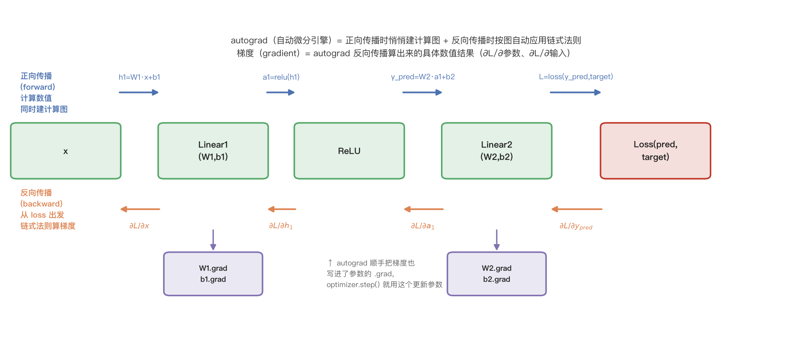
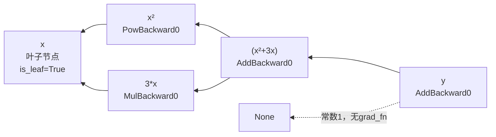
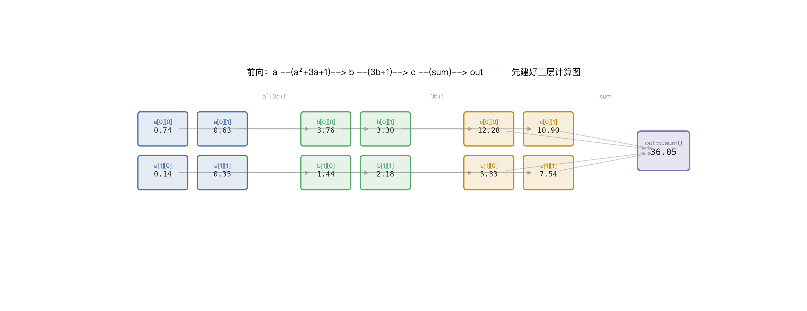
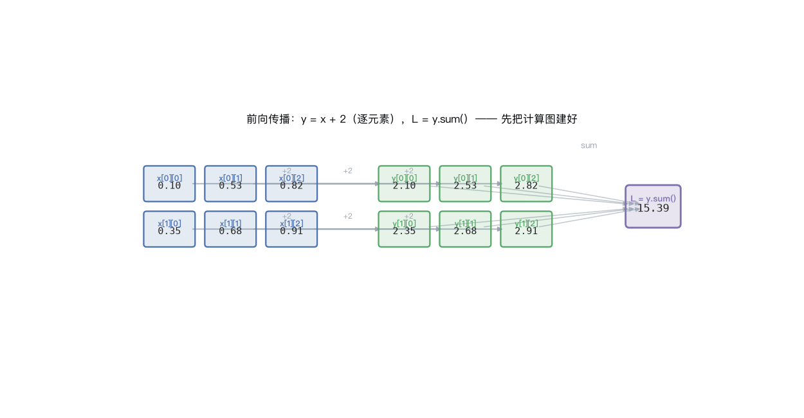
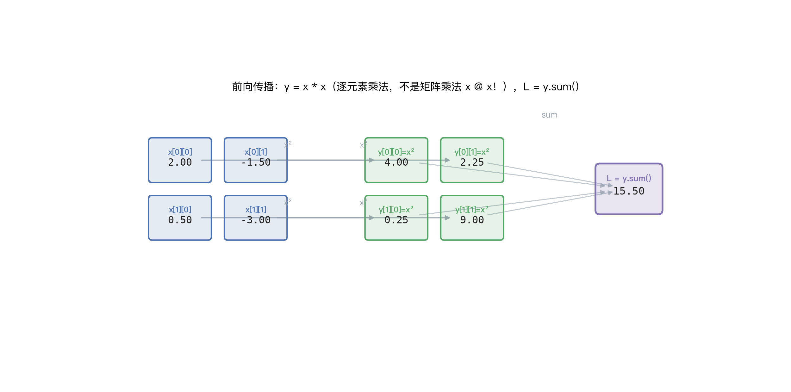
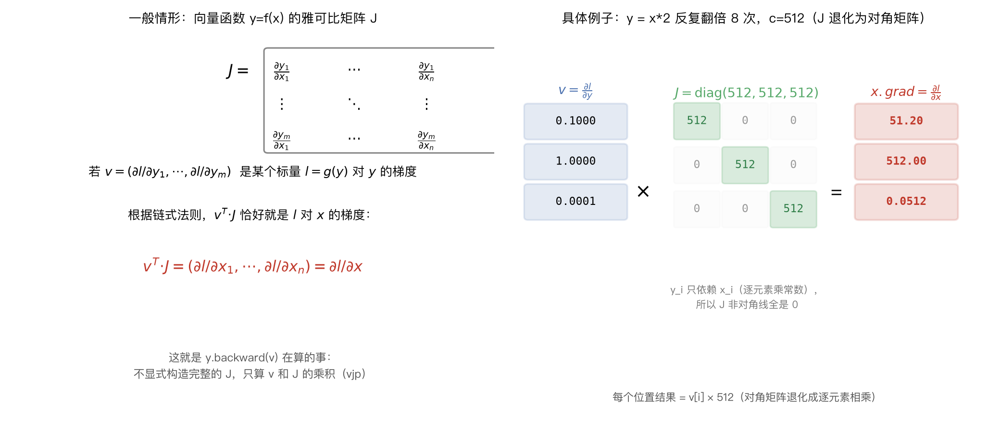

# 自动微分（Autograd）详解

对应代码：`02_autograd_automatic_differention.py`

> 本文与 [02_00_范数和雅可比矩阵求导.md](./02_00_范数和雅可比矩阵求导.md) 互为姊妹篇：本文讲 autograd 的完整使用方式，vector-Jacobian product 背后更严格的范数、雅可比矩阵数学证明见那一篇。

## 目录

1. 预备知识：常用 API 速查（含标量与张量的区别）
2. 正向传播、反向传播，以及自动微分与梯度的关系（含图示）
3. 从一个最简单的例子开始：标量的自动微分（含事后开启 `requires_grad_()` 的补充例子）
4. 计算图是怎么建立的：`grad_fn` 链条（含 autograd 与 `Function` 的区别、dtype 在图中保持不变）
5. 叶子节点 vs 非叶子节点：`is_leaf`、`retain_grad()`（含三层链式法则推导例子）
6. 多变量的偏导数（含动图：张量场景下逐元素的偏导数计算过程）
7. 逐元素乘法 `*` vs 矩阵乘法 `@`：乘积法则求导（含动图）
8. 向量/张量的反向传播：为什么需要传入 `gradient` 参数（含雅可比矩阵原理图、动态计算图例子、retain_grad 与自定义 gradient 结合的例子）
9. 梯度累积：为什么每次都要 `zero_grad()`
10. 阻止梯度追踪：`torch.no_grad()` / `detach()` / `requires_grad_()`（含 detach 与 no_grad 的区别）
11. 二次反向传播：`retain_graph=True` 与 `torch.autograd.grad` 求高阶导数
12. 原地操作与自动微分的坑
13. 为什么 `requires_grad` 只能用在浮点/复数类型上（`randint` 为什么不能求梯度）
14. 要点小结

## 1. 预备知识：常用 API 速查

### 1.1 标量（Scalar）与张量（Tensor）的区别

- **标量**：一个单独的数值，没有方向、没有"维度"这个概念，数学上就是一个数（比如 `3`、`-0.5`）。
- **张量**：PyTorch 的核心数据结构，是"标量、向量、矩阵……"这一系列概念按**维度数**统一起来的推广，维度数用 `.dim()`（或 `.ndim`）查询：

| 维度数 `ndim` | 数学名称 | PyTorch 创建示例 | `.shape` |
|---|---|---|---|
| 0 | 标量（scalar） | `torch.tensor(1.0)` | `torch.Size([])` |
| 1 | 向量（vector） | `torch.tensor([1.0, 2.0, 3.0])` | `torch.Size([3])` |
| 2 | 矩阵（matrix） | `torch.tensor([[1.0, 2.0], [3.0, 4.0]])` | `torch.Size([2, 2])` |
| ≥3 | （没有专门数学名字，统称张量） | `torch.rand(2, 3, 4)` | `torch.Size([2, 3, 4])` |

**关键点：在 PyTorch 里，"标量"不是一个独立的类型，而是张量的一个特例——0维的张量。** 不管是标量、向量、矩阵还是更高维的张量，底层都是同一个类 `torch.Tensor` 的实例，共享同一套属性和方法（`.shape`、`.dtype`、`.requires_grad`、`.backward()`……）：

```python
s = torch.tensor(1.0)
v = torch.tensor([1.0])
print(type(s), type(v))     # <class 'torch.Tensor'> <class 'torch.Tensor'>  —— 同一个类
print(s, s.shape, s.dim())    # tensor(1.)   torch.Size([])   0   —— 0维，没有中括号
print(v, v.shape, v.dim())    # tensor([1.]) torch.Size([1])  1   —— 1维，有一层中括号
```

`s` 和 `v` 存的数值都是 `1.0`，但 `s` 是标量（0维），`v` 是"长度为1的向量"（1维）——两者维度不同，`s.dim()==0` 而 `v.dim()==1`，打印时 `s` 没有中括号、`v` 有一层中括号，这也是本文档第7.1节区分"逐元素乘法 vs 矩阵乘法"时反复用到的判断方式：**看 `.shape`/`.dim()`，不要只看数值本身**。

**为什么这个区别在自动微分里很重要：** 第8.1节会讲到，`backward()` 默认只能在**标量（0维张量）**上直接调用，非标量（`dim()≥1`）必须显式传入 `gradient` 参数——`out = z.mean()`、`out = c.sum()` 这类操作能直接 `.backward()`，正是因为 `mean()`/`sum()` 把多维张量归约成了一个**0维张量**（不是普通的 Python 数字，仍然是 `torch.Tensor`，仍然带着 `grad_fn`，只是维度数为0）。

**怎么判断一个打印出来的张量是不是标量？** 拿第5.1节的例子来说，`out = c.sum()` 打印出来是 `tensor(40.1684, grad_fn=<SumBackward0>)`——**这就是一个标量（0维张量）**，判断依据：

```python
print(out.shape)    # torch.Size([])   —— 空元组，0维
print(out.dim())     # 0
print(out.numel())   # 1                —— 只有1个元素
```

最直观的判断方式是**打印格式里有没有中括号 `[]`**：`tensor(40.1684, ...)` 没有中括号，说明是标量；如果是 `tensor([40.1684], ...)`（多了一层中括号），那就是形状 `[1]` 的**一维张量**，虽然同样只存了1个数字、`numel()` 也是1，但 `dim()` 是1不是0——这跟前面 `torch.Size([])` vs `torch.Size([1])` 的区别是同一件事：**元素个数相同，不代表维度相同**。`out` 之所以能直接 `out.backward()` 不报错，正是因为它是真正的0维标量，不是"形状为`[1]`的一维张量"。

### 1.2 怎么读懂 `torch.Size(...)`：括号里有几个数就是几维

`.shape` 和 `.size()` 是**完全等价**的两种写法（一个是属性、一个是方法，返回的都是同一种 `torch.Size` 对象），查形状用哪个纯属个人习惯：

```python
k = torch.rand(1, 1)
print(k.shape)      # torch.Size([1, 1])
print(k.size())      # torch.Size([1, 1])   —— 结果完全一样
```

**判断维度数的通用规则：`torch.Size([...])` 这个元组里有几个数字，张量就是几维——这条规则对任意维度都成立，不只是0维、1维、2维这几个特例：**

```python
torch.Size([])              # 元组里 0 个数字  -> 0维（标量）
torch.Size([1])              # 元组里 1 个数字  -> 1维（向量）
torch.Size([1, 1])           # 元组里 2 个数字  -> 2维（矩阵）
torch.Size([2, 3, 4])        # 元组里 3 个数字  -> 3维
torch.Size([2, 3, 4, 5])     # 元组里 4 个数字  -> 4维
```

**规则拆成两层看：**

1. **元组的"长度"（有几个数字） = 维度数 `ndim`/`dim()`**
2. **元组里"每个数字的值" = 对应那一维有多少个元素**，把所有数字相乘就是 `.numel()`（元素总数）

```python
t = torch.rand(2, 3, 4)
print(t.dim())      # 3    （元组长度）
print(t.numel())     # 24   （2×3×4，元组里数值相乘）
```

**容易搞混的一点：`torch.Size([1, 1])`（形状描述）和 `tensor([1, 1])`（张量的实际数据）是两件完全不同的事，别看到"括号里两个1"就当成一回事：**

```python
k = torch.rand(1, 1)
print(k)             # tensor([[0.8475]])   <- shape是[1,1]，2维，打印时两层中括号，里面只有1个数
print(k.shape)        # torch.Size([1, 1])

t = torch.tensor([1, 1])
print(t)             # tensor([1, 1])        <- 这是1维张量，一层中括号，里面装了2个数：1和1
print(t.shape)        # torch.Size([2])
```

`torch.Size([1, 1])` 说的是"这个张量是2维的，每一维大小都是1"（结构描述）；`tensor([1, 1])` 说的是"这个张量是1维的，装了两个值、都等于1"（实际内容）——两者的中括号含义完全不同：**`shape` 元组里的数字表示"各维度的大小"，张量打印结果里的中括号层数表示"维度数"、括号内的数字才是"存的值"**，判断维度永远数**中括号嵌套了几层**（或直接查 `.dim()`），不要看数值本身写了几个数字。

| API | 类型 | 作用 |
|---|---|---|
| `torch.tensor(..., requires_grad=True)` | **工厂函数参数** | 创建张量时开启梯度追踪，PyTorch 会记录后续对它做的每一步运算 |
| `x.requires_grad` | **张量属性** | 查询/（配合赋值）标记该张量是否需要追踪梯度 |
| `x.requires_grad_(True/False)` | **张量实例方法（原地）** | 在已有张量上原地切换 `requires_grad`，不用重新创建张量 |
| `y.grad_fn` | **张量属性** | 该张量是由哪个运算产生的，指向计算图里的一个反向函数节点；叶子节点为 `None` |
| `x.is_leaf` | **张量属性** | 是否是计算图的"叶子"（用户直接创建、不是由其他张量运算得来的） |
| `y.backward()` | **张量实例方法** | 从 `y` 出发，沿计算图反向传播，把梯度累加到各叶子节点的 `.grad` 上 |
| `x.grad` | **张量属性** | 反向传播后，梯度值会累加/写入这里（只有叶子节点、或调用过 `retain_grad()` 的节点才会有值） |
| `x.grad.zero_()` | **张量实例方法（原地）** | 清空已累积的梯度，训练循环里每个 step 通常都要做（或用 `optimizer.zero_grad()`） |
| `y.retain_grad()` | **张量实例方法** | 让本来不是叶子节点的中间张量，也在 `backward()` 后保留 `.grad`，仅用于调试/观察 |
| `torch.no_grad()` | **上下文管理器** | 代码块内所有运算都不追踪梯度，新产生的张量 `requires_grad` 一律为 `False` |
| `x.detach()` | **张量实例方法** | 返回一个与 `x` 共享内存、但脱离计算图的新张量（`requires_grad=False`），常用于"只要值、不要梯度" |
| `y.backward(gradient=...)` / `retain_graph=True` | **方法参数** | 非标量 `y` 反向传播时必须传入和 `y` 同形状的权重张量；`retain_graph=True` 让计算图在一次 `backward()` 后不被释放，可以再次反向传播 |
| `torch.autograd.grad(outputs, inputs, create_graph=True)` | **函数** | 不写入 `.grad`，而是直接返回梯度张量；`create_graph=True` 会保留梯度的计算图，从而可以再次求导（高阶导数） |

**`requires_grad` —— 追踪梯度的开关：**

```python
x = torch.tensor(2.0, requires_grad=True)   # 从创建时就开启追踪
a = torch.tensor([1.0, 2.0])
a.requires_grad_(True)                      # 或者对已有张量原地切换
```

**`grad_fn` / `is_leaf` —— 谁是"用户造的"，谁是"算出来的"：**

```python
x = torch.tensor(2.0, requires_grad=True)
y = x ** 2 + 3 * x + 1
x.is_leaf   # True  —— 用户直接创建的
y.is_leaf   # False —— 由 x 运算得来
y.grad_fn   # <AddBackward0 object at ...> —— 记录了"y 是被加法运算产生的"
```

## 2. 正向传播、反向传播，以及自动微分与梯度的关系

在深入具体 API 之前，先把几个经常被混着用的词说清楚：**正向传播**、**反向传播**、**自动微分（autograd）**、**梯度（gradient）**。

### 2.1 正向传播（Forward Propagation）

数据从输入开始，依次经过每一层的计算（线性变换、激活函数……），一路往前算，直到算出最终的输出/预测值，再和真实标签一起算出一个标量损失（loss）——这个"从输入算到 loss"、方向上是"从前往后"的过程，就是**正向传播**。

关键点（呼应第1、3、4节内容）：**正向传播不仅是在算数值，还在背后悄悄建立计算图**——每算一步，PyTorch 就记录一个 `grad_fn` 节点，为接下来的反向传播做准备。

### 2.2 反向传播（Backward Propagation）

有了 loss（一个标量）之后，调用 `.backward()`，PyTorch 会**从 loss 出发，沿着正向传播时建好的计算图，反着往回走**（从输出方向走向输入方向），每经过一个节点就套用链式法则，算出 loss 对这个节点的偏导数,最终把结果写进各个叶子节点（通常是模型参数）的 `.grad`——这个"从 loss 算回参数"、方向上是"从后往前"的过程，就是**反向传播**。

### 2.3 自动微分（autograd）与梯度（gradient）的关系

这是最容易混的一点，一句话说清楚：**autograd 是"手段/引擎"，梯度是这个引擎算出来的"具体数值结果"。**

- **梯度**是一个纯数学概念：损失函数 `L` 对某个变量（参数、输入）的偏导数 `∂L/∂x`，描述"这个变量变化一点点，loss 会跟着变化多少"。不管用什么方法算出来，只要算的是这个量，都叫"梯度"。
- **自动微分（autograd）**是获得梯度数值的一种**自动化手段**——相对于"手工推导求导公式再编码实现"（容易出错、改一次模型结构就要重新推导）或者"数值微分近似"（$\frac{f(x+h)-f(x)}{h}$，慢且有精度误差），autograd 是在正向传播时记录计算图，反向传播时**精确地**、**自动地**应用链式法则，算出精确梯度值，不需要人手推公式。

换句话说：**没有 autograd，梯度依然存在（是数学上客观的偏导数）；但没有 autograd，你就得自己手写链式法则去算它**——这正是本文档第3节开头那句话的意思："自动微分解决的问题是……PyTorch 能自动算出 `dy/dx`，不需要手写求导公式"。

### 2.4 图示：正向传播与反向传播

用一个简化的两层网络 `x → Linear1 → ReLU → Linear2 → Loss` 演示这两条路径：



- **上方蓝色箭头**：正向传播，从左到右，逐层算出 `h1 → a1 → y_pred → L`，每一步都建立对应的 `grad_fn`（对应第3、4节的 `AddBackward0`/`MulBackward0` 等）。
- **下方橙色箭头**：反向传播，从右到左，从 `∂L/∂y_pred` 开始，逐层用链式法则算出 `∂L/∂a1`、`∂L/∂h1`、`∂L/∂x`。
- **紫色箭头**：反向传播沿途"顺手"把梯度也写进了各层参数（`W1,b1,W2,b2`）的 `.grad` 里——这些参数的梯度正是训练时 `optimizer.step()` 用来更新参数的依据。

**串联成完整的训练循环**（这也是后面第9节 `zero_grad()`、第10节 `no_grad()` 等内容实际发生的场景）：

```python
for x, target in dataloader:
    optimizer.zero_grad()          # 清空上一轮的梯度（第9节）
    y_pred = model(x)                # 正向传播：算出预测值，同时建计算图
    loss = loss_fn(y_pred, target)   # 正向传播的最后一步：算出标量 loss
    loss.backward()                  # 反向传播：autograd 沿计算图算出所有参数的梯度
    optimizer.step()                 # 用刚算出的梯度更新参数
```

一句话总结：**正向传播产出 loss 和计算图；反向传播（由 autograd 引擎驱动）沿着这张图算出梯度；梯度再交给 optimizer 去更新参数**——这就是本文档接下来所有小节（`grad_fn`、`backward()`、`.grad`、`zero_grad()`……）共同服务的那个大流程。

## 3. 从一个最简单的例子开始：标量的自动微分

自动微分（Autograd）解决的问题是：给定一个由若干次运算组成的表达式 `y = f(x)`，PyTorch 能自动算出 `dy/dx`，不需要手写求导公式。

```python
x = torch.tensor(2.0, requires_grad=True)
y = x ** 2 + 3 * x + 1
print(y)             # tensor(11., grad_fn=<AddBackward0>)

y.backward()          # 触发反向传播
print(x.grad)          # tensor(7.)
```

手工验证：`y = x² + 3x + 1`，导数 `dy/dx = 2x + 3`；代入 `x=2`，结果是 `2*2+3 = 7`，与 `x.grad` 完全一致。

**这里发生了两件事：**
1. **前向阶段**（执行 `y = x**2 + 3*x + 1` 这一行时）：PyTorch 一边正常计算数值，一边偷偷在背后搭建了一张记录了"每一步是哪种运算、依赖哪些输入"的**计算图**。
2. **反向阶段**（调用 `y.backward()` 时）：PyTorch 沿着这张图从 `y` 往回走，对每个节点应用链式法则，把最终导数值写入叶子节点的 `.grad`。

### 3.1 补充例子：张量版的完整链路 `x → y → z → out`

再看一个稍微完整一点的链路（张量版，多步运算叠加），能更好体会"正向建图、反向按图求导"这件事：

```python
x = torch.ones(2, 2, requires_grad=True)
y = x + 2
z = y * y * 3
out = z.mean()   # mean() 是求所有元素的算术平均值，等价于 z.sum() / z.numel()；这里 z 有4个元素，out = (27+27+27+27)/4 = 27

print(y)     # tensor([[3., 3.], [3., 3.]], grad_fn=<AddBackward0>)
print(z, out)
# tensor([[27., 27.], [27., 27.]], grad_fn=<MulBackward0>)  tensor(27., grad_fn=<MeanBackward0>)

out.backward()          # out 是标量，等价于 out.backward(torch.tensor(1.))
print(x.grad)
# tensor([[4.5000, 4.5000], [4.5000, 4.5000]])
```

**手工验算**：`out = mean(z) = mean(3·y²) = (3/4)·Σy_i²`（4个元素的均值）。对每个 `x_i`：

$$\frac{\partial \, out}{\partial y_i} = \frac{3}{4}\cdot 2y_i = 1.5\,y_i \;\Big|_{y_i=3} = 4.5, \qquad \frac{\partial y_i}{\partial x_i} = 1$$

$$\frac{\partial \, out}{\partial x_i} = 4.5 \times 1 = 4.5$$

与 `x.grad` 的结果完全一致。这里也顺带验证了一个规则：**`out` 是标量时，`out.backward()` 等价于 `out.backward(torch.tensor(1.))`**——不需要额外传参数，这正是第8节要讲"非标量为什么必须传 `gradient` 参数"的反面例子。

### 3.2 补充例子：对已创建的张量事后开启 `requires_grad_()`

前面的例子都是在**创建时**就传入 `requires_grad=True`。也可以对一个已经存在、默认不追踪梯度的张量，事后用 `requires_grad_(True)`（注意下划线结尾，原地修改）随时打开追踪：

```python
a = torch.randn(2, 2)
a = ((a * 3) / (a - 1))
print(a.requires_grad)   # False

a.requires_grad_(True)
print(a.requires_grad)   # True

b = (a * a).sum()
print(b.grad_fn)   # <SumBackward0 object at 0x10d1fc610>
```

只要在某次运算**之前**把 `requires_grad` 打开，之后由它参与产生的所有张量都会自动被追踪进计算图——`a` 本身经历了 `*3`、`/(a-1)` 两步运算才被赋值回 `a`，但这两步都发生在打开追踪**之前**，所以不会被记录；打开之后的 `b = (a * a).sum()` 才开始建图，`b.grad_fn` 也就随之出现。

## 4. 计算图是怎么建立的：`grad_fn` 链条

每个由运算产生的张量，`grad_fn` 都指向一个"反向函数节点"，节点上的 `next_functions` 又指向更上游的节点——这些节点串起来就是完整的计算图。用第3节的例子实测：

```python
x = torch.tensor(2.0, requires_grad=True)
y = x ** 2 + 3 * x + 1

print(y.grad_fn)                      # <AddBackward0 object at 0x...>          最外层：(x²+3x) + 1
print(y.grad_fn.next_functions)
# ((<AddBackward0 object at 0x...>, 0), (None, 0))
#     ↑ 上一层加法 (x²+3x)                ↑ 常数 1，没有 grad_fn
```

`y = x**2 + 3*x + 1` 实际上是 `(x**2 + 3*x) + 1` 两次加法嵌套。继续往里看第一层加法节点的 `next_functions`：

```
第0层 AddBackward0   ((x²+3x) + 1)
  ├─ 第1层 AddBackward0   (x² + 3x)
  │    ├─ PowBackward0    (x²)
  │    └─ MulBackward0    (3*x)
  └─ None                 (常数 1，不参与求导)
```



`backward()` 本质就是从 `y` 这个根节点出发，按上图**从右到左**（从输出往输入）遍历，每经过一个节点就按链式法则把局部导数乘上去，最终在到达叶子节点 `x` 时把结果**写入** `x.grad`——中间的 `AddBackward0`、`PowBackward0`、`MulBackward0` 节点本身不保留梯度值（第5节详述）。

### 4.1 `torch.autograd` 与 `torch.autograd.Function` 的区别

`torch.autograd` 和 `torch.autograd.Function` 是同一套自动求导机制里两个不同层级的东西：

- **`autograd`**：整个自动求导**引擎/框架**。负责记录张量上的操作历史（计算图），并在调用 `.backward()` 时沿着这个图反向传播梯度。前面用到的 `requires_grad`、`.grad_fn`、`.backward()`、`.retain_grad()` 都是 `autograd` 提供的能力，一般是**隐式**工作的——写普通张量运算，`autograd` 自动帮你构图。
- **`Function`（`torch.autograd.Function`）**：计算图中**单个运算节点**的抽象基类，代表一次操作的前向 + 反向定义。每个内置算子背后都对应一个 `Function` 子类，这也是为什么上面 `y.grad_fn` 打印出来是 `<AddBackward0 object ...>`——它就是一个 `Function` 实例，记录了如何对这次加法做反向求导。当内置算子不够用、需要**自定义某个操作的前向和反向传播规则**时，才需要自己继承 `Function`，实现 `forward()` 和 `backward()` 静态方法。

一句话总结：**`autograd` 是整个自动求导框架/引擎，`Function` 是这个引擎里每个基本运算节点的实现单元**。日常写代码基本只跟 `autograd` 打交道，只有需要自定义反向传播逻辑时才会直接用到 `Function`。

### 4.2 dtype 在计算图里保持不变

```python
x = torch.ones(2, 2, requires_grad=True)
y = x + 2
z = y * y * 3
out = z.mean()
print(x.dtype, y.dtype, z.dtype, out.dtype)
# torch.float32 torch.float32 torch.float32 torch.float32
```

计算图上各个节点的 dtype 会跟随最初创建时的 dtype 传递下去，运算不会偷偷改变精度（除非显式 `.float()` / `.double()` 转换）。

## 5. 叶子节点 vs 非叶子节点：`is_leaf`、`retain_grad()`

- **叶子节点（leaf）**：用户直接创建的张量（比如 `torch.tensor(2.0, requires_grad=True)`），不是任何运算的输出。`is_leaf` 为 `True`。
- **非叶子节点**：由其他张量运算得到的中间结果，`is_leaf` 为 `False`。

**`backward()` 默认只把梯度写入叶子节点**，中间结果的 `.grad` 不会被填充：

```python
x = torch.tensor(2.0, requires_grad=True)
y = x * 2
z = y * 3
z.backward()
print(x.grad)   # tensor(6.)
print(y.grad)   # None，并伴随 UserWarning:
# The .grad attribute of a Tensor that is not a leaf Tensor is being accessed...
```

如果确实想在调试时看看某个中间节点的梯度，用 `retain_grad()` 显式声明：

```python
x2 = torch.tensor(2.0, requires_grad=True)
y2 = x2 * 2
y2.retain_grad()      # 声明：backward 后我要看 y2 的梯度
z2 = y2 * 3
z2.backward()
print(y2.grad)         # tensor(3.)   dz2/dy2 = 3
```

**为什么默认不保留中间梯度？** 深度学习模型的计算图往往有成千上万个中间张量，如果每一个都保留梯度，显存会迅速耗尽——所以 PyTorch 默认只保留"真正需要优化"的叶子节点（通常是模型参数）的梯度，中间值算完梯度就释放，这是**用时间/一次性计算换显存**的设计。

### 5.1 补充例子：三层链式法则 `a → b → c → out`，多个 `retain_grad()`

**先插一句：下面为什么全程用 `∂`（偏导数符号），不用 `d`（导数符号）？** `a`、`b`、`c` 都是 `2×2` 的张量，本质上是**4个各自独立的标量变量**（`a[0][0]、a[0][1]、a[1][0]、a[1][1]`……），第6.1节会展开讲，这里先给一句话版本：**偏导数就是"多变量函数里，只关心某一个变量的变化率，其余变量固定不动当常数"**。下面推导 `∂out/∂c_{ij}` 时，其实就是把除了 `c_{ij}` 以外的其他3个位置都当成常数——这也是为什么符号要写成 `∂` 而不是 `d`：`d` 用在"只有一个自变量"的场景（比如第3节 `y=x²+3x+1` 对 `x` 求导），`∂` 用在"有多个自变量，只对其中一个求导"的场景，本例4个位置互相独立，天然就是多变量场景。

再看一个稍复杂的例子，链路拉长到三层，中间两个非叶子节点 `b`、`c` 都调用了 `retain_grad()`：

```python
a = torch.rand(2, 2, requires_grad=True)
b = a ** 2 + 3 * a + 1      # grad_fn=<AddBackward0>
b.retain_grad()               # b 不是叶子节点，要看 b.grad 必须显式声明
c = 3 * b + 1                  # grad_fn=<AddBackward0>
c.retain_grad()
out = c.sum()
out.backward()
```

某一次运行的实测结果（`a` 的初始值不同，具体数字会变，但推导过程完全一样）：

```
a = tensor([[0.7383, 0.6332], [0.1411, 0.3519]], requires_grad=True)
b = tensor([[3.7602, 3.3005], [1.4431, 2.1797]], grad_fn=<AddBackward0>)
c = tensor([[12.2806, 10.9015], [ 5.3294,  7.5390]], grad_fn=<AddBackward0>)
a.grad = tensor([[13.4301, 12.7991], [ 9.8465, 11.1116]])
b.grad = tensor([[3., 3.], [3., 3.]])
c.grad = tensor([[1., 1.], [1., 1.]])
```

**逐层推导，从 `out` 往回走（对应第4节讲的 `grad_fn` 链条，只是这次有3层，每一层的"局部导数"都完整推一遍，不直接跳结论）：**

**第1层：推导 `∂out/∂c`，得到 `c.grad`**

`out = c.sum() = Σ c_{ij}`（把 `c` 矩阵的4个元素直接加起来）。对其中某一个元素 `c_{ij}` 求偏导，其余元素当常数，`Σ` 展开后只剩 `c_{ij}` 这一项对自己求导：

$$\frac{\partial \,out}{\partial c_{ij}} = \frac{\partial}{\partial c_{ij}}\Big(c_{11}+c_{12}+c_{21}+c_{22}\Big) = 1$$

（无论 `c_{ij}` 在哪个位置，展开式里其他项都不含它，求导后消失，只留下它自己那一项、系数为1）。所以：

$$c.grad = \frac{\partial \,out}{\partial c} = 1\text{（每个位置都是1）}$$

**这里 `c.grad` 恒为1，跟 `a`、`b` 有多复杂完全没关系——只取决于 `out` 是怎么由 `c` 算出来的这一步。** `c.grad` 本质是 `∂out/∂c`，只由"`out` 和 `c` 之间那一步的运算"决定；`a→b→c` 这条链路不管多复杂，都只影响 `c` 存的具体**数值**，不会影响 `sum()` 这一步本身的局部导数。实测对比一下，`a`、`b`、`c` 完全不变，只把最后一步从 `sum()` 换成 `prod()`（乘积）：

```python
out = c.sum()      # c.grad = tensor([[1., 1.], [1., 1.]])           —— 全是1
out = c.prod()      # c.grad = tensor([[438.00, 493.38], [1009.20, 713.49]])   —— 完全不是1
```

**一句话记住：只要最后一步是用 `sum()` 归约回 `out`，`c.grad`（以及任何"直接参与 `sum()` 的张量"的 `.grad`）就一定是1，跟前面的计算链路多复杂无关；换成 `prod()`、平方、取最大值等其他操作，这条规律立刻失效。**

**第2层：推导 `∂c/∂b`，链式法则得到 `b.grad`**

`c = 3b + 1`，对 `b_{ij}` 求导，套用"常数乘法求导"（$\frac{d}{dx}(kx)=k$）和"常数求导为0"两条基本规则：

$$\frac{\partial c_{ij}}{\partial b_{ij}} = \frac{\partial}{\partial b_{ij}}\big(3\,b_{ij}\big) + \frac{\partial}{\partial b_{ij}}\big(1\big) = 3 + 0 = 3$$

这是个**常数**，不依赖 `b` 的取值（跟第7.2节 `y=x+2` 局部导数恒为常数是同一个道理——线性运算的导数就是它自己的系数）。链式法则：把"上一层已经传回来的梯度"乘上"这一层刚推出来的局部导数"：

$$\frac{\partial \,out}{\partial b_{ij}} = \underbrace{\frac{\partial \,out}{\partial c_{ij}}}_{\text{第1层推导结果}=1} \times \underbrace{\frac{\partial c_{ij}}{\partial b_{ij}}}_{\text{本层刚推导}=3} = 1 \times 3 = 3$$

$$b.grad = 3\text{（每个位置都是3）}$$

**第3层：推导 `∂b/∂a`，链式法则得到 `a.grad`**

`b = a² + 3a + 1`，逐项求导（正是第3节 `y=x²+3x+1` 那个标量例子的张量版）：

- 幂函数项：$\dfrac{\partial}{\partial a_{ij}}(a_{ij}^2) = 2a_{ij}$（幂函数求导法则 $\frac{d}{dx}x^n=nx^{n-1}$，这里 $n=2$）
- 线性项：$\dfrac{\partial}{\partial a_{ij}}(3a_{ij}) = 3$（常数乘法求导）
- 常数项：$\dfrac{\partial}{\partial a_{ij}}(1) = 0$

三项相加：

$$\frac{\partial b_{ij}}{\partial a_{ij}} = 2a_{ij} + 3 + 0 = 2a_{ij}+3$$

**这次局部导数不再是常数，而是依赖 `a` 取值的表达式**（因为 `a²` 这一项引入了非线性）。继续套链式法则，把梯度往下乘：

$$\frac{\partial \,out}{\partial a_{ij}} = \underbrace{\frac{\partial \,out}{\partial b_{ij}}}_{\text{第2层推导结果}=3} \times \underbrace{\frac{\partial b_{ij}}{\partial a_{ij}}}_{\text{本层刚推导}=2a_{ij}+3} = 3\times(2a_{ij}+3) = 6a_{ij}+9$$

$$a.grad = 6a+9\text{（依赖 }a\text{ 的取值，每个位置结果不同）}$$

**代入具体数值逐一验算**：

$$a_{00}=0.7383:\quad 6\times 0.7383+9 = 4.4298+9 = 13.4298 \approx 13.4301$$
$$a_{01}=0.6332:\quad 6\times 0.6332+9 = 3.7992+9 = 12.7992 \approx 12.7991$$
$$a_{10}=0.1411:\quad 6\times 0.1411+9 = 0.8466+9 = 9.8466 \approx 9.8465$$
$$a_{11}=0.3519:\quad 6\times 0.3519+9 = 2.1114+9 = 11.1114 \approx 11.1116$$

四个位置全部和实测的 `a.grad` 对上（微小差异只是打印时的四舍五入）。

**动图演示（三层反向传播，含 `b.grad`、`c.grad` 的图示）**：



动图分三步反向传播，一步步把上面的推导过程"跑"一遍：① 橙色脉冲从 `out` 流回每个 `c[i][j]`，标出 `c.grad=1`（对应第1层推导）；② 脉冲继续从每个 `c[i][j]` 流回对应的 `b[i][j]`，标出 `b.grad=3`（对应第2层推导）；③ 脉冲最后从每个 `b[i][j]` 流回对应的 `a[i][j]`，标出各自不同的 `a.grad` 数值（对应第3层推导）。可以看到 **`c.grad`、`b.grad` 全程都是统一的常数（1和3），只有传到 `a` 这一层，标签才第一次出现"每个位置数值不同"**——这正是因为前两步（`sum`、`3b+1`）是线性运算，局部导数是常数，只有 `b=a²+3a+1` 这一步的 `a²` 引入了对 `a` 取值的依赖。

**一句话总结**：`out→c→b→a` 是三层嵌套的链式法则，每一层的梯度 = **上一层传下来的梯度 × 这一层自己的局部导数**——`c.grad`（=1）乘上常数局部导数 `3` 得到 `b.grad`（=3），`b.grad`（=3）再乘上**依赖 `a` 取值**的局部导数 `(2a+3)` 才得到最终的 `a.grad`。前两层（`sum`、`3b+1`）都是线性/常系数运算，只有 `a²` 这一步引入了对 `a` 本身的依赖，这正是 `a.grad` 不是常数、而 `b.grad`、`c.grad` 都是常数的原因。

## 6. 多变量的偏导数

### 6.1 什么是偏导数：从单变量导数说起

**导数（单变量）**：如果 `y = f(x)` 只有一个自变量，导数 `dy/dx` 描述的是"`x` 变化一点点，`y` 跟着变化多少"，即变化率。比如 `y = x²`，`dy/dx = 2x`。

**偏导数是导数在"多变量函数"上的推广。** 当函数依赖**多个**自变量时，比如 `z = f(x, y) = x²y`，要分开问两个问题：

- "固定住 `y`，只让 `x` 变化，`z` 怎么变？" —— 这就是 `∂z/∂x`
- "固定住 `x`，只让 `y` 变化，`z` 怎么变？" —— 这就是 `∂z/∂y`

**求法**：把除了目标变量以外的所有变量都当成"常数"，按普通求导法则求导即可。以 `z = x²y` 为例：

- 求 `∂z/∂x`：把 `y` 当常数，`z = y·x²`，对 `x` 求导得 `2xy`
- 求 `∂z/∂y`：把 `x²` 当常数，`z = x²·y`，对 `y` 求导得 `x²`

### 6.2 例子：`z = x²y + y³` 的偏导数

在6.1节 `z=x²y` 的基础上多加一项 `y³`（这样 `y` 也能体验到"幂函数求导"，不只是简单地留下 `x²` 这个系数），用代码实测 `backward()` 会对涉及到的**所有** `requires_grad=True` 的叶子节点分别求偏导数，各自累加到自己的 `.grad`：

```python
x = torch.tensor(2.0, requires_grad=True)
y = torch.tensor(3.0, requires_grad=True)
z = x ** 2 * y + y ** 3

z.backward()
print(x.grad)   # tensor(12.)   dz/dx = 2xy      = 2*2*3  = 12
print(y.grad)   # tensor(31.)   dz/dy = x² + 3y²  = 4+27  = 31
```

这正是多元函数求偏导数：把其他变量当常数，只对目标变量求导——`backward()` 一次调用就能把计算图里涉及到的所有叶子变量的偏导数**同时**算出来，不需要对每个变量分别调用。

### 6.3 张量场景下的偏导数：`x = torch.rand(2, 3)`、`y = x + 2`、`L = y.sum()`

上面 6.2 的例子里 `x`、`y` 各自是**一个独立的标量变量**。但实际写代码时更常见的是像下面这样的场景（对应 `02_autograd_automatic_differention.py`）：

```python
x = torch.rand(2, 3)
x.requires_grad_(True)
y = x + 2
y.sum().backward()
print(x.grad)   # 与 x 同形状，每个位置都是 1
```

这里 `x` 是形状 `[2,3]` 的张量，本质上是 **6 个各自独立的标量自变量**：`x[0][0], x[0][1], x[0][2], x[1][0], x[1][1], x[1][2]`。`y = x + 2` 是**逐元素（elementwise）**运算，`y[i][j]` **只**依赖 `x[i][j]` 这一个位置，跟其他 5 个位置完全无关。最终 `L = y.sum()` 是这 6 个自变量的多元函数，要对每一个 `x[i][j]` 分别求偏导：

$$\frac{\partial L}{\partial x_{ij}} = \frac{\partial L}{\partial y_{ij}} \cdot \frac{\partial y_{ij}}{\partial x_{ij}}$$

**这一步能这么简单地"一对一"配对，正是因为 `y[i][j]` 只依赖 `x[i][j]`**：对其他位置 `x[k][l]`（`k≠i` 或 `l≠j`）求偏导，`∂y[i][j]/∂x[k][l] = 0`——因为 `y[i][j] = x[i][j] + 2` 这个式子里根本不包含 `x[k][l]`，"`x[k][l]` 怎么变，`y[i][j]` 都不受影响"。

**具体计算过程**（取一组示例数值，与动图对应）：

| | `x[0][0]` | `x[0][1]` | `x[0][2]` | `x[1][0]` | `x[1][1]` | `x[1][2]` |
|---|---|---|---|---|---|---|
| 取值 | 0.10 | 0.53 | 0.82 | 0.35 | 0.68 | 0.91 |
| `y=x+2` | 2.10 | 2.53 | 2.82 | 2.35 | 2.68 | 2.91 |

`L = y.sum() = 2.10+2.53+2.82+2.35+2.68+2.91 = 15.39`

**第1步：`∂L/∂y[i][j]`**——`sum` 就是把 6 项直接相加，每一项前面的系数都是 `1`，所以：

$$\frac{\partial L}{\partial y_{ij}} = 1 \quad（对全部 6 个位置都成立）$$

**第2步：`∂y[i][j]/∂x[i][j]`**——`y[i][j] = x[i][j] + 2`，常数 `2` 求导为 `0` 消失，`x[i][j]` 本身求导为 `1`：

$$\frac{\partial y_{ij}}{\partial x_{ij}} = 1 \quad（对全部 6 个位置都成立，且与 x 的具体取值无关）$$

**第3步：链式法则相乘**，得到 6 个位置各自的最终梯度：

$$\frac{\partial L}{\partial x_{ij}} = \frac{\partial L}{\partial y_{ij}} \times \frac{\partial y_{ij}}{\partial x_{ij}} = 1 \times 1 = 1$$

所以 `x.grad` 是一个和 `x` 同形状 `[2,3]`、**每个位置都是 `1`** 的张量——这个结果和 `x` 具体取的数值（0.10、0.53……）完全无关，因为 `y=x+2` 的局部导数本身就是常数 `1`，不依赖 `x` 的值。

**动图演示**（前向建图 → 反向传播两步 → 最终梯度）：



动图分四个阶段：① 先展示前向计算图 `x --(+2)--> y --(sum)--> L` 静态建好的样子；② 橙色的"梯度脉冲"从 `L` 并行流回每个 `y[i][j]`，标出 `∂L/∂y=1`（对应上面第1步）；③ 脉冲继续从每个 `y[i][j]` 流回对应的 `x[i][j]`（注意：只流向同位置的 `x`，不会流向其他位置，呼应前面"`y[i][j]` 只依赖 `x[i][j]`"这一点），标出 `∂L/∂x=1`（对应上面第2、3步）；④ 最终定格，展示 `x.grad` 全为 `1` 的结果与完整的链式法则公式。6 个位置的脉冲做了故意的错峰处理（一个个依次亮起而不是同时闪现），纯粹是为了动画演示时更容易看清楚"每个位置独立传播"这件事——实际 PyTorch 执行时，这 6 个位置的梯度是在一次向量化操作里**同时**算出来的，并不会真的有先后顺序。

## 7. 逐元素乘法 `*` vs 矩阵乘法 `@`：乘积法则求导

### 7.1 `*` 是逐元素乘法，不是矩阵乘法

写 `y = x * x` 时很容易望文生义地以为这是"矩阵相乘"，但在 PyTorch 里 **`*` 是逐元素乘法（Hadamard product）**：`y[i][j] = x[i][j] * x[i][j]`，只有对应位置的元素相乘，结果形状和输入完全一样。**真正的矩阵乘法要用 `@` 或 `torch.matmul(...)`**（或二维张量的 `.mm(...)`），计算方式是"行×列"，形状会按线性代数规则变化，两者是完全不同的运算：

```python
x = torch.tensor([[1.0, 2.0], [3.0, 4.0]])

x * x            # 逐元素乘法：tensor([[1., 4.], [9., 16.]])，shape 不变
x @ x            # 矩阵乘法：  tensor([[7., 10.], [15., 22.]])，用的是行×列的线性代数规则
torch.matmul(x, x)   # 与 x @ x 完全等价
```

`@` 对一维向量的语义不是"矩阵乘法"而是**点积（内积）**，结果直接退化成一个标量，这一点容易和二维矩阵的情形混淆：

```python
v = torch.tensor([1.0, 2.0, 3.0])

v * v            # 逐元素乘法：tensor([1., 4., 9.])，shape 不变，还是长度为3的向量
v @ v            # 点积：      tensor(14.)，标量！ = 1*1 + 2*2 + 3*3
```

| | `x * x` | `x @ x` |
|---|---|---|
| 一维向量 | 逐元素平方，shape 不变 | 点积，退化成标量 |
| 二维矩阵 | 逐元素平方，shape 不变 | 矩阵乘法，遵循行×列规则 |
| 要求 | 形状相同（或可广播） | 满足矩阵乘法的维度规则 |

后续例子里出现的 `y = x * x`，都是前一种——逐元素平方,不涉及矩阵乘法的转置、行列对齐等更复杂的求导规则。

### 7.2 `y = x * x` 的求导：从导数定义（极限）推导

`y = x + 2` 的局部导数是常数 `1`，跟 `x` 的值无关；但 `y = x * x` 不同。这里不直接套用乘积法则的公式，而是**从导数最基础的定义（极限）出发**完整推一遍：

**第1步：写出导数的定义式**（`y=f(x)=x²`）

$$\frac{dy}{dx} = \lim_{a \to 0} \frac{f(x+a) - f(x)}{a} = \lim_{a \to 0} \frac{(x+a)^2 - x^2}{a}$$

直接代入 `a→0` 会得到 `0/0` 的不定型，先展开分子做代数变形。

**第2步：展开分子 `(x+a)²`**

$$(x+a)^2 = x^2 + 2ax + a^2$$

代入分子：

$$(x+a)^2 - x^2 = \big(x^2+2ax+a^2\big) - x^2 = 2ax + a^2 = a(2x+a)$$

**第3步：约去分子分母的 `a`**（此时 `a≠0`，约分合法）

$$\frac{a(2x+a)}{a} = 2x + a$$

**第4步：分母不再含 `a` 了，可以安全地令 `a→0` 取极限**

$$\frac{dy}{dx} = \lim_{a \to 0} (2x+a) = 2x$$

**结论：**

$$\boxed{\frac{d}{dx}(x\cdot x) = 2x}$$

**跟乘积法则对一下账**：把 `x·x` 看成 `u(x)·v(x)`（`u(x)=v(x)=x`），套用乘积法则 $\frac{d}{dx}[u\cdot v]=u'v+uv'=1\cdot x+x\cdot 1=2x$——走捷径的公式和第一性原理的极限推导结果完全一致，只是乘积法则把这套极限推导过程封装成了一条可以直接套用的公式。

**关键结论：局部导数 `dy/dx = 2x`，是依赖 `x` 取值的变量，不再是常数**——`x` 的每个位置梯度大小可能都不一样，这跟第6.3节 `y=x+2` 的情形（每个位置梯度恒为1）形成对比。

### 7.3 完整例子：`x = [[2, -1.5], [0.5, -3]]`

```python
x = torch.tensor([[2.0, -1.5], [0.5, -3.0]], requires_grad=True)
y = x * x
y.sum().backward()
print(x.grad)
# tensor([[ 4., -3.],
#         [ 1., -6.]])
```

**逐位置验算**（`∂L/∂x[i][j] = ∂L/∂y[i][j] × ∂y[i][j]/∂x[i][j] = 1 × 2x[i][j]`）：

| | `x[0][0]=2.0` | `x[0][1]=-1.5` | `x[1][0]=0.5` | `x[1][1]=-3.0` |
|---|---|---|---|---|
| `y=x²` | 4.00 | 2.25 | 0.25 | 9.00 |
| `2x`（局部导数） | 4.00 | -3.00 | 1.00 | -6.00 |
| `x.grad`（= `1 × 2x`） | 4.00 | -3.00 | 1.00 | -6.00 |

`L = y.sum() = 4.00+2.25+0.25+9.00 = 15.50`。

**动图演示**：



和第6.3节的动图结构一样，分"前向建图 → 反向两步 → 最终结果"四个阶段,唯一的区别在**第2步**:这里箭头旁标注的不再是固定的"1",而是每个位置各自算出来的 `2x` 具体数值——直观展示"局部导数依赖输入值"这件事,对比第6.3节"`y=x+2` 时局部导数恒为1、与输入值无关"的情形。

## 8. 向量/张量的反向传播：为什么需要传入 `gradient` 参数

### 8.1 非标量输出必须传 `gradient` 参数

`backward()` 默认只能用于**标量**（0维）输出，因为数学上"标量对张量求导"结果形状明确（和输入同形状），但"张量对张量求导"结果是雅可比矩阵，没有唯一默认的化简方式。对非标量输出直接调用会报错：

```python
x = torch.tensor([1.0, 2.0, 3.0], requires_grad=True)
y = x * 2
y.backward()
# RuntimeError: grad can be implicitly created only for scalar outputs
```

**两种解决方式：**

**方式一：先归约成标量**（最常见，深度学习里 `loss` 几乎总是标量）：

```python
z = (x * 2).sum()
z.backward()
print(x.grad)   # tensor([2., 2., 2.])
```

**方式二：显式传入一个和 `y` 同形状的 `gradient` 张量**，充当"上游传来的梯度权重"（对应链式法则里的 `dL/dy`）：

```python
x.grad.zero_()
y = x * 2
y.backward(torch.tensor([1.0, 1.0, 1.0]))
print(x.grad)   # tensor([2., 2., 2.])   等价于对 y.sum() 求导

x.grad.zero_()
y = x * 2
y.backward(torch.tensor([1.0, 0.0, 0.0]))
print(x.grad)   # tensor([2., 0., 0.])   只关心 y[0] 这一路的梯度，权重为0的位置贡献为0
```

一句话：`y.backward(v)` 计算的是 `v @ (dy/dx)`（向量-雅可比积），而不是完整的雅可比矩阵——这正是 `v` 全为1时退化成"对 `y.sum()` 求导"的原因，也是深度学习框架能高效处理高维输出的关键设计（永远不显式构造雅可比矩阵）。

### 8.2 一般化原理：雅可比矩阵与向量-雅可比积（vector-Jacobian product）

上面"方式二"里的 `v` 到底代表什么、为什么 `v @ (dy/dx)` 就是我们想要的梯度？完整推一遍：

设 `y = f(x)` 是一个向量函数，`x` 是 `n` 维，`y` 是 `m` 维,那么 `y` 对 `x` 的导数不再是一个数，而是一个 `m×n` 的**雅可比矩阵（Jacobian matrix）** `J`，第 `i` 行第 `j` 列是 `∂y_i/∂x_j`：

$$J=\begin{pmatrix}\dfrac{\partial y_1}{\partial x_1} & \cdots & \dfrac{\partial y_1}{\partial x_n}\\ \vdots & \ddots & \vdots\\ \dfrac{\partial y_m}{\partial x_1} & \cdots & \dfrac{\partial y_m}{\partial x_n}\end{pmatrix}$$

现在假设有某个**标量** `l = g(y)`（在深度学习里，`l` 通常就是最终的 loss），已知 `l` 对 `y` 的梯度 `v = (∂l/∂y_1, ..., ∂l/∂y_m)`。根据链式法则，`v` 和 `J` 的乘积（`v` 是行向量，乘在左边）恰好就是 `l` 对 `x` 的梯度：

$$v^{T}\cdot J=\left(\frac{\partial l}{\partial x_1}, \cdots, \frac{\partial l}{\partial x_n}\right)=\frac{\partial l}{\partial x}$$

**这正是 `y.backward(v)` 在做的事**：PyTorch 从不会去显式构造那个可能非常巨大的雅可比矩阵 `J`（一张现代神经网络的 `J` 可能有几十亿×几十亿个元素，根本存不下），而是直接算 `v` 和 `J` 的乘积，这个操作叫**向量-雅可比积（vector-Jacobian product, vjp）**——只要你能提供 `v`（也就是"外部/下游"已经算好的、`l` 对 `y` 的梯度），PyTorch 就能继续把梯度往前传，不需要中间那个巨大的矩阵。



上图右半部分对应下面 8.3 节的具体例子：由于 `y = x * c`（`c` 是常数）是逐元素的线性缩放,`y_i` 只依赖 `x_i`,所以雅可比矩阵 `J` **退化成了一个对角矩阵**(非对角线元素全是0),`v @ J` 也就退化成了最简单的"逐元素相乘" `v[i] * c`——这也是为什么本文档前面几节(第6、7节)的例子里,反向传播看起来总是"一对一"、没有牵扯到矩阵乘法:因为逐元素运算(`+`、`*`)对应的雅可比矩阵本来就是对角矩阵。**如果换成真正的矩阵乘法(`@`/`matmul`),雅可比矩阵就不再是对角矩阵,`v@J` 也不会退化成逐元素乘法**,但原理依然是同一个 vjp 公式。

### 8.3 动态计算图例子：`while` 循环

PyTorch 是"**define-by-run**"（运行时动态建图）的框架——计算图不是提前声明好、一次定死的，而是**代码实际执行到哪一步，图就建到哪一步**，哪怕中间有循环、分支这类"动态"结构，一样能正确追踪。用一个带 `while` 循环的例子验证：

```python
torch.manual_seed(0)
x = torch.randn(3, requires_grad=True)
print(x)   # tensor([ 1.5410, -0.2934, -2.1788], requires_grad=True)

y = x * 2
while y.data.norm() < 1000:
    y = y * 2

print(y)
# tensor([  788.9900,  -150.2356, -1115.5402], grad_fn=<MulBackward0>)
```

这里循环执行了几次完全取决于 `y.data.norm()` 什么时候超过1000——**运行前根本不知道计算图会有多少层**，纯粹由运行时的数值决定（本例实测循环了8次，加上循环外的一次 `x*2`,总共翻倍了9次,`y = x * 2⁹ = x * 512`）。`y` 现在是形状 `[3]` 的非标量,不能直接 `backward()`,要按 8.1 节的方式传入 `v`：

```python
v = torch.tensor([0.1, 1.0, 0.0001])
y.backward(v)
print(x.grad)
# tensor([5.1200e+01, 5.1200e+02, 5.1200e-02])
```

**验算**：因为 `y = x * 512` 是逐元素缩放,雅可比矩阵 `J = diag(512, 512, 512)`（对应上图右侧），`v @ J` 退化成逐元素相乘 `v[i] * 512`：

```python
print(v * 512)
# tensor([5.1200e+01, 5.1200e+02, 5.1200e-02])   与 x.grad 完全一致
```

这个例子同时说明了两件事：① 计算图可以由**运行时的控制流**（`while`、`if`）动态决定，这也是 PyTorch（相对早期 TensorFlow 1.x 的静态图）的一大特点；② 只要最终的运算是逐元素的线性缩放，`vjp` 无论中间经过多少步，本质上都还是"`v` 乘上那个总的缩放系数"。

### 8.4 补充例子：`retain_grad()` 与自定义 `gradient` 结合使用

前面 8.1~8.3 节的自定义 `gradient` 例子都只看了叶子节点的 `.grad`。把第5节的 `retain_grad()` 和非标量 `backward(gradient)` 结合起来，可以同时看到链路上每一层的梯度：

```python
x = torch.randint(1, 10, size=(3,), dtype=torch.float)
x.requires_grad_(True)
print(x, x.requires_grad)

y = x * 3
while y.norm() < 1000:
    y = y * 3
y.retain_grad()
print(y, y.requires_grad)

z = y * y * 3
z.retain_grad()
z.backward(torch.tensor([1.0, 2.0, 3.0]))

print(z.grad)   # tensor([1., 2., 3.])           —— 就是传入的 v 本身
print(y.grad)   # tensor([ 8748.,  2916., 13122.])  —— v @ (dz/dy)
print(x.grad)   # tensor([2125764.,  708588., 3188646.])  —— 继续链式法则传到 x
```

`z.grad` 恒等于传入的 `v`，因为 `z` 是 `backward()` 的起点，`∂z/∂z = 1`；`y.grad`、`x.grad` 则是 `v` 沿着 `z→y→x` 这条链、经过两次向量-雅可比积之后的结果——这正是第8.2节 `vjp` 公式在多层链路上的实际应用。

## 9. 梯度累积：为什么每次都要 `zero_grad()`

**`.grad` 默认是累加（`+=`），不是覆盖**。同一个叶子节点如果被多次 `backward()`，梯度会不断叠加：

```python
x = torch.tensor(3.0, requires_grad=True)
for i in range(3):
    y = x ** 2
    y.backward()
    print(f"round {i}: x.grad =", x.grad)
# round 0: x.grad = tensor(6.)
# round 1: x.grad = tensor(12.)   <- 6 + 6，不是重新算出的 6
# round 2: x.grad = tensor(18.)   <- 12 + 6
```

不清零的话，梯度会一轮轮"越滚越大"，训练时权重更新会完全错误。正确做法是每次反向传播前手动清零（训练循环里通常用 `optimizer.zero_grad()` 代劳）：

```python
x2 = torch.tensor(3.0, requires_grad=True)
for i in range(3):
    if x2.grad is not None:
        x2.grad.zero_()
    y = x2 ** 2
    y.backward()
    print(f"round {i}: x2.grad =", x2.grad)
# round 0: x2.grad = tensor(6.)
# round 1: x2.grad = tensor(6.)
# round 2: x2.grad = tensor(6.)
```

**为什么默认设计成累加而不是覆盖？** 这是为了支持"梯度累积"（gradient accumulation）等高级用法——比如显存不够时把一个大 batch 拆成几个小 batch，分别 `backward()` 后梯度自然叠加，等效于一次大 batch 的梯度，最后再统一 `optimizer.step()`。

## 10. 阻止梯度追踪：`torch.no_grad()` / `detach()` / `requires_grad_()`

有时候只想拿到计算结果的**值**，不需要（也不希望产生开销去）追踪梯度，比如推理阶段、评估指标计算。三种常用手段：

**`torch.no_grad()`——上下文管理器，块内所有新张量都不追踪梯度：**

```python
x = torch.tensor(2.0, requires_grad=True)
with torch.no_grad():
    y = x * 2
print(y.requires_grad)   # False
```

**`x.detach()`——从某个张量"切出"一份不追踪梯度、但共享底层内存的新张量：**

```python
y2 = x * 2
z2 = y2.detach()
print(z2.requires_grad)                     # False
print(z2.data_ptr() == y2.data_ptr())        # True，共享内存，不拷贝数据
```

**`x.requires_grad_(False)`——原地切换某个张量自身的追踪状态：**

```python
a = torch.tensor([1.0, 2.0])
a.requires_grad_(True)
print(a.requires_grad)   # True
```

三者的选择：模型推理常用 `with torch.no_grad():` 包住整个前向过程（省显存、省计算图构建开销）；只需要"看一眼某个中间张量的值、后续还要接着用它算梯度"时用 `.detach()`（比如打印/记录 loss 数值：`loss.item()` 内部也是先脱离计算图再转成 Python 数）；需要长期冻结某些参数（比如迁移学习里冻结骨干网络）时用 `requires_grad_(False)`。

### 10.1 `detach()` 和 `no_grad()` 到底有什么区别

这两个是最容易被混用的一对——都能让某段计算"不追踪梯度"，但**作用的对象、作用范围、影响谁**完全不同：

| | `torch.no_grad()` | `x.detach()` |
|---|---|---|
| **本质** | 上下文管理器（`with` 语句），影响的是**一段代码** | 张量的实例方法，影响的是**某一个具体的张量** |
| **作用范围** | 整个 `with` 代码块内，**所有新产生的张量**都不追踪梯度、不建计算图 | 只针对调用它的这**一个**张量，切出一个新对象 |
| **返回值** | 没有返回值（不是表达式，是代码块） | 返回一个**新的张量对象**，`requires_grad=False`、`grad_fn=None` |
| **原对象是否被改变** | 块外的原变量（比如 `x`）完全不受影响，`x.requires_grad` 该是什么还是什么 | 原张量（比如 `z`）本身也完全不受影响，`z.requires_grad` 不变 |
| **和原对象是否共享内存** | 不涉及"新旧对象"这个概念（本来就没生成脱离原图的副本） | **共享同一块底层内存**（`data_ptr()` 相同），只是切断了梯度追踪 |
| **典型场景** | 包住整段前向推理/评估过程，或包住"手动更新参数"的原地操作 | 从某个仍需要梯度的计算链路里，"借"一份纯数值出来单独用（不影响原链路） |

**实测验证**：

```python
x = torch.tensor(2.0, requires_grad=True)

# no_grad()：只影响"块内新产生的张量"，x 自己完全没变
with torch.no_grad():
    y = x * 2
print(y.requires_grad, y.grad_fn)   # False None
print(x.requires_grad)                # True  —— x 本身丝毫未变

# detach()：针对已有张量 z，切出一个新对象 w，z 本身完全没变
z = x * 2
w = z.detach()
print(z.requires_grad, w.requires_grad)   # True False
print(z.data_ptr() == w.data_ptr())        # True  —— 共享内存
print(z is w)                                # False —— 但不是同一个对象
```

**一句话区分记忆法**：`no_grad()` 管的是"接下来这一段代码要不要建图"（范围是**一段代码**）；`detach()` 管的是"这一个张量还要不要连在图上"（范围是**一个对象**）。

**最典型的实战场景——手动更新参数，必须用 `no_grad()` 而不是 `detach()`：**

```python
param = torch.tensor(5.0, requires_grad=True)
loss = param ** 2
loss.backward()

with torch.no_grad():
    param -= 0.1 * param.grad   # 原地修改叶子节点

print(param, param.requires_grad)   # tensor(4., requires_grad=True)   True
```

这里必须用 `with torch.no_grad():` 包住 `param -= 0.1 * param.grad` 这一行——`param` 是叶子节点，直接原地修改会触发第12节"坑①"的报错（`a leaf Variable that requires grad is being used in an in-place operation`）；`no_grad()` 告诉 PyTorch"这一步操作不用建图、不受梯度追踪规则约束"，修改完之后 `param` **依然是**同一个 `requires_grad=True` 的叶子张量，可以接着参与下一轮 `loss.backward()`。如果换成 `.detach()` 则完全不是一回事：`param.detach()` 会**新建**一个不追踪梯度的对象，对这个新对象做原地修改，虽然因为共享内存、`param` 的数值也会跟着变，但这种"绕开检查去改数据"的写法不是标准用法，工程上统一用 `optimizer.step()`（内部也是用 `no_grad()` 包起来的）来做参数更新，不会手写这种代码。

## 11. 二次反向传播：`retain_graph=True` 与 `torch.autograd.grad` 求高阶导数

**默认情况下，`backward()` 用完一次计算图就释放了**（省显存），再调用第二次会报错：

```python
x2 = torch.tensor(2.0, requires_grad=True)
y2 = x2 ** 2
y2.backward()
y2.backward()
# RuntimeError: Trying to backward through the graph a second time
# (or directly access saved tensors after they have already been freed)...
```

传入 `retain_graph=True` 可以保留计算图，支持对同一个 `y` 反复调用 `backward()`（梯度依然是累加的）：

```python
x = torch.tensor(2.0, requires_grad=True)
y = x ** 2
y.backward(retain_graph=True)
print(x.grad)   # tensor(4.)
y.backward()
print(x.grad)   # tensor(8.)   <- 4 + 4，两次反向传播的梯度累加了
```

**求高阶导数（比如二阶导）**，更推荐用 `torch.autograd.grad`，配合 `create_graph=True` 让"梯度"本身也带上计算图，从而可以对梯度再求一次导：

```python
x2 = torch.tensor(2.0, requires_grad=True)
y2 = x2 ** 3
grad_x2, = torch.autograd.grad(y2, x2, create_graph=True)
print(grad_x2)          # tensor(12., grad_fn=<MulBackward0>)   dy/dx = 3x² = 12，且自带 grad_fn

grad2_x2, = torch.autograd.grad(grad_x2, x2)
print(grad2_x2)          # tensor(12.)   d²y/dx² = 6x = 12
```

`torch.autograd.grad(outputs, inputs)` 与 `outputs.backward()` 的区别：前者**直接返回**梯度张量（不写入 `.grad`），更适合"只要梯度值、马上还要对梯度做进一步运算"的场景（比如高阶导数、部分特殊的正则化项如梯度惩罚）；后者写入叶子节点的 `.grad` 属性，是训练循环里最常用的写法。

## 12. 原地操作与自动微分的坑

**坑① 叶子节点不能直接原地修改**（会破坏梯度追踪所需的信息）：

```python
a = torch.tensor([1.0, 2.0], requires_grad=True)
a += 1
# RuntimeError: a leaf Variable that requires grad is being used in an in-place operation.
```

**坑② 原地修改了反向传播需要用到的中间值，会在 `backward()` 时才报错**（而不是在原地修改那一行报错，容易误导排查方向）：

```python
x = torch.tensor([1.0, 2.0, 3.0], requires_grad=True)
y = x * 2
z = y * y          # z 依赖 y 的值，反向传播时要用到它
y.add_(1)          # 原地修改了 y，把 backward 需要的旧值覆盖掉了
z.sum().backward()
# RuntimeError: one of the variables needed for gradient computation has been modified
# by an inplace operation: [torch.FloatTensor [3]], which is output 0 of AddBackward0,
# is at version 1; expected version 0 instead.
```

报错信息里的"version"指的是 PyTorch 给每个张量维护的一个版本计数器：每做一次原地操作版本号加一，`backward()` 执行时会检查所保存的张量版本号是否和当初保存时一致，不一致就说明数据已经被"偷偷改过"，梯度计算不再可靠，因此直接报错而不是静默给出错误结果。

**并非所有原地操作都会报错**——比如对非叶子张量做原地的切片赋值，PyTorch 能够正确处理并保留追踪信息（生成 `CopySlices` 节点）：

```python
x = torch.tensor([1.0, 2.0, 3.0], requires_grad=True)
y = x * 2
y[0] = 100.0            # 原地切片赋值，可以正常追踪
print(y.grad_fn)          # <CopySlices object at ...>
y.sum().backward()
print(x.grad)              # tensor([0., 2., 2.])  <- 第0个位置被覆盖，对应梯度变成0
```

`x.grad` 第0项变成 `0` 很直观：`y[0]` 的值已经被替换成常数 `100.0`，不再依赖 `x[0]`，所以 `dy[0]/dx[0] = 0`；后两项没被覆盖，依然是 `y=2x` 的导数 `2`。

## 13. 为什么 `requires_grad` 只能用在浮点/复数类型上（`randint` 为什么不能求梯度）

`torch.randint` 生成的是**整数类型**（默认 `int64`）张量，无论是创建时传 `requires_grad=True`，还是创建后调用 `x.requires_grad_(True)`，都会报同样的错误：

```python
x = torch.randint(0, 10, (3,))
x.requires_grad_(True)
# RuntimeError: only Tensors of floating point dtype can require gradients

torch.randint(0, 10, (3,), requires_grad=True)
# RuntimeError: Only Tensors of floating point and complex dtype can require gradients
```

**这不是某个 API 的限制，而是张量对象本身的硬性检查**：PyTorch 只看 `dtype` 是不是浮点/复数类型，跟用哪种写法设置无关——只要 `dtype` 是整数类型，任何设置方式都会被拒绝。

**根本原因是导数本身的数学定义要求连续域。** 导数是极限：

```
f'(x) = lim(h→0) [f(x+h) - f(x)] / h
```

这里的 `h` 是一个可以任意趋近于 0 的"无穷小"，只有在**连续**的实数/复数域上才有意义——整数是离散的，两个相邻整数之间没有"更小的一步"，`h→0` 这个极限过程根本无法定义，所以"对整数张量求导"在数学上就是一件没有意义的事,而不是 PyTorch 人为设了一道限制。

**另一层直观的理由：梯度值本身往往是分数，整数张量根本装不下。** 比如：

```python
x = torch.tensor(4.0, requires_grad=True)
y = torch.sqrt(x)
y.backward()
print(x.grad)   # tensor(0.2500)   dy/dx = 1/(2*sqrt(x)) = 1/4 = 0.25
```

`dy/dx = 1/(2√x)` 在 `x=4` 时的结果是 `0.25`，一个不能被整数精确表示的值。如果 `x` 是整数张量，`.grad` 也必须是同类型，`0.25` 就无法存储——这从另一个角度说明了"整数张量的梯度"这个概念本身是不自洽的。

**结论**：只有浮点（`float16/32/64`）和复数（`complex64/128`）类型的张量才能开启 `requires_grad`。如果确实需要对"整数生成的东西"求梯度，做法是先转成浮点类型：

```python
x = torch.randint(0, 10, (3,)).float()
x.requires_grad_(True)   # 现在可以了
```

但要注意：`randint` 通常是用来生成**离散的索引/标签**（类别标签、采样下标），这类值本身就不该参与求导——真正需要梯度的是模型的**连续参数**（权重、`randn` 生成的浮点张量等）。

## 14. 要点小结

- **正向传播**（从输入算到 loss，同时建计算图）→ **反向传播**（从 loss 沿计算图往回走，链式法则算梯度）→ **梯度写入参数 `.grad`** → **optimizer 用梯度更新参数**，这是训练循环的完整链路；**自动微分（autograd）是驱动反向传播的引擎/手段，梯度是它算出来的具体数值结果**，两者不是同一个东西。
- **`requires_grad=True`** 开启梯度追踪；每次运算都会在背后建立一张记录依赖关系的**计算图**，节点通过 `grad_fn` / `next_functions` 串联。
- **叶子节点（`is_leaf=True`）** 是用户直接创建的张量，`backward()` 默认只把梯度写入叶子节点；中间节点想看梯度要显式 `retain_grad()`。
- **多变量场景**：一次 `backward()` 会把计算图里涉及到的所有 `requires_grad=True` 叶子节点的偏导数同时算出来。
- **`*` 是逐元素乘法，`@`/`matmul` 才是矩阵乘法**，两者求导规则不同：`y=x+2` 局部导数恒为常数1；`y=x*x` 要用乘积法则，局部导数是 `2x`，依赖 `x` 的具体取值。
- **非标量输出**必须显式传入 `gradient` 参数（或先归约成标量再 `backward()`），本质是在算"向量-雅可比积（vjp）" `v @ J`，而不是显式构造完整雅可比矩阵 `J`；PyTorch 是"define-by-run"，计算图可以由 `while`/`if` 等运行时控制流动态决定。
- **`.grad` 默认累加**，每轮训练前要 `zero_grad()`，否则梯度会越滚越大；这个"默认累加"的设计是为了支持梯度累积等高级用法。
- **`torch.no_grad()` / `.detach()` / `requires_grad_(False)`** 是三种阻止/脱离梯度追踪的手段，分别适合"整段代码不追踪"、"从某个张量切出不追踪的副本"、"长期冻结某个张量"。
- 默认一次 `backward()` 后计算图被释放，二次调用要 `retain_graph=True`；求高阶导数更推荐 `torch.autograd.grad(..., create_graph=True)`。
- **原地操作**对叶子节点直接报错；对非叶子节点，如果破坏了反向传播所需的旧值，会在 `backward()` 时才报错（PyTorch 靠张量的"版本号"发现问题），排查时要留意报错信息里提到的具体是哪个 `xxxBackward` 节点、哪个版本不匹配。
- **`requires_grad` 只能用在浮点/复数类型张量上**，`torch.randint` 等生成的整数张量无法开启梯度追踪——根本原因是导数定义本身要求连续域（`h→0` 的极限在离散整数上没有意义），且梯度值往往是分数，整数类型也存不下。
